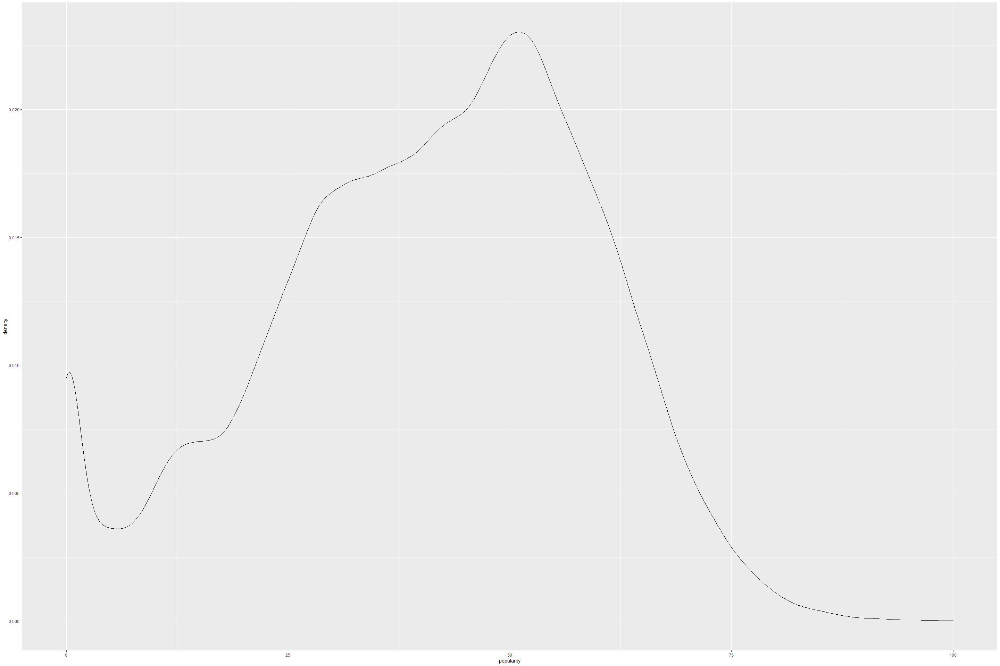
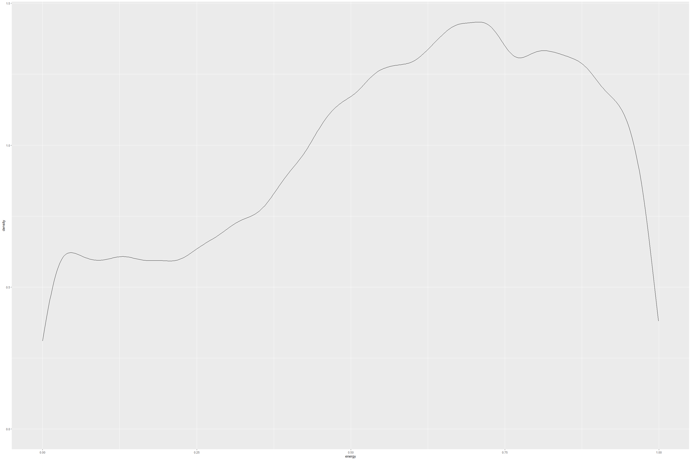
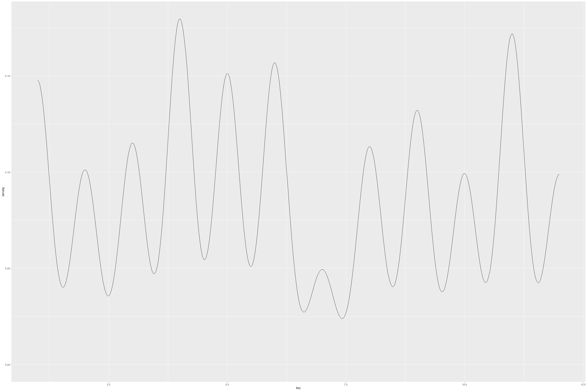
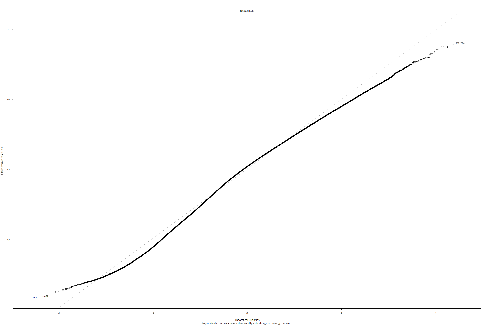

Spotify Tracks dataset
================
Sushma akoju
9/15/2021

## Dataset Description

##### Spotify Tracks Dataset is about playlist features and how they compare by genre or album/artist ids w.r.t popularity, acoustic ness, danceability, energy, instrumentals, key (musical chords) etc. Since all of us commonly listen to music, we found it interesting to explore various factors and their influence on playlists that become popular.

## About the features

##### It seems that Spotify has defined features based on various audio- acoustic features such as Shimmer, pitch, tone, fundamental frequency, etc as well as musical acoustics. <https://developer.spotify.com/documentation/web-api/reference/#endpoint-get-audio-features> The audio features seem to be based on pitch ranges, harmonics, overtones of musical instruments along with known vocal quality metrics based on features such as fundamental frequency, jitter, shimmer, pitch, tone etc. Each os metrics for musical acoustics, as well as voice acoustics, are analyzed based on defined audio signal processing standards and algorithms. Each of metrics are averaged over entire track to define a single score/number for representing value of each metric.

## Goal

##### We primarily focus and attempt to understand each of the features, their technical definitions cited here <https://developer.spotify.com/documentation/web-api/reference/#endpoint-get-audio-features> . we would like to see how existing human notions about music fare against what data actually tells us about. For example, it has been widely popular that the C\# chord is most popular in western music. We want to find out how the features contribute to popularity.

##### Example: “My favorite things” song from “The Sound of music” movie which was very popular back in 1960s and still considered a classic, unfortunately has a popularity score of zero while a modern, contemporary version inspired from the same song and rewritten with lyrics and named as “7 rings” by Ariana Grande, has a popularity score of 100.

-   Understanding Audio features
    -   Acousticness:
    -   Danceability: This is based on tempo, rhythm stability, beat
        strength, and overall regularity. On sclae of 0 to 1, this
        metric suggests if the track is for dancing.
    -   Energy: Indicates loudness of a track loudness, timbre, onset
        rate, and general entropy. Bach prelude seems to score low on
        this feature. The values are expected to be high for Heavy metal
        genre.
    -   Instrumentalness: predicts if a track contains no vocals. Values
        above 0.5 indicate Instrumental tracks such as Classical music
        (example: soloist music).
    -   Liveness: Detects presence of audience. This is indicator if
        this was recorded live. Higher value suggests this is a live
        recording.
    -   Loudness: Loudness values are averaged across entire track and
        are measured in decibels (dB). Ranges -60 to 0.
    -   Speechiness: detects the presence of spoken words in a track.
        Measures the exclusivity of the speech over a scale of &lt;= 1.
        ). Spoken content would give values closer to 1 and
        values &gt;0.66 as well as values between 0.33 and 0.66 suggest
        musical tracks such as Rap song genre. Values below 0.33
        indicate music and non-speech tracks.
    -   Tempo: number of beats per minute (BPM). It is the speed or pace
        of a given track.
    -   Valence: Defines the positiveness or negativeness of the track.
    -   Mode: Mode indicates modality of the track such as minor or
        major scales - type of scale the melodic content is derived.
        Measured as 0 as Minor scale and 1 as Major scale.
    -   Key: The track the key is played in. This is an Integer, 0
        denotes C, 1 denotes C\#. This follows Pitch class notation:
        <a  href="https://en.wikipedia.org/wiki/Pitch_class">https://en.wikipedia.org/wiki/Pitch\_class</a>
    -   Duration\_ms: Duration of track in milliseconds.
-   Types of
    <a href="https://en.wikipedia.org/wiki/Acoustic_music#Types_of_acoustic_instruments">
    Acoustic instruments </a>
-   The features are extracted based on an custom Algorithm from The
    Echo Nest company.

##### Get data from url to a Tibble.

``` r
data_url <- "https://raw.githubusercontent.com/sushmaakoju/spotify-tracks-data-analysis/main/SpotifyFeatures.csv"
column_names <- c("genre","artist_name","track_name","track_id","popularity","acousticness","danceability","duration_ms","energy","instrumentalness","key","liveness","loudness","mode","speechiness","tempo","time_signature","valence")

spotifydf <- read_csv(data_url, show_col_types=FALSE)
head(spotifydf)
```

    ## # A tibble: 6 x 18
    ##   genre artist_name  track_name   track_id  popularity acousticness danceability
    ##   <chr> <chr>        <chr>        <chr>          <dbl>        <dbl>        <dbl>
    ## 1 Movie Henri Salva~ C'est beau ~ 0BRjO6ga~          0        0.611        0.389
    ## 2 Movie Martin & le~ Perdu d'ava~ 0BjC1Nfo~          1        0.246        0.59 
    ## 3 Movie Joseph Will~ Don't Let M~ 0CoSDzoN~          3        0.952        0.663
    ## 4 Movie Henri Salva~ Dis-moi Mon~ 0Gc6TVm5~          0        0.703        0.24 
    ## 5 Movie Fabien Nataf Ouverture    0IuslXpM~          4        0.95         0.331
    ## 6 Movie Henri Salva~ Le petit so~ 0Mf1jKa8~          0        0.749        0.578
    ## # ... with 11 more variables: duration_ms <dbl>, energy <dbl>,
    ## #   instrumentalness <dbl>, key <chr>, liveness <dbl>, loudness <dbl>,
    ## #   mode <chr>, speechiness <dbl>, tempo <dbl>, time_signature <chr>,
    ## #   valence <dbl>

``` r
colSums(is.na(spotifydf))
```

    ##            genre      artist_name       track_name         track_id 
    ##                0                0                0                0 
    ##       popularity     acousticness     danceability      duration_ms 
    ##                0                0                0                0 
    ##           energy instrumentalness              key         liveness 
    ##                0                0                0                0 
    ##         loudness             mode      speechiness            tempo 
    ##                0                0                0                0 
    ##   time_signature          valence 
    ##                0                0

``` r
head( spotifydf)
```

    ## # A tibble: 6 x 18
    ##   genre artist_name  track_name   track_id  popularity acousticness danceability
    ##   <chr> <chr>        <chr>        <chr>          <dbl>        <dbl>        <dbl>
    ## 1 Movie Henri Salva~ C'est beau ~ 0BRjO6ga~          0        0.611        0.389
    ## 2 Movie Martin & le~ Perdu d'ava~ 0BjC1Nfo~          1        0.246        0.59 
    ## 3 Movie Joseph Will~ Don't Let M~ 0CoSDzoN~          3        0.952        0.663
    ## 4 Movie Henri Salva~ Dis-moi Mon~ 0Gc6TVm5~          0        0.703        0.24 
    ## 5 Movie Fabien Nataf Ouverture    0IuslXpM~          4        0.95         0.331
    ## 6 Movie Henri Salva~ Le petit so~ 0Mf1jKa8~          0        0.749        0.578
    ## # ... with 11 more variables: duration_ms <dbl>, energy <dbl>,
    ## #   instrumentalness <dbl>, key <chr>, liveness <dbl>, loudness <dbl>,
    ## #   mode <chr>, speechiness <dbl>, tempo <dbl>, time_signature <chr>,
    ## #   valence <dbl>

``` r
glimpse(spotifydf)
```

    ## Rows: 232,725
    ## Columns: 18
    ## $ genre            <chr> "Movie", "Movie", "Movie", "Movie", "Movie", "Movie",~
    ## $ artist_name      <chr> "Henri Salvador", "Martin & les fées", "Joseph Willia~
    ## $ track_name       <chr> "C'est beau de faire un Show", "Perdu d'avance (par G~
    ## $ track_id         <chr> "0BRjO6ga9RKCKjfDqeFgWV", "0BjC1NfoEOOusryehmNudP", "~
    ## $ popularity       <dbl> 0, 1, 3, 0, 4, 0, 2, 15, 0, 10, 0, 2, 4, 3, 0, 0, 0, ~
    ## $ acousticness     <dbl> 0.61100, 0.24600, 0.95200, 0.70300, 0.95000, 0.74900,~
    ## $ danceability     <dbl> 0.389, 0.590, 0.663, 0.240, 0.331, 0.578, 0.703, 0.41~
    ## $ duration_ms      <dbl> 99373, 137373, 170267, 152427, 82625, 160627, 212293,~
    ## $ energy           <dbl> 0.9100, 0.7370, 0.1310, 0.3260, 0.2250, 0.0948, 0.270~
    ## $ instrumentalness <dbl> 0.00000000, 0.00000000, 0.00000000, 0.00000000, 0.123~
    ## $ key              <chr> "C#", "F#", "C", "C#", "F", "C#", "C#", "F#", "C", "G~
    ## $ liveness         <dbl> 0.3460, 0.1510, 0.1030, 0.0985, 0.2020, 0.1070, 0.105~
    ## $ loudness         <dbl> -1.828, -5.559, -13.879, -12.178, -21.150, -14.970, -~
    ## $ mode             <chr> "Major", "Minor", "Minor", "Major", "Major", "Major",~
    ## $ speechiness      <dbl> 0.0525, 0.0868, 0.0362, 0.0395, 0.0456, 0.1430, 0.953~
    ## $ tempo            <dbl> 166.969, 174.003, 99.488, 171.758, 140.576, 87.479, 8~
    ## $ time_signature   <chr> "4/4", "4/4", "5/4", "4/4", "4/4", "4/4", "4/4", "4/4~
    ## $ valence          <dbl> 0.8140, 0.8160, 0.3680, 0.2270, 0.3900, 0.3580, 0.533~

## Including Plots

##### Some genres are duplicated. (encoding mismatches).

``` r
na.omit(spotifydf)
```

    ## # A tibble: 232,725 x 18
    ##    genre artist_name  track_name   track_id popularity acousticness danceability
    ##    <chr> <chr>        <chr>        <chr>         <dbl>        <dbl>        <dbl>
    ##  1 Movie Henri Salva~ C'est beau ~ 0BRjO6g~          0      0.611          0.389
    ##  2 Movie Martin & le~ Perdu d'ava~ 0BjC1Nf~          1      0.246          0.59 
    ##  3 Movie Joseph Will~ Don't Let M~ 0CoSDzo~          3      0.952          0.663
    ##  4 Movie Henri Salva~ Dis-moi Mon~ 0Gc6TVm~          0      0.703          0.24 
    ##  5 Movie Fabien Nataf Ouverture    0IuslXp~          4      0.95           0.331
    ##  6 Movie Henri Salva~ Le petit so~ 0Mf1jKa~          0      0.749          0.578
    ##  7 Movie Martin & le~ Premières r~ 0NUiKYR~          2      0.344          0.703
    ##  8 Movie Laura Mayne  Let Me Let ~ 0PbIF9Y~         15      0.939          0.416
    ##  9 Movie Chorus       Helka        0ST6uPf~          0      0.00104        0.734
    ## 10 Movie Le Club des~ Les bisous ~ 0VSqZ3K~         10      0.319          0.598
    ## # ... with 232,715 more rows, and 11 more variables: duration_ms <dbl>,
    ## #   energy <dbl>, instrumentalness <dbl>, key <chr>, liveness <dbl>,
    ## #   loudness <dbl>, mode <chr>, speechiness <dbl>, tempo <dbl>,
    ## #   time_signature <chr>, valence <dbl>

``` r
genres <- distinct(spotifydf, genre)$genre
genres
```

    ##  [1] "Movie"            "R&B"              "A Capella"        "Alternative"     
    ##  [5] "Country"          "Dance"            "Electronic"       "Anime"           
    ##  [9] "Folk"             "Blues"            "Opera"            "Hip-Hop"         
    ## [13] "Children's Music" "Children’s Music" "Rap"              "Indie"           
    ## [17] "Classical"        "Pop"              "Reggae"           "Reggaeton"       
    ## [21] "Jazz"             "Rock"             "Ska"              "Comedy"          
    ## [25] "Soul"             "Soundtrack"       "World"

``` r
spotifydf$genre[spotifydf$genre=="Children's Music"] <- "Children’s Music"
spotifydf[!duplicated(spotifydf$track_id),]
```

    ## # A tibble: 176,774 x 18
    ##    genre artist_name  track_name   track_id popularity acousticness danceability
    ##    <chr> <chr>        <chr>        <chr>         <dbl>        <dbl>        <dbl>
    ##  1 Movie Henri Salva~ C'est beau ~ 0BRjO6g~          0      0.611          0.389
    ##  2 Movie Martin & le~ Perdu d'ava~ 0BjC1Nf~          1      0.246          0.59 
    ##  3 Movie Joseph Will~ Don't Let M~ 0CoSDzo~          3      0.952          0.663
    ##  4 Movie Henri Salva~ Dis-moi Mon~ 0Gc6TVm~          0      0.703          0.24 
    ##  5 Movie Fabien Nataf Ouverture    0IuslXp~          4      0.95           0.331
    ##  6 Movie Henri Salva~ Le petit so~ 0Mf1jKa~          0      0.749          0.578
    ##  7 Movie Martin & le~ Premières r~ 0NUiKYR~          2      0.344          0.703
    ##  8 Movie Laura Mayne  Let Me Let ~ 0PbIF9Y~         15      0.939          0.416
    ##  9 Movie Chorus       Helka        0ST6uPf~          0      0.00104        0.734
    ## 10 Movie Le Club des~ Les bisous ~ 0VSqZ3K~         10      0.319          0.598
    ## # ... with 176,764 more rows, and 11 more variables: duration_ms <dbl>,
    ## #   energy <dbl>, instrumentalness <dbl>, key <chr>, liveness <dbl>,
    ## #   loudness <dbl>, mode <chr>, speechiness <dbl>, tempo <dbl>,
    ## #   time_signature <chr>, valence <dbl>

``` r
genres <- distinct(spotifydf, genre)$genre
```

##### Convert character format columns: key and mode to numeric values.

``` r
unique(spotifydf$key)
```

    ##  [1] "C#" "F#" "C"  "F"  "G"  "E"  "D#" "G#" "D"  "A#" "A"  "B"

``` r
unique(as.numeric(as.factor(spotifydf$key)))
```

    ##  [1]  5 10  4  9 11  8  7 12  6  2  1  3

``` r
spotifydf$key <- as.numeric(as.factor(spotifydf$key))

unique(spotifydf$mode)
```

    ## [1] "Major" "Minor"

``` r
unique(as.numeric(as.factor(spotifydf$mode)))
```

    ## [1] 1 2

``` r
spotifydf$mode <- as.numeric(as.factor(spotifydf$mode))
```

##### Get all numeric columns from the dataframe.

``` r
str(spotifydf)
```

    ## spec_tbl_df [232,725 x 18] (S3: spec_tbl_df/tbl_df/tbl/data.frame)
    ##  $ genre           : chr [1:232725] "Movie" "Movie" "Movie" "Movie" ...
    ##  $ artist_name     : chr [1:232725] "Henri Salvador" "Martin & les fées" "Joseph Williams" "Henri Salvador" ...
    ##  $ track_name      : chr [1:232725] "C'est beau de faire un Show" "Perdu d'avance (par Gad Elmaleh)" "Don't Let Me Be Lonely Tonight" "Dis-moi Monsieur Gordon Cooper" ...
    ##  $ track_id        : chr [1:232725] "0BRjO6ga9RKCKjfDqeFgWV" "0BjC1NfoEOOusryehmNudP" "0CoSDzoNIKCRs124s9uTVy" "0Gc6TVm52BwZD07Ki6tIvf" ...
    ##  $ popularity      : num [1:232725] 0 1 3 0 4 0 2 15 0 10 ...
    ##  $ acousticness    : num [1:232725] 0.611 0.246 0.952 0.703 0.95 0.749 0.344 0.939 0.00104 0.319 ...
    ##  $ danceability    : num [1:232725] 0.389 0.59 0.663 0.24 0.331 0.578 0.703 0.416 0.734 0.598 ...
    ##  $ duration_ms     : num [1:232725] 99373 137373 170267 152427 82625 ...
    ##  $ energy          : num [1:232725] 0.91 0.737 0.131 0.326 0.225 0.0948 0.27 0.269 0.481 0.705 ...
    ##  $ instrumentalness: num [1:232725] 0 0 0 0 0.123 0 0 0 0.00086 0.00125 ...
    ##  $ key             : num [1:232725] 5 10 4 5 9 5 5 10 4 11 ...
    ##  $ liveness        : num [1:232725] 0.346 0.151 0.103 0.0985 0.202 0.107 0.105 0.113 0.0765 0.349 ...
    ##  $ loudness        : num [1:232725] -1.83 -5.56 -13.88 -12.18 -21.15 ...
    ##  $ mode            : num [1:232725] 1 2 2 1 1 1 1 1 1 1 ...
    ##  $ speechiness     : num [1:232725] 0.0525 0.0868 0.0362 0.0395 0.0456 0.143 0.953 0.0286 0.046 0.0281 ...
    ##  $ tempo           : num [1:232725] 167 174 99.5 171.8 140.6 ...
    ##  $ time_signature  : chr [1:232725] "4/4" "4/4" "5/4" "4/4" ...
    ##  $ valence         : num [1:232725] 0.814 0.816 0.368 0.227 0.39 0.358 0.533 0.274 0.765 0.718 ...
    ##  - attr(*, "spec")=
    ##   .. cols(
    ##   ..   genre = col_character(),
    ##   ..   artist_name = col_character(),
    ##   ..   track_name = col_character(),
    ##   ..   track_id = col_character(),
    ##   ..   popularity = col_double(),
    ##   ..   acousticness = col_double(),
    ##   ..   danceability = col_double(),
    ##   ..   duration_ms = col_double(),
    ##   ..   energy = col_double(),
    ##   ..   instrumentalness = col_double(),
    ##   ..   key = col_character(),
    ##   ..   liveness = col_double(),
    ##   ..   loudness = col_double(),
    ##   ..   mode = col_character(),
    ##   ..   speechiness = col_double(),
    ##   ..   tempo = col_double(),
    ##   ..   time_signature = col_character(),
    ##   ..   valence = col_double()
    ##   .. )
    ##  - attr(*, "problems")=<externalptr>

``` r
columns <- colnames(spotifydf)
columns
```

    ##  [1] "genre"            "artist_name"      "track_name"       "track_id"        
    ##  [5] "popularity"       "acousticness"     "danceability"     "duration_ms"     
    ##  [9] "energy"           "instrumentalness" "key"              "liveness"        
    ## [13] "loudness"         "mode"             "speechiness"      "tempo"           
    ## [17] "time_signature"   "valence"

``` r
numeric_columns <- unlist(lapply(spotifydf, is.numeric))
numeric_columns
```

    ##            genre      artist_name       track_name         track_id 
    ##            FALSE            FALSE            FALSE            FALSE 
    ##       popularity     acousticness     danceability      duration_ms 
    ##             TRUE             TRUE             TRUE             TRUE 
    ##           energy instrumentalness              key         liveness 
    ##             TRUE             TRUE             TRUE             TRUE 
    ##         loudness             mode      speechiness            tempo 
    ##             TRUE             TRUE             TRUE             TRUE 
    ##   time_signature          valence 
    ##            FALSE             TRUE

``` r
numeric_spotifydf <- spotifydf[,numeric_columns]
colnames(numeric_spotifydf)
```

    ##  [1] "popularity"       "acousticness"     "danceability"     "duration_ms"     
    ##  [5] "energy"           "instrumentalness" "key"              "liveness"        
    ##  [9] "loudness"         "mode"             "speechiness"      "tempo"           
    ## [13] "valence"

##### Use Corrr library to plot correlation based on feature groups.

##### Found this library more helpful to group into clusters for higher or similar correlation between features.

``` r
corr_df <- correlate(numeric_spotifydf, quiet = TRUE)
corr_df
```

    ## # A tibble: 13 x 14
    ##    term             popularity acousticness danceability duration_ms  energy
    ##    <chr>                 <dbl>        <dbl>        <dbl>       <dbl>   <dbl>
    ##  1 popularity        NA             -0.381       0.257       0.00235  0.249 
    ##  2 acousticness      -0.381         NA          -0.365       0.0112  -0.726 
    ##  3 danceability       0.257         -0.365      NA          -0.126    0.326 
    ##  4 duration_ms        0.00235        0.0112     -0.126      NA       -0.0305
    ##  5 energy             0.249         -0.726       0.326      -0.0305  NA     
    ##  6 instrumentalness  -0.211          0.316      -0.365       0.0760  -0.379 
    ##  7 key               -0.000943       0.0143     -0.00700    -0.00351 -0.0104
    ##  8 liveness          -0.168          0.0690     -0.0417      0.0238   0.193 
    ##  9 loudness           0.363         -0.690       0.439      -0.0476   0.816 
    ## 10 mode               0.0706        -0.0559      0.0619      0.0116   0.0413
    ## 11 speechiness       -0.151          0.151       0.135      -0.0162   0.145 
    ## 12 tempo              0.0810        -0.238       0.0219     -0.0285   0.229 
    ## 13 valence            0.0601        -0.326       0.547      -0.142    0.437 
    ## # ... with 8 more variables: instrumentalness <dbl>, key <dbl>, liveness <dbl>,
    ## #   loudness <dbl>, mode <dbl>, speechiness <dbl>, tempo <dbl>, valence <dbl>

``` r
corr_df %>% 
  select(-term) %>% 
  map_dbl(~ mean(., na.rm = TRUE))
```

    ##       popularity     acousticness     danceability      duration_ms 
    ##      0.014184858     -0.184994439      0.073552896     -0.022415605 
    ##           energy instrumentalness              key         liveness 
    ##      0.107507980     -0.145097040     -0.006138012      0.036819088 
    ##         loudness             mode      speechiness            tempo 
    ##      0.088582298      0.012430743      0.046871552      0.014349281 
    ##          valence 
    ##      0.069672654

``` r
corr_df2 <- cor(numeric_spotifydf)
col3 = hcl.colors(10, "YlOrRd", rev = TRUE)
corr1 <- corrplot(corr_df2, col=col3, method = 'number') 
```

<!-- -->

``` r
corrplot(corr_df2,  order = 'hclust', addrect = 2)
```

<!-- -->

``` r
corrplot(corr_df2/2, col.lim=c(-0.5, 0.5))
```

<!-- -->

##### There is a high correlation between energy and loudness features and similarly there is a second highest correlation between valence and danceability where valence is positiveness or negativeness of a track defined by (cheerful vs sad, depressive tune, lyrics)

##### For each feature, plot grouping w.r.t Popularity.

``` r
genres_df <- spotifydf %>%
   select(popularity, genre)%>%
    count(popularity, genre)
by_genres <- spotifydf %>% group_by(genre, popularity)
by_genres %>% summarise(
  popularity = mean(popularity),
)
```

    ## `summarise()` has grouped output by 'genre'. You can override using the `.groups` argument.

    ## # A tibble: 1,802 x 2
    ## # Groups:   genre [26]
    ##    genre     popularity
    ##    <chr>          <dbl>
    ##  1 A Capella          0
    ##  2 A Capella          1
    ##  3 A Capella          2
    ##  4 A Capella          3
    ##  5 A Capella          4
    ##  6 A Capella          5
    ##  7 A Capella          6
    ##  8 A Capella          7
    ##  9 A Capella          8
    ## 10 A Capella          9
    ## # ... with 1,792 more rows

``` r
by_genre <- by_genres %>% summarise(n = n())
```

    ## `summarise()` has grouped output by 'genre'. You can override using the `.groups` argument.

``` r
by_genre %>% summarise(n = sum(n)) %>% filter(n>0)
```

    ## # A tibble: 26 x 2
    ##    genre                n
    ##    <chr>            <int>
    ##  1 A Capella          119
    ##  2 Alternative       9263
    ##  3 Anime             8936
    ##  4 Blues             9023
    ##  5 Children’s Music 14756
    ##  6 Classical         9256
    ##  7 Comedy            9681
    ##  8 Country           8664
    ##  9 Dance             8701
    ## 10 Electronic        9377
    ## # ... with 16 more rows

``` r
#vtree(genres_df, "genre")
colnames(by_genre)
```

    ## [1] "genre"      "popularity" "n"

``` r
ggplot(genres_df)+
  geom_point(aes(x = genre, y= n))
```

<!-- -->

``` r
genres_df %>% ggplot(aes(x = genre, y= n))+
  geom_line(aes(color = "genre")) 
```

<!-- -->

``` r
ggplot(data=by_genre,aes(x = genre, y = n, fill=genre)) +
  geom_bar(stat="identity", width=0.5,  position=position_dodge())+
coord_flip()+
    labs(title = "Spotify tracks by Genre in US", y= NULL)
```

<!-- -->

##### Group by Genres and select all features except text based features.

``` r
genres_df <- spotifydf %>%
  select(-c(artist_name, track_name, track_id, time_signature, key))
```

##### Each of features do seem to have different types of density, suggesting distributions are different from each other. It would have been nice if some normalization technique or re-sampling of features was done. But in the interest of time, we could not do this. From the above density plots, it would be reaosnable to find some kind of normalization between feature data.

``` r
spotify_summary <- datasummary_skim(numeric_spotifydf)
spotify_summary
```

<table class="table" style="width: auto !important; margin-left: auto; margin-right: auto;">
<thead>
<tr>
<th style="text-align:left;">
</th>
<th style="text-align:right;">
Unique (\#)
</th>
<th style="text-align:right;">
Missing (%)
</th>
<th style="text-align:right;">
Mean
</th>
<th style="text-align:right;">
SD
</th>
<th style="text-align:right;">
Min
</th>
<th style="text-align:right;">
Median
</th>
<th style="text-align:right;">
Max
</th>
<th style="text-align:right;">
</th>
</tr>
</thead>
<tbody>
<tr>
<td style="text-align:left;">
popularity
</td>
<td style="text-align:right;">
101
</td>
<td style="text-align:right;">
0
</td>
<td style="text-align:right;">
41.1
</td>
<td style="text-align:right;">
18.2
</td>
<td style="text-align:right;">
0.0
</td>
<td style="text-align:right;">
43.0
</td>
<td style="text-align:right;">
100.0
</td>
<td style="text-align:right;">
<svg xmlns="http://www.w3.org/2000/svg" xmlns:xlink="http://www.w3.org/1999/xlink" class="svglite" width="48.00pt" height="12.00pt" viewBox="0 0 48.00 12.00">
<defs>
<style type="text/css">
    .svglite line, .svglite polyline, .svglite polygon, .svglite path, .svglite rect, .svglite circle {
      fill: none;
      stroke: #000000;
      stroke-linecap: round;
      stroke-linejoin: round;
      stroke-miterlimit: 10.00;
    }
  </style>
</defs><rect width="100%" height="100%" style="stroke: none; fill: none;"></rect><defs><clipPath id="cpMC4wMHw0OC4wMHwwLjAwfDEyLjAw"><rect x="0.00" y="0.00" width="48.00" height="12.00"></rect></clipPath></defs><g clip-path="url(#cpMC4wMHw0OC4wMHwwLjAwfDEyLjAw)">
</g><defs><clipPath id="cpMC4wMHw0OC4wMHwyLjg4fDEyLjAw"><rect x="0.00" y="2.88" width="48.00" height="9.12"></rect></clipPath></defs><g clip-path="url(#cpMC4wMHw0OC4wMHwyLjg4fDEyLjAw)"><rect x="1.78" y="8.06" width="2.22" height="3.61" style="stroke-width: 0.38; fill: #000000;"></rect><rect x="4.00" y="10.12" width="2.22" height="1.54" style="stroke-width: 0.38; fill: #000000;"></rect><rect x="6.22" y="9.07" width="2.22" height="2.59" style="stroke-width: 0.38; fill: #000000;"></rect><rect x="8.44" y="8.81" width="2.22" height="2.85" style="stroke-width: 0.38; fill: #000000;"></rect><rect x="10.67" y="7.28" width="2.22" height="4.39" style="stroke-width: 0.38; fill: #000000;"></rect><rect x="12.89" y="5.68" width="2.22" height="5.98" style="stroke-width: 0.38; fill: #000000;"></rect><rect x="15.11" y="5.11" width="2.22" height="6.55" style="stroke-width: 0.38; fill: #000000;"></rect><rect x="17.33" y="4.83" width="2.22" height="6.83" style="stroke-width: 0.38; fill: #000000;"></rect><rect x="19.56" y="4.29" width="2.22" height="7.37" style="stroke-width: 0.38; fill: #000000;"></rect><rect x="21.78" y="3.39" width="2.22" height="8.28" style="stroke-width: 0.38; fill: #000000;"></rect><rect x="24.00" y="3.22" width="2.22" height="8.44" style="stroke-width: 0.38; fill: #000000;"></rect><rect x="26.22" y="4.74" width="2.22" height="6.92" style="stroke-width: 0.38; fill: #000000;"></rect><rect x="28.44" y="6.57" width="2.22" height="5.09" style="stroke-width: 0.38; fill: #000000;"></rect><rect x="30.67" y="8.60" width="2.22" height="3.06" style="stroke-width: 0.38; fill: #000000;"></rect><rect x="32.89" y="10.16" width="2.22" height="1.50" style="stroke-width: 0.38; fill: #000000;"></rect><rect x="35.11" y="11.02" width="2.22" height="0.64" style="stroke-width: 0.38; fill: #000000;"></rect><rect x="37.33" y="11.45" width="2.22" height="0.22" style="stroke-width: 0.38; fill: #000000;"></rect><rect x="39.56" y="11.59" width="2.22" height="0.072" style="stroke-width: 0.38; fill: #000000;"></rect><rect x="41.78" y="11.64" width="2.22" height="0.026" style="stroke-width: 0.38; fill: #000000;"></rect><rect x="44.00" y="11.65" width="2.22" height="0.0088" style="stroke-width: 0.38; fill: #000000;"></rect></g>
</svg>
</td>
</tr>
<tr>
<td style="text-align:left;">
acousticness
</td>
<td style="text-align:right;">
4734
</td>
<td style="text-align:right;">
0
</td>
<td style="text-align:right;">
0.4
</td>
<td style="text-align:right;">
0.4
</td>
<td style="text-align:right;">
0.0
</td>
<td style="text-align:right;">
0.2
</td>
<td style="text-align:right;">
1.0
</td>
<td style="text-align:right;">
<svg xmlns="http://www.w3.org/2000/svg" xmlns:xlink="http://www.w3.org/1999/xlink" class="svglite" width="48.00pt" height="12.00pt" viewBox="0 0 48.00 12.00">
<defs>
<style type="text/css">
    .svglite line, .svglite polyline, .svglite polygon, .svglite path, .svglite rect, .svglite circle {
      fill: none;
      stroke: #000000;
      stroke-linecap: round;
      stroke-linejoin: round;
      stroke-miterlimit: 10.00;
    }
  </style>
</defs><rect width="100%" height="100%" style="stroke: none; fill: none;"></rect><defs><clipPath id="cpMC4wMHw0OC4wMHwwLjAwfDEyLjAw"><rect x="0.00" y="0.00" width="48.00" height="12.00"></rect></clipPath></defs><g clip-path="url(#cpMC4wMHw0OC4wMHwwLjAwfDEyLjAw)">
</g><defs><clipPath id="cpMC4wMHw0OC4wMHwyLjg4fDEyLjAw"><rect x="0.00" y="2.88" width="48.00" height="9.12"></rect></clipPath></defs><g clip-path="url(#cpMC4wMHw0OC4wMHwyLjg4fDEyLjAw)"><rect x="1.78" y="3.22" width="2.23" height="8.44" style="stroke-width: 0.38; fill: #000000;"></rect><rect x="4.01" y="9.06" width="2.23" height="2.61" style="stroke-width: 0.38; fill: #000000;"></rect><rect x="6.24" y="9.83" width="2.23" height="1.83" style="stroke-width: 0.38; fill: #000000;"></rect><rect x="8.47" y="10.21" width="2.23" height="1.45" style="stroke-width: 0.38; fill: #000000;"></rect><rect x="10.70" y="10.45" width="2.23" height="1.21" style="stroke-width: 0.38; fill: #000000;"></rect><rect x="12.93" y="10.64" width="2.23" height="1.03" style="stroke-width: 0.38; fill: #000000;"></rect><rect x="15.16" y="10.75" width="2.23" height="0.91" style="stroke-width: 0.38; fill: #000000;"></rect><rect x="17.40" y="10.86" width="2.23" height="0.81" style="stroke-width: 0.38; fill: #000000;"></rect><rect x="19.63" y="10.92" width="2.23" height="0.74" style="stroke-width: 0.38; fill: #000000;"></rect><rect x="21.86" y="10.97" width="2.23" height="0.69" style="stroke-width: 0.38; fill: #000000;"></rect><rect x="24.09" y="11.00" width="2.23" height="0.66" style="stroke-width: 0.38; fill: #000000;"></rect><rect x="26.32" y="11.03" width="2.23" height="0.64" style="stroke-width: 0.38; fill: #000000;"></rect><rect x="28.55" y="11.00" width="2.23" height="0.66" style="stroke-width: 0.38; fill: #000000;"></rect><rect x="30.78" y="10.98" width="2.23" height="0.68" style="stroke-width: 0.38; fill: #000000;"></rect><rect x="33.01" y="10.88" width="2.23" height="0.78" style="stroke-width: 0.38; fill: #000000;"></rect><rect x="35.24" y="10.73" width="2.23" height="0.93" style="stroke-width: 0.38; fill: #000000;"></rect><rect x="37.48" y="10.59" width="2.23" height="1.08" style="stroke-width: 0.38; fill: #000000;"></rect><rect x="39.71" y="10.47" width="2.23" height="1.19" style="stroke-width: 0.38; fill: #000000;"></rect><rect x="41.94" y="10.28" width="2.23" height="1.38" style="stroke-width: 0.38; fill: #000000;"></rect><rect x="44.17" y="9.14" width="2.23" height="2.53" style="stroke-width: 0.38; fill: #000000;"></rect></g>
</svg>
</td>
</tr>
<tr>
<td style="text-align:left;">
danceability
</td>
<td style="text-align:right;">
1295
</td>
<td style="text-align:right;">
0
</td>
<td style="text-align:right;">
0.6
</td>
<td style="text-align:right;">
0.2
</td>
<td style="text-align:right;">
0.1
</td>
<td style="text-align:right;">
0.6
</td>
<td style="text-align:right;">
1.0
</td>
<td style="text-align:right;">
<svg xmlns="http://www.w3.org/2000/svg" xmlns:xlink="http://www.w3.org/1999/xlink" class="svglite" width="48.00pt" height="12.00pt" viewBox="0 0 48.00 12.00">
<defs>
<style type="text/css">
    .svglite line, .svglite polyline, .svglite polygon, .svglite path, .svglite rect, .svglite circle {
      fill: none;
      stroke: #000000;
      stroke-linecap: round;
      stroke-linejoin: round;
      stroke-miterlimit: 10.00;
    }
  </style>
</defs><rect width="100%" height="100%" style="stroke: none; fill: none;"></rect><defs><clipPath id="cpMC4wMHw0OC4wMHwwLjAwfDEyLjAw"><rect x="0.00" y="0.00" width="48.00" height="12.00"></rect></clipPath></defs><g clip-path="url(#cpMC4wMHw0OC4wMHwwLjAwfDEyLjAw)">
</g><defs><clipPath id="cpMC4wMHw0OC4wMHwyLjg4fDEyLjAw"><rect x="0.00" y="2.88" width="48.00" height="9.12"></rect></clipPath></defs><g clip-path="url(#cpMC4wMHw0OC4wMHwyLjg4fDEyLjAw)"><rect x="1.45" y="10.94" width="2.38" height="0.73" style="stroke-width: 0.38; fill: #000000;"></rect><rect x="3.83" y="10.55" width="2.38" height="1.11" style="stroke-width: 0.38; fill: #000000;"></rect><rect x="6.22" y="9.70" width="2.38" height="1.96" style="stroke-width: 0.38; fill: #000000;"></rect><rect x="8.60" y="9.45" width="2.38" height="2.21" style="stroke-width: 0.38; fill: #000000;"></rect><rect x="10.99" y="9.01" width="2.38" height="2.65" style="stroke-width: 0.38; fill: #000000;"></rect><rect x="13.37" y="8.34" width="2.38" height="3.32" style="stroke-width: 0.38; fill: #000000;"></rect><rect x="15.75" y="7.35" width="2.38" height="4.32" style="stroke-width: 0.38; fill: #000000;"></rect><rect x="18.14" y="6.15" width="2.38" height="5.52" style="stroke-width: 0.38; fill: #000000;"></rect><rect x="20.52" y="4.84" width="2.38" height="6.83" style="stroke-width: 0.38; fill: #000000;"></rect><rect x="22.91" y="3.65" width="2.38" height="8.01" style="stroke-width: 0.38; fill: #000000;"></rect><rect x="25.29" y="3.22" width="2.38" height="8.44" style="stroke-width: 0.38; fill: #000000;"></rect><rect x="27.67" y="3.32" width="2.38" height="8.34" style="stroke-width: 0.38; fill: #000000;"></rect><rect x="30.06" y="3.71" width="2.38" height="7.95" style="stroke-width: 0.38; fill: #000000;"></rect><rect x="32.44" y="4.86" width="2.38" height="6.80" style="stroke-width: 0.38; fill: #000000;"></rect><rect x="34.83" y="6.26" width="2.38" height="5.40" style="stroke-width: 0.38; fill: #000000;"></rect><rect x="37.21" y="8.11" width="2.38" height="3.56" style="stroke-width: 0.38; fill: #000000;"></rect><rect x="39.59" y="9.67" width="2.38" height="1.99" style="stroke-width: 0.38; fill: #000000;"></rect><rect x="41.98" y="10.86" width="2.38" height="0.80" style="stroke-width: 0.38; fill: #000000;"></rect><rect x="44.36" y="11.54" width="2.38" height="0.13" style="stroke-width: 0.38; fill: #000000;"></rect></g>
</svg>
</td>
</tr>
<tr>
<td style="text-align:left;">
duration\_ms
</td>
<td style="text-align:right;">
70749
</td>
<td style="text-align:right;">
0
</td>
<td style="text-align:right;">
235122.3
</td>
<td style="text-align:right;">
118935.9
</td>
<td style="text-align:right;">
15387.0
</td>
<td style="text-align:right;">
220427.0
</td>
<td style="text-align:right;">
5552917.0
</td>
<td style="text-align:right;">
<svg xmlns="http://www.w3.org/2000/svg" xmlns:xlink="http://www.w3.org/1999/xlink" class="svglite" width="48.00pt" height="12.00pt" viewBox="0 0 48.00 12.00">
<defs>
<style type="text/css">
    .svglite line, .svglite polyline, .svglite polygon, .svglite path, .svglite rect, .svglite circle {
      fill: none;
      stroke: #000000;
      stroke-linecap: round;
      stroke-linejoin: round;
      stroke-miterlimit: 10.00;
    }
  </style>
</defs><rect width="100%" height="100%" style="stroke: none; fill: none;"></rect><defs><clipPath id="cpMC4wMHw0OC4wMHwwLjAwfDEyLjAw"><rect x="0.00" y="0.00" width="48.00" height="12.00"></rect></clipPath></defs><g clip-path="url(#cpMC4wMHw0OC4wMHwwLjAwfDEyLjAw)">
</g><defs><clipPath id="cpMC4wMHw0OC4wMHwyLjg4fDEyLjAw"><rect x="0.00" y="2.88" width="48.00" height="9.12"></rect></clipPath></defs><g clip-path="url(#cpMC4wMHw0OC4wMHwyLjg4fDEyLjAw)"><rect x="1.65" y="3.22" width="4.01" height="8.44" style="stroke-width: 0.38; fill: #000000;"></rect><rect x="5.67" y="11.50" width="4.01" height="0.16" style="stroke-width: 0.38; fill: #000000;"></rect><rect x="9.68" y="11.65" width="4.01" height="0.010" style="stroke-width: 0.38; fill: #000000;"></rect><rect x="13.69" y="11.66" width="4.01" height="0.0020" style="stroke-width: 0.38; fill: #000000;"></rect><rect x="17.71" y="11.66" width="4.01" height="0.0011" style="stroke-width: 0.38; fill: #000000;"></rect><rect x="21.72" y="11.66" width="4.01" height="0.00070" style="stroke-width: 0.38; fill: #000000;"></rect><rect x="25.73" y="11.66" width="4.01" height="0.0010" style="stroke-width: 0.38; fill: #000000;"></rect><rect x="29.75" y="11.66" width="4.01" height="0.00056" style="stroke-width: 0.38; fill: #000000;"></rect><rect x="33.76" y="11.66" width="4.01" height="0.00019" style="stroke-width: 0.38; fill: #000000;"></rect><rect x="37.77" y="11.66" width="4.01" height="0.00019" style="stroke-width: 0.38; fill: #000000;"></rect><rect x="41.78" y="11.66" width="4.01" height="0.000037" style="stroke-width: 0.38; fill: #000000;"></rect><rect x="45.80" y="11.66" width="4.01" height="0.000037" style="stroke-width: 0.38; fill: #000000;"></rect></g>
</svg>
</td>
</tr>
<tr>
<td style="text-align:left;">
energy
</td>
<td style="text-align:right;">
2517
</td>
<td style="text-align:right;">
0
</td>
<td style="text-align:right;">
0.6
</td>
<td style="text-align:right;">
0.3
</td>
<td style="text-align:right;">
0.0
</td>
<td style="text-align:right;">
0.6
</td>
<td style="text-align:right;">
1.0
</td>
<td style="text-align:right;">
<svg xmlns="http://www.w3.org/2000/svg" xmlns:xlink="http://www.w3.org/1999/xlink" class="svglite" width="48.00pt" height="12.00pt" viewBox="0 0 48.00 12.00">
<defs>
<style type="text/css">
    .svglite line, .svglite polyline, .svglite polygon, .svglite path, .svglite rect, .svglite circle {
      fill: none;
      stroke: #000000;
      stroke-linecap: round;
      stroke-linejoin: round;
      stroke-miterlimit: 10.00;
    }
  </style>
</defs><rect width="100%" height="100%" style="stroke: none; fill: none;"></rect><defs><clipPath id="cpMC4wMHw0OC4wMHwwLjAwfDEyLjAw"><rect x="0.00" y="0.00" width="48.00" height="12.00"></rect></clipPath></defs><g clip-path="url(#cpMC4wMHw0OC4wMHwwLjAwfDEyLjAw)">
</g><defs><clipPath id="cpMC4wMHw0OC4wMHwyLjg4fDEyLjAw"><rect x="0.00" y="2.88" width="48.00" height="9.12"></rect></clipPath></defs><g clip-path="url(#cpMC4wMHw0OC4wMHwyLjg4fDEyLjAw)"><rect x="1.78" y="7.92" width="2.22" height="3.74" style="stroke-width: 0.38; fill: #000000;"></rect><rect x="4.00" y="8.14" width="2.22" height="3.53" style="stroke-width: 0.38; fill: #000000;"></rect><rect x="6.23" y="8.11" width="2.22" height="3.56" style="stroke-width: 0.38; fill: #000000;"></rect><rect x="8.45" y="8.13" width="2.22" height="3.53" style="stroke-width: 0.38; fill: #000000;"></rect><rect x="10.67" y="8.18" width="2.22" height="3.48" style="stroke-width: 0.38; fill: #000000;"></rect><rect x="12.90" y="7.75" width="2.22" height="3.91" style="stroke-width: 0.38; fill: #000000;"></rect><rect x="15.12" y="7.30" width="2.22" height="4.36" style="stroke-width: 0.38; fill: #000000;"></rect><rect x="17.35" y="6.79" width="2.22" height="4.87" style="stroke-width: 0.38; fill: #000000;"></rect><rect x="19.57" y="5.93" width="2.22" height="5.73" style="stroke-width: 0.38; fill: #000000;"></rect><rect x="21.80" y="4.90" width="2.22" height="6.76" style="stroke-width: 0.38; fill: #000000;"></rect><rect x="24.02" y="4.54" width="2.22" height="7.12" style="stroke-width: 0.38; fill: #000000;"></rect><rect x="26.25" y="4.12" width="2.22" height="7.55" style="stroke-width: 0.38; fill: #000000;"></rect><rect x="28.47" y="3.86" width="2.22" height="7.80" style="stroke-width: 0.38; fill: #000000;"></rect><rect x="30.70" y="3.22" width="2.22" height="8.44" style="stroke-width: 0.38; fill: #000000;"></rect><rect x="32.92" y="3.30" width="2.22" height="8.36" style="stroke-width: 0.38; fill: #000000;"></rect><rect x="35.14" y="4.05" width="2.22" height="7.62" style="stroke-width: 0.38; fill: #000000;"></rect><rect x="37.37" y="3.80" width="2.22" height="7.86" style="stroke-width: 0.38; fill: #000000;"></rect><rect x="39.59" y="4.12" width="2.22" height="7.54" style="stroke-width: 0.38; fill: #000000;"></rect><rect x="41.82" y="4.74" width="2.22" height="6.92" style="stroke-width: 0.38; fill: #000000;"></rect><rect x="44.04" y="6.72" width="2.22" height="4.94" style="stroke-width: 0.38; fill: #000000;"></rect></g>
</svg>
</td>
</tr>
<tr>
<td style="text-align:left;">
instrumentalness
</td>
<td style="text-align:right;">
5400
</td>
<td style="text-align:right;">
0
</td>
<td style="text-align:right;">
0.1
</td>
<td style="text-align:right;">
0.3
</td>
<td style="text-align:right;">
0.0
</td>
<td style="text-align:right;">
0.0
</td>
<td style="text-align:right;">
1.0
</td>
<td style="text-align:right;">
<svg xmlns="http://www.w3.org/2000/svg" xmlns:xlink="http://www.w3.org/1999/xlink" class="svglite" width="48.00pt" height="12.00pt" viewBox="0 0 48.00 12.00">
<defs>
<style type="text/css">
    .svglite line, .svglite polyline, .svglite polygon, .svglite path, .svglite rect, .svglite circle {
      fill: none;
      stroke: #000000;
      stroke-linecap: round;
      stroke-linejoin: round;
      stroke-miterlimit: 10.00;
    }
  </style>
</defs><rect width="100%" height="100%" style="stroke: none; fill: none;"></rect><defs><clipPath id="cpMC4wMHw0OC4wMHwwLjAwfDEyLjAw"><rect x="0.00" y="0.00" width="48.00" height="12.00"></rect></clipPath></defs><g clip-path="url(#cpMC4wMHw0OC4wMHwwLjAwfDEyLjAw)">
</g><defs><clipPath id="cpMC4wMHw0OC4wMHwyLjg4fDEyLjAw"><rect x="0.00" y="2.88" width="48.00" height="9.12"></rect></clipPath></defs><g clip-path="url(#cpMC4wMHw0OC4wMHwyLjg4fDEyLjAw)"><rect x="1.78" y="3.22" width="2.22" height="8.44" style="stroke-width: 0.38; fill: #000000;"></rect><rect x="4.00" y="11.41" width="2.22" height="0.25" style="stroke-width: 0.38; fill: #000000;"></rect><rect x="6.23" y="11.51" width="2.22" height="0.15" style="stroke-width: 0.38; fill: #000000;"></rect><rect x="8.45" y="11.55" width="2.22" height="0.11" style="stroke-width: 0.38; fill: #000000;"></rect><rect x="10.68" y="11.58" width="2.22" height="0.083" style="stroke-width: 0.38; fill: #000000;"></rect><rect x="12.90" y="11.58" width="2.22" height="0.077" style="stroke-width: 0.38; fill: #000000;"></rect><rect x="15.12" y="11.59" width="2.22" height="0.073" style="stroke-width: 0.38; fill: #000000;"></rect><rect x="17.35" y="11.60" width="2.22" height="0.065" style="stroke-width: 0.38; fill: #000000;"></rect><rect x="19.57" y="11.60" width="2.22" height="0.064" style="stroke-width: 0.38; fill: #000000;"></rect><rect x="21.80" y="11.60" width="2.22" height="0.063" style="stroke-width: 0.38; fill: #000000;"></rect><rect x="24.02" y="11.59" width="2.22" height="0.067" style="stroke-width: 0.38; fill: #000000;"></rect><rect x="26.25" y="11.59" width="2.22" height="0.068" style="stroke-width: 0.38; fill: #000000;"></rect><rect x="28.47" y="11.58" width="2.22" height="0.078" style="stroke-width: 0.38; fill: #000000;"></rect><rect x="30.70" y="11.57" width="2.22" height="0.091" style="stroke-width: 0.38; fill: #000000;"></rect><rect x="32.92" y="11.56" width="2.22" height="0.10" style="stroke-width: 0.38; fill: #000000;"></rect><rect x="35.14" y="11.52" width="2.22" height="0.15" style="stroke-width: 0.38; fill: #000000;"></rect><rect x="37.37" y="11.44" width="2.22" height="0.22" style="stroke-width: 0.38; fill: #000000;"></rect><rect x="39.59" y="11.27" width="2.22" height="0.39" style="stroke-width: 0.38; fill: #000000;"></rect><rect x="41.82" y="11.22" width="2.22" height="0.44" style="stroke-width: 0.38; fill: #000000;"></rect><rect x="44.04" y="11.54" width="2.22" height="0.13" style="stroke-width: 0.38; fill: #000000;"></rect></g>
</svg>
</td>
</tr>
<tr>
<td style="text-align:left;">
key
</td>
<td style="text-align:right;">
12
</td>
<td style="text-align:right;">
0
</td>
<td style="text-align:right;">
6.3
</td>
<td style="text-align:right;">
3.5
</td>
<td style="text-align:right;">
1.0
</td>
<td style="text-align:right;">
6.0
</td>
<td style="text-align:right;">
12.0
</td>
<td style="text-align:right;">
<svg xmlns="http://www.w3.org/2000/svg" xmlns:xlink="http://www.w3.org/1999/xlink" class="svglite" width="48.00pt" height="12.00pt" viewBox="0 0 48.00 12.00">
<defs>
<style type="text/css">
    .svglite line, .svglite polyline, .svglite polygon, .svglite path, .svglite rect, .svglite circle {
      fill: none;
      stroke: #000000;
      stroke-linecap: round;
      stroke-linejoin: round;
      stroke-miterlimit: 10.00;
    }
  </style>
</defs><rect width="100%" height="100%" style="stroke: none; fill: none;"></rect><defs><clipPath id="cpMC4wMHw0OC4wMHwwLjAwfDEyLjAw"><rect x="0.00" y="0.00" width="48.00" height="12.00"></rect></clipPath></defs><g clip-path="url(#cpMC4wMHw0OC4wMHwwLjAwfDEyLjAw)">
</g><defs><clipPath id="cpMC4wMHw0OC4wMHwyLjg4fDEyLjAw"><rect x="0.00" y="2.88" width="48.00" height="9.12"></rect></clipPath></defs><g clip-path="url(#cpMC4wMHw0OC4wMHwyLjg4fDEyLjAw)"><rect x="1.78" y="4.72" width="2.02" height="6.94" style="stroke-width: 0.38; fill: #000000;"></rect><rect x="3.80" y="6.91" width="2.02" height="4.75" style="stroke-width: 0.38; fill: #000000;"></rect><rect x="5.82" y="11.66" width="2.02" height="0.00" style="stroke-width: 0.38; fill: #000000;"></rect><rect x="7.84" y="6.26" width="2.02" height="5.41" style="stroke-width: 0.38; fill: #000000;"></rect><rect x="9.86" y="11.66" width="2.02" height="0.00" style="stroke-width: 0.38; fill: #000000;"></rect><rect x="11.88" y="3.22" width="2.02" height="8.44" style="stroke-width: 0.38; fill: #000000;"></rect><rect x="13.90" y="11.66" width="2.02" height="0.00" style="stroke-width: 0.38; fill: #000000;"></rect><rect x="15.92" y="4.56" width="2.02" height="7.10" style="stroke-width: 0.38; fill: #000000;"></rect><rect x="17.94" y="11.66" width="2.02" height="0.00" style="stroke-width: 0.38; fill: #000000;"></rect><rect x="19.96" y="4.29" width="2.02" height="7.37" style="stroke-width: 0.38; fill: #000000;"></rect><rect x="21.98" y="11.66" width="2.02" height="0.00" style="stroke-width: 0.38; fill: #000000;"></rect><rect x="24.00" y="9.35" width="2.02" height="2.32" style="stroke-width: 0.38; fill: #000000;"></rect><rect x="26.02" y="11.66" width="2.02" height="0.00" style="stroke-width: 0.38; fill: #000000;"></rect><rect x="28.04" y="6.34" width="2.02" height="5.32" style="stroke-width: 0.38; fill: #000000;"></rect><rect x="30.06" y="11.66" width="2.02" height="0.00" style="stroke-width: 0.38; fill: #000000;"></rect><rect x="32.08" y="5.45" width="2.02" height="6.21" style="stroke-width: 0.38; fill: #000000;"></rect><rect x="34.10" y="11.66" width="2.02" height="0.00" style="stroke-width: 0.38; fill: #000000;"></rect><rect x="36.12" y="7.00" width="2.02" height="4.66" style="stroke-width: 0.38; fill: #000000;"></rect><rect x="38.14" y="11.66" width="2.02" height="0.00" style="stroke-width: 0.38; fill: #000000;"></rect><rect x="40.16" y="3.58" width="2.02" height="8.08" style="stroke-width: 0.38; fill: #000000;"></rect><rect x="42.18" y="11.66" width="2.02" height="0.00" style="stroke-width: 0.38; fill: #000000;"></rect><rect x="44.20" y="7.02" width="2.02" height="4.64" style="stroke-width: 0.38; fill: #000000;"></rect></g>
</svg>
</td>
</tr>
<tr>
<td style="text-align:left;">
liveness
</td>
<td style="text-align:right;">
1732
</td>
<td style="text-align:right;">
0
</td>
<td style="text-align:right;">
0.2
</td>
<td style="text-align:right;">
0.2
</td>
<td style="text-align:right;">
0.0
</td>
<td style="text-align:right;">
0.1
</td>
<td style="text-align:right;">
1.0
</td>
<td style="text-align:right;">
<svg xmlns="http://www.w3.org/2000/svg" xmlns:xlink="http://www.w3.org/1999/xlink" class="svglite" width="48.00pt" height="12.00pt" viewBox="0 0 48.00 12.00">
<defs>
<style type="text/css">
    .svglite line, .svglite polyline, .svglite polygon, .svglite path, .svglite rect, .svglite circle {
      fill: none;
      stroke: #000000;
      stroke-linecap: round;
      stroke-linejoin: round;
      stroke-miterlimit: 10.00;
    }
  </style>
</defs><rect width="100%" height="100%" style="stroke: none; fill: none;"></rect><defs><clipPath id="cpMC4wMHw0OC4wMHwwLjAwfDEyLjAw"><rect x="0.00" y="0.00" width="48.00" height="12.00"></rect></clipPath></defs><g clip-path="url(#cpMC4wMHw0OC4wMHwwLjAwfDEyLjAw)">
</g><defs><clipPath id="cpMC4wMHw0OC4wMHwyLjg4fDEyLjAw"><rect x="0.00" y="2.88" width="48.00" height="9.12"></rect></clipPath></defs><g clip-path="url(#cpMC4wMHw0OC4wMHwyLjg4fDEyLjAw)"><rect x="1.34" y="11.11" width="2.24" height="0.55" style="stroke-width: 0.38; fill: #000000;"></rect><rect x="3.59" y="4.52" width="2.24" height="7.14" style="stroke-width: 0.38; fill: #000000;"></rect><rect x="5.83" y="3.22" width="2.24" height="8.44" style="stroke-width: 0.38; fill: #000000;"></rect><rect x="8.08" y="8.97" width="2.24" height="2.70" style="stroke-width: 0.38; fill: #000000;"></rect><rect x="10.32" y="10.00" width="2.24" height="1.66" style="stroke-width: 0.38; fill: #000000;"></rect><rect x="12.56" y="10.24" width="2.24" height="1.42" style="stroke-width: 0.38; fill: #000000;"></rect><rect x="14.81" y="10.10" width="2.24" height="1.57" style="stroke-width: 0.38; fill: #000000;"></rect><rect x="17.05" y="10.62" width="2.24" height="1.04" style="stroke-width: 0.38; fill: #000000;"></rect><rect x="19.30" y="11.25" width="2.24" height="0.42" style="stroke-width: 0.38; fill: #000000;"></rect><rect x="21.54" y="11.38" width="2.24" height="0.29" style="stroke-width: 0.38; fill: #000000;"></rect><rect x="23.78" y="11.42" width="2.24" height="0.24" style="stroke-width: 0.38; fill: #000000;"></rect><rect x="26.03" y="11.43" width="2.24" height="0.23" style="stroke-width: 0.38; fill: #000000;"></rect><rect x="28.27" y="11.39" width="2.24" height="0.27" style="stroke-width: 0.38; fill: #000000;"></rect><rect x="30.51" y="11.26" width="2.24" height="0.40" style="stroke-width: 0.38; fill: #000000;"></rect><rect x="32.76" y="11.33" width="2.24" height="0.33" style="stroke-width: 0.38; fill: #000000;"></rect><rect x="35.00" y="11.45" width="2.24" height="0.21" style="stroke-width: 0.38; fill: #000000;"></rect><rect x="37.25" y="11.48" width="2.24" height="0.19" style="stroke-width: 0.38; fill: #000000;"></rect><rect x="39.49" y="11.44" width="2.24" height="0.23" style="stroke-width: 0.38; fill: #000000;"></rect><rect x="41.73" y="11.38" width="2.24" height="0.28" style="stroke-width: 0.38; fill: #000000;"></rect><rect x="43.98" y="11.44" width="2.24" height="0.23" style="stroke-width: 0.38; fill: #000000;"></rect></g>
</svg>
</td>
</tr>
<tr>
<td style="text-align:left;">
loudness
</td>
<td style="text-align:right;">
27923
</td>
<td style="text-align:right;">
0
</td>
<td style="text-align:right;">
-9.6
</td>
<td style="text-align:right;">
6.0
</td>
<td style="text-align:right;">
-52.5
</td>
<td style="text-align:right;">
-7.8
</td>
<td style="text-align:right;">
3.7
</td>
<td style="text-align:right;">
<svg xmlns="http://www.w3.org/2000/svg" xmlns:xlink="http://www.w3.org/1999/xlink" class="svglite" width="48.00pt" height="12.00pt" viewBox="0 0 48.00 12.00">
<defs>
<style type="text/css">
    .svglite line, .svglite polyline, .svglite polygon, .svglite path, .svglite rect, .svglite circle {
      fill: none;
      stroke: #000000;
      stroke-linecap: round;
      stroke-linejoin: round;
      stroke-miterlimit: 10.00;
    }
  </style>
</defs><rect width="100%" height="100%" style="stroke: none; fill: none;"></rect><defs><clipPath id="cpMC4wMHw0OC4wMHwwLjAwfDEyLjAw"><rect x="0.00" y="0.00" width="48.00" height="12.00"></rect></clipPath></defs><g clip-path="url(#cpMC4wMHw0OC4wMHwwLjAwfDEyLjAw)">
</g><defs><clipPath id="cpMC4wMHw0OC4wMHwyLjg4fDEyLjAw"><rect x="0.00" y="2.88" width="48.00" height="9.12"></rect></clipPath></defs><g clip-path="url(#cpMC4wMHw0OC4wMHwyLjg4fDEyLjAw)"><rect x="-0.23" y="11.66" width="3.95" height="0.000076" style="stroke-width: 0.38; fill: #000000;"></rect><rect x="3.72" y="11.66" width="3.95" height="0.0011" style="stroke-width: 0.38; fill: #000000;"></rect><rect x="7.67" y="11.65" width="3.95" height="0.010" style="stroke-width: 0.38; fill: #000000;"></rect><rect x="11.63" y="11.62" width="3.95" height="0.045" style="stroke-width: 0.38; fill: #000000;"></rect><rect x="15.58" y="11.53" width="3.95" height="0.14" style="stroke-width: 0.38; fill: #000000;"></rect><rect x="19.54" y="11.30" width="3.95" height="0.36" style="stroke-width: 0.38; fill: #000000;"></rect><rect x="23.49" y="10.91" width="3.95" height="0.75" style="stroke-width: 0.38; fill: #000000;"></rect><rect x="27.45" y="10.26" width="3.95" height="1.40" style="stroke-width: 0.38; fill: #000000;"></rect><rect x="31.40" y="8.41" width="3.95" height="3.26" style="stroke-width: 0.38; fill: #000000;"></rect><rect x="35.35" y="3.22" width="3.95" height="8.44" style="stroke-width: 0.38; fill: #000000;"></rect><rect x="39.31" y="8.29" width="3.95" height="3.37" style="stroke-width: 0.38; fill: #000000;"></rect><rect x="43.26" y="11.66" width="3.95" height="0.0070" style="stroke-width: 0.38; fill: #000000;"></rect></g>
</svg>
</td>
</tr>
<tr>
<td style="text-align:left;">
mode
</td>
<td style="text-align:right;">
2
</td>
<td style="text-align:right;">
0
</td>
<td style="text-align:right;">
1.3
</td>
<td style="text-align:right;">
0.5
</td>
<td style="text-align:right;">
1.0
</td>
<td style="text-align:right;">
1.0
</td>
<td style="text-align:right;">
2.0
</td>
<td style="text-align:right;">
<svg xmlns="http://www.w3.org/2000/svg" xmlns:xlink="http://www.w3.org/1999/xlink" class="svglite" width="48.00pt" height="12.00pt" viewBox="0 0 48.00 12.00">
<defs>
<style type="text/css">
    .svglite line, .svglite polyline, .svglite polygon, .svglite path, .svglite rect, .svglite circle {
      fill: none;
      stroke: #000000;
      stroke-linecap: round;
      stroke-linejoin: round;
      stroke-miterlimit: 10.00;
    }
  </style>
</defs><rect width="100%" height="100%" style="stroke: none; fill: none;"></rect><defs><clipPath id="cpMC4wMHw0OC4wMHwwLjAwfDEyLjAw"><rect x="0.00" y="0.00" width="48.00" height="12.00"></rect></clipPath></defs><g clip-path="url(#cpMC4wMHw0OC4wMHwwLjAwfDEyLjAw)">
</g><defs><clipPath id="cpMC4wMHw0OC4wMHwyLjg4fDEyLjAw"><rect x="0.00" y="2.88" width="48.00" height="9.12"></rect></clipPath></defs><g clip-path="url(#cpMC4wMHw0OC4wMHwyLjg4fDEyLjAw)"><rect x="1.78" y="3.22" width="2.22" height="8.44" style="stroke-width: 0.38; fill: #000000;"></rect><rect x="4.00" y="11.66" width="2.22" height="0.00" style="stroke-width: 0.38; fill: #000000;"></rect><rect x="6.22" y="11.66" width="2.22" height="0.00" style="stroke-width: 0.38; fill: #000000;"></rect><rect x="8.44" y="11.66" width="2.22" height="0.00" style="stroke-width: 0.38; fill: #000000;"></rect><rect x="10.67" y="11.66" width="2.22" height="0.00" style="stroke-width: 0.38; fill: #000000;"></rect><rect x="12.89" y="11.66" width="2.22" height="0.00" style="stroke-width: 0.38; fill: #000000;"></rect><rect x="15.11" y="11.66" width="2.22" height="0.00" style="stroke-width: 0.38; fill: #000000;"></rect><rect x="17.33" y="11.66" width="2.22" height="0.00" style="stroke-width: 0.38; fill: #000000;"></rect><rect x="19.56" y="11.66" width="2.22" height="0.00" style="stroke-width: 0.38; fill: #000000;"></rect><rect x="21.78" y="11.66" width="2.22" height="0.00" style="stroke-width: 0.38; fill: #000000;"></rect><rect x="24.00" y="11.66" width="2.22" height="0.00" style="stroke-width: 0.38; fill: #000000;"></rect><rect x="26.22" y="11.66" width="2.22" height="0.00" style="stroke-width: 0.38; fill: #000000;"></rect><rect x="28.44" y="11.66" width="2.22" height="0.00" style="stroke-width: 0.38; fill: #000000;"></rect><rect x="30.67" y="11.66" width="2.22" height="0.00" style="stroke-width: 0.38; fill: #000000;"></rect><rect x="32.89" y="11.66" width="2.22" height="0.00" style="stroke-width: 0.38; fill: #000000;"></rect><rect x="35.11" y="11.66" width="2.22" height="0.00" style="stroke-width: 0.38; fill: #000000;"></rect><rect x="37.33" y="11.66" width="2.22" height="0.00" style="stroke-width: 0.38; fill: #000000;"></rect><rect x="39.56" y="11.66" width="2.22" height="0.00" style="stroke-width: 0.38; fill: #000000;"></rect><rect x="41.78" y="11.66" width="2.22" height="0.00" style="stroke-width: 0.38; fill: #000000;"></rect><rect x="44.00" y="7.16" width="2.22" height="4.51" style="stroke-width: 0.38; fill: #000000;"></rect></g>
</svg>
</td>
</tr>
<tr>
<td style="text-align:left;">
speechiness
</td>
<td style="text-align:right;">
1641
</td>
<td style="text-align:right;">
0
</td>
<td style="text-align:right;">
0.1
</td>
<td style="text-align:right;">
0.2
</td>
<td style="text-align:right;">
0.0
</td>
<td style="text-align:right;">
0.1
</td>
<td style="text-align:right;">
1.0
</td>
<td style="text-align:right;">
<svg xmlns="http://www.w3.org/2000/svg" xmlns:xlink="http://www.w3.org/1999/xlink" class="svglite" width="48.00pt" height="12.00pt" viewBox="0 0 48.00 12.00">
<defs>
<style type="text/css">
    .svglite line, .svglite polyline, .svglite polygon, .svglite path, .svglite rect, .svglite circle {
      fill: none;
      stroke: #000000;
      stroke-linecap: round;
      stroke-linejoin: round;
      stroke-miterlimit: 10.00;
    }
  </style>
</defs><rect width="100%" height="100%" style="stroke: none; fill: none;"></rect><defs><clipPath id="cpMC4wMHw0OC4wMHwwLjAwfDEyLjAw"><rect x="0.00" y="0.00" width="48.00" height="12.00"></rect></clipPath></defs><g clip-path="url(#cpMC4wMHw0OC4wMHwwLjAwfDEyLjAw)">
</g><defs><clipPath id="cpMC4wMHw0OC4wMHwyLjg4fDEyLjAw"><rect x="0.00" y="2.88" width="48.00" height="9.12"></rect></clipPath></defs><g clip-path="url(#cpMC4wMHw0OC4wMHwyLjg4fDEyLjAw)"><rect x="0.73" y="3.22" width="2.35" height="8.44" style="stroke-width: 0.38; fill: #000000;"></rect><rect x="3.09" y="7.59" width="2.35" height="4.07" style="stroke-width: 0.38; fill: #000000;"></rect><rect x="5.44" y="10.45" width="2.35" height="1.21" style="stroke-width: 0.38; fill: #000000;"></rect><rect x="7.79" y="10.96" width="2.35" height="0.70" style="stroke-width: 0.38; fill: #000000;"></rect><rect x="10.14" y="11.13" width="2.35" height="0.53" style="stroke-width: 0.38; fill: #000000;"></rect><rect x="12.49" y="11.22" width="2.35" height="0.44" style="stroke-width: 0.38; fill: #000000;"></rect><rect x="14.85" y="11.34" width="2.35" height="0.33" style="stroke-width: 0.38; fill: #000000;"></rect><rect x="17.20" y="11.45" width="2.35" height="0.21" style="stroke-width: 0.38; fill: #000000;"></rect><rect x="19.55" y="11.54" width="2.35" height="0.13" style="stroke-width: 0.38; fill: #000000;"></rect><rect x="21.90" y="11.59" width="2.35" height="0.075" style="stroke-width: 0.38; fill: #000000;"></rect><rect x="24.25" y="11.62" width="2.35" height="0.042" style="stroke-width: 0.38; fill: #000000;"></rect><rect x="26.61" y="11.64" width="2.35" height="0.022" style="stroke-width: 0.38; fill: #000000;"></rect><rect x="28.96" y="11.65" width="2.35" height="0.016" style="stroke-width: 0.38; fill: #000000;"></rect><rect x="31.31" y="11.65" width="2.35" height="0.013" style="stroke-width: 0.38; fill: #000000;"></rect><rect x="33.66" y="11.64" width="2.35" height="0.017" style="stroke-width: 0.38; fill: #000000;"></rect><rect x="36.01" y="11.64" width="2.35" height="0.020" style="stroke-width: 0.38; fill: #000000;"></rect><rect x="38.37" y="11.63" width="2.35" height="0.031" style="stroke-width: 0.38; fill: #000000;"></rect><rect x="40.72" y="11.57" width="2.35" height="0.093" style="stroke-width: 0.38; fill: #000000;"></rect><rect x="43.07" y="11.24" width="2.35" height="0.42" style="stroke-width: 0.38; fill: #000000;"></rect><rect x="45.42" y="11.57" width="2.35" height="0.089" style="stroke-width: 0.38; fill: #000000;"></rect></g>
</svg>
</td>
</tr>
<tr>
<td style="text-align:left;">
tempo
</td>
<td style="text-align:right;">
78512
</td>
<td style="text-align:right;">
0
</td>
<td style="text-align:right;">
117.7
</td>
<td style="text-align:right;">
30.9
</td>
<td style="text-align:right;">
30.4
</td>
<td style="text-align:right;">
115.8
</td>
<td style="text-align:right;">
242.9
</td>
<td style="text-align:right;">
<svg xmlns="http://www.w3.org/2000/svg" xmlns:xlink="http://www.w3.org/1999/xlink" class="svglite" width="48.00pt" height="12.00pt" viewBox="0 0 48.00 12.00">
<defs>
<style type="text/css">
    .svglite line, .svglite polyline, .svglite polygon, .svglite path, .svglite rect, .svglite circle {
      fill: none;
      stroke: #000000;
      stroke-linecap: round;
      stroke-linejoin: round;
      stroke-miterlimit: 10.00;
    }
  </style>
</defs><rect width="100%" height="100%" style="stroke: none; fill: none;"></rect><defs><clipPath id="cpMC4wMHw0OC4wMHwwLjAwfDEyLjAw"><rect x="0.00" y="0.00" width="48.00" height="12.00"></rect></clipPath></defs><g clip-path="url(#cpMC4wMHw0OC4wMHwwLjAwfDEyLjAw)">
</g><defs><clipPath id="cpMC4wMHw0OC4wMHwyLjg4fDEyLjAw"><rect x="0.00" y="2.88" width="48.00" height="9.12"></rect></clipPath></defs><g clip-path="url(#cpMC4wMHw0OC4wMHwyLjg4fDEyLjAw)"><rect x="1.70" y="11.64" width="2.09" height="0.025" style="stroke-width: 0.38; fill: #000000;"></rect><rect x="3.79" y="11.59" width="2.09" height="0.070" style="stroke-width: 0.38; fill: #000000;"></rect><rect x="5.88" y="11.37" width="2.09" height="0.29" style="stroke-width: 0.38; fill: #000000;"></rect><rect x="7.97" y="10.32" width="2.09" height="1.34" style="stroke-width: 0.38; fill: #000000;"></rect><rect x="10.06" y="6.76" width="2.09" height="4.91" style="stroke-width: 0.38; fill: #000000;"></rect><rect x="12.15" y="4.63" width="2.09" height="7.03" style="stroke-width: 0.38; fill: #000000;"></rect><rect x="14.25" y="3.22" width="2.09" height="8.44" style="stroke-width: 0.38; fill: #000000;"></rect><rect x="16.34" y="5.19" width="2.09" height="6.47" style="stroke-width: 0.38; fill: #000000;"></rect><rect x="18.43" y="4.96" width="2.09" height="6.70" style="stroke-width: 0.38; fill: #000000;"></rect><rect x="20.52" y="4.00" width="2.09" height="7.66" style="stroke-width: 0.38; fill: #000000;"></rect><rect x="22.61" y="5.40" width="2.09" height="6.26" style="stroke-width: 0.38; fill: #000000;"></rect><rect x="24.70" y="6.48" width="2.09" height="5.19" style="stroke-width: 0.38; fill: #000000;"></rect><rect x="26.79" y="8.71" width="2.09" height="2.95" style="stroke-width: 0.38; fill: #000000;"></rect><rect x="28.88" y="9.09" width="2.09" height="2.57" style="stroke-width: 0.38; fill: #000000;"></rect><rect x="30.98" y="8.88" width="2.09" height="2.78" style="stroke-width: 0.38; fill: #000000;"></rect><rect x="33.07" y="10.63" width="2.09" height="1.03" style="stroke-width: 0.38; fill: #000000;"></rect><rect x="35.16" y="11.25" width="2.09" height="0.41" style="stroke-width: 0.38; fill: #000000;"></rect><rect x="37.25" y="11.39" width="2.09" height="0.27" style="stroke-width: 0.38; fill: #000000;"></rect><rect x="39.34" y="11.64" width="2.09" height="0.027" style="stroke-width: 0.38; fill: #000000;"></rect><rect x="41.43" y="11.66" width="2.09" height="0.0022" style="stroke-width: 0.38; fill: #000000;"></rect><rect x="43.52" y="11.66" width="2.09" height="0.0022" style="stroke-width: 0.38; fill: #000000;"></rect><rect x="45.62" y="11.66" width="2.09" height="0.00028" style="stroke-width: 0.38; fill: #000000;"></rect></g>
</svg>
</td>
</tr>
<tr>
<td style="text-align:left;">
valence
</td>
<td style="text-align:right;">
1692
</td>
<td style="text-align:right;">
0
</td>
<td style="text-align:right;">
0.5
</td>
<td style="text-align:right;">
0.3
</td>
<td style="text-align:right;">
0.0
</td>
<td style="text-align:right;">
0.4
</td>
<td style="text-align:right;">
1.0
</td>
<td style="text-align:right;">
<svg xmlns="http://www.w3.org/2000/svg" xmlns:xlink="http://www.w3.org/1999/xlink" class="svglite" width="48.00pt" height="12.00pt" viewBox="0 0 48.00 12.00">
<defs>
<style type="text/css">
    .svglite line, .svglite polyline, .svglite polygon, .svglite path, .svglite rect, .svglite circle {
      fill: none;
      stroke: #000000;
      stroke-linecap: round;
      stroke-linejoin: round;
      stroke-miterlimit: 10.00;
    }
  </style>
</defs><rect width="100%" height="100%" style="stroke: none; fill: none;"></rect><defs><clipPath id="cpMC4wMHw0OC4wMHwwLjAwfDEyLjAw"><rect x="0.00" y="0.00" width="48.00" height="12.00"></rect></clipPath></defs><g clip-path="url(#cpMC4wMHw0OC4wMHwwLjAwfDEyLjAw)">
</g><defs><clipPath id="cpMC4wMHw0OC4wMHwyLjg4fDEyLjAw"><rect x="0.00" y="2.88" width="48.00" height="9.12"></rect></clipPath></defs><g clip-path="url(#cpMC4wMHw0OC4wMHwyLjg4fDEyLjAw)"><rect x="1.78" y="5.39" width="2.22" height="6.27" style="stroke-width: 0.38; fill: #000000;"></rect><rect x="4.00" y="5.11" width="2.22" height="6.55" style="stroke-width: 0.38; fill: #000000;"></rect><rect x="6.22" y="5.09" width="2.22" height="6.57" style="stroke-width: 0.38; fill: #000000;"></rect><rect x="8.44" y="4.26" width="2.22" height="7.40" style="stroke-width: 0.38; fill: #000000;"></rect><rect x="10.67" y="4.54" width="2.22" height="7.12" style="stroke-width: 0.38; fill: #000000;"></rect><rect x="12.89" y="4.39" width="2.22" height="7.28" style="stroke-width: 0.38; fill: #000000;"></rect><rect x="15.11" y="3.58" width="2.22" height="8.08" style="stroke-width: 0.38; fill: #000000;"></rect><rect x="17.33" y="3.22" width="2.22" height="8.44" style="stroke-width: 0.38; fill: #000000;"></rect><rect x="19.56" y="4.14" width="2.22" height="7.52" style="stroke-width: 0.38; fill: #000000;"></rect><rect x="21.78" y="4.07" width="2.22" height="7.59" style="stroke-width: 0.38; fill: #000000;"></rect><rect x="24.00" y="3.73" width="2.22" height="7.93" style="stroke-width: 0.38; fill: #000000;"></rect><rect x="26.22" y="4.19" width="2.22" height="7.47" style="stroke-width: 0.38; fill: #000000;"></rect><rect x="28.44" y="4.83" width="2.22" height="6.83" style="stroke-width: 0.38; fill: #000000;"></rect><rect x="30.67" y="5.03" width="2.22" height="6.63" style="stroke-width: 0.38; fill: #000000;"></rect><rect x="32.89" y="5.61" width="2.22" height="6.05" style="stroke-width: 0.38; fill: #000000;"></rect><rect x="35.11" y="6.08" width="2.22" height="5.58" style="stroke-width: 0.38; fill: #000000;"></rect><rect x="37.33" y="6.79" width="2.22" height="4.87" style="stroke-width: 0.38; fill: #000000;"></rect><rect x="39.56" y="7.36" width="2.22" height="4.31" style="stroke-width: 0.38; fill: #000000;"></rect><rect x="41.78" y="8.21" width="2.22" height="3.46" style="stroke-width: 0.38; fill: #000000;"></rect><rect x="44.00" y="9.10" width="2.22" height="2.56" style="stroke-width: 0.38; fill: #000000;"></rect></g>
</svg>
</td>
</tr>
</tbody>
</table>

##### Plot the density distributions of each of features.

``` r
spotify_histograms <- numeric_spotifydf[,-c(4)]
plot_num(spotify_histograms)
```

    ## Warning: `guides(<scale> = FALSE)` is deprecated. Please use `guides(<scale> =
    ## "none")` instead.

<!-- -->

``` r
ggplot(spotifydf, aes(popularity)) +
  geom_density()
```

<!-- -->

``` r
ggplot(spotifydf, aes(energy)) +
  geom_density()
```

<!-- -->

``` r
ggplot(spotifydf, aes(danceability)) +
  geom_density()
```

<!-- -->

``` r
ggplot(spotifydf, aes(key)) +
  geom_density()
```

<!-- -->

## Sushma Akoju:

##### Check linear fit between all features vs popularity

##### This is multiple regression since we have multiple predictors vs one response variable.

##### We find a linear fit for y = \[popularity\] and X = \[ acousticness, danceability, duration\_ms, energy, instrumentalness, liveness, loudness, speechiness, tempo, valence\] to check model fit.

``` r
lmfit = lm(popularity ~ acousticness + danceability + duration_ms +energy + instrumentalness + liveness + loudness + speechiness + tempo + valence, numeric_spotifydf )
summary(lmfit)
```

    ## 
    ## Call:
    ## lm(formula = popularity ~ acousticness + danceability + duration_ms + 
    ##     energy + instrumentalness + liveness + loudness + speechiness + 
    ##     tempo + valence, data = numeric_spotifydf)
    ## 
    ## Residuals:
    ##     Min      1Q  Median      3Q     Max 
    ## -58.034 -10.215   1.413  11.058  57.368 
    ## 
    ## Coefficients:
    ##                        Estimate     Std. Error t value             Pr(>|t|)    
    ## (Intercept)       55.3882318323   0.3440857483 160.972 < 0.0000000000000002 ***
    ## acousticness     -11.9348863471   0.1547306909 -77.133 < 0.0000000000000002 ***
    ## danceability      17.7399712075   0.2421276181  73.267 < 0.0000000000000002 ***
    ## duration_ms        0.0000024569   0.0000002816   8.726 < 0.0000000000000002 ***
    ## energy            -5.6278359232   0.2794090244 -20.142 < 0.0000000000000002 ***
    ## instrumentalness  -4.3105903938   0.1330431074 -32.400 < 0.0000000000000002 ***
    ## liveness          -9.6705519516   0.2011430478 -48.078 < 0.0000000000000002 ***
    ## loudness           0.7150992187   0.0112616140  63.499 < 0.0000000000000002 ***
    ## speechiness       -8.1081609287   0.2298549766 -35.275 < 0.0000000000000002 ***
    ## tempo             -0.0042749795   0.0011180789  -3.824             0.000132 ***
    ## valence          -13.2258861142   0.1659321212 -79.707 < 0.0000000000000002 ***
    ## ---
    ## Signif. codes:  0 '***' 0.001 '**' 0.01 '*' 0.05 '.' 0.1 ' ' 1
    ## 
    ## Residual standard error: 15.92 on 232714 degrees of freedom
    ## Multiple R-squared:  0.2339, Adjusted R-squared:  0.2339 
    ## F-statistic:  7106 on 10 and 232714 DF,  p-value: < 0.00000000000000022

``` r
plot(lmfit)
```

<!-- --><!-- --><!-- --><!-- -->

## Sushma Akoju:

##### The summary of linear fit suggests that R-squared value is 0.2339 which is not significant enough to explain how much percentage of data fits linearly. Standard error is 15.92 suggests this is 15.92 standard deviations of the residuals away from true regression fit. The p-value of less than 0.01 suggests that null hypothesis that predictors and response variables are not related can be rejected. Hence observed values of response variable are no better than predicted values, by a chance. However since this is a multiple linear regression, F-statistic may also be relevant here since it checks if atleast one of the predictors’ coefficients is non-zero. F-statistic = (SSR/SSE) = (Sum of squares regression) / (sum of squares error) -&gt; is the ratio of variance explained / varinace that cannot be explained. The standard errors suggest that about \~75% of variance in data cannot be explained. P(&gt; \|t\|) for each of features also suggests null hypothesis that there is no relation between predictors and response variable - must be rejected.

## checking coefficients

``` r
coefficients(lmfit)
```

    ##      (Intercept)     acousticness     danceability      duration_ms 
    ##  55.388231832270 -11.934886347087  17.739971207543   0.000002456887 
    ##           energy instrumentalness         liveness         loudness 
    ##  -5.627835923246  -4.310590393787  -9.670551951580   0.715099218724 
    ##      speechiness            tempo          valence 
    ##  -8.108160928731  -0.004274979477 -13.225886114236

## Above coefficients seems to show

``` r
lmfit2 = lm(popularity ~ acousticness + danceability +energy + instrumentalness + liveness + loudness + speechiness + tempo + valence + key+mode+(energy * loudness) + (valence * danceability) , numeric_spotifydf )
summary(lmfit2)
```

    ## 
    ## Call:
    ## lm(formula = popularity ~ acousticness + danceability + energy + 
    ##     instrumentalness + liveness + loudness + speechiness + tempo + 
    ##     valence + key + mode + (energy * loudness) + (valence * danceability), 
    ##     data = numeric_spotifydf)
    ## 
    ## Residuals:
    ##    Min     1Q Median     3Q    Max 
    ## -60.60 -10.16   1.42  10.98  57.75 
    ## 
    ## Coefficients:
    ##                        Estimate Std. Error t value             Pr(>|t|)    
    ## (Intercept)           48.642916   0.383028 126.996 < 0.0000000000000002 ***
    ## acousticness         -11.869822   0.154208 -76.973 < 0.0000000000000002 ***
    ## danceability          26.491613   0.379808  69.750 < 0.0000000000000002 ***
    ## energy                -4.806738   0.303869 -15.818 < 0.0000000000000002 ***
    ## instrumentalness      -4.074058   0.133798 -30.449 < 0.0000000000000002 ***
    ## liveness              -9.667267   0.201558 -47.963 < 0.0000000000000002 ***
    ## loudness               0.627526   0.012114  51.802 < 0.0000000000000002 ***
    ## speechiness           -8.102821   0.232924 -34.787 < 0.0000000000000002 ***
    ## tempo                 -0.008507   0.001124  -7.569   0.0000000000000376 ***
    ## valence                0.836879   0.480117   1.743               0.0813 .  
    ## key                    0.038810   0.009514   4.079   0.0000452207135986 ***
    ## mode                   1.895830   0.069785  27.167 < 0.0000000000000002 ***
    ## energy:loudness        0.269525   0.024068  11.198 < 0.0000000000000002 ***
    ## danceability:valence -23.230354   0.749642 -30.989 < 0.0000000000000002 ***
    ## ---
    ## Signif. codes:  0 '***' 0.001 '**' 0.01 '*' 0.05 '.' 0.1 ' ' 1
    ## 
    ## Residual standard error: 15.87 on 232711 degrees of freedom
    ## Multiple R-squared:  0.2393, Adjusted R-squared:  0.2392 
    ## F-statistic:  5630 on 13 and 232711 DF,  p-value: < 0.00000000000000022

##### The summary of linear fit suggests that R-squared value is 0.2392 which should be significant enough to explain how much percentage of data fits linearly. Standard error is 15.92 suggests this is 15.92 standard deviations of the residuals away from true regression fit. The p-value of less than 0.01 suggests that null hypothesis that predictors and response variables are not related can be rejected. Hence observed values of response variable are no better than predicted values, by a chance. However since this is a multiple linear regression, F-statistic may also be relevant here since it checks if atleast one of the predictors’ coefficients is non-zero. F-statistic = (SSR/SSE) = (Sum of squares regression) / (sum of squares error) -&gt; is the ratio of variance explained / varinace that cannot be explained. The standard errors suggest that about \~75% of variance in data cannot be explained. P(&gt; \|t\|) for each of features also suggests null hypothesis that there is no relation between predictors and response variable - must be rejected. From p(&gt;\|t\|) = 0.08 for valence, seems to indicate null hypothesis true for valence and popularity score suggesting that valence has no influence on popularity score.

``` r
anova(lmfit2)
```

    ## Analysis of Variance Table
    ## 
    ## Response: popularity
    ##                          Df   Sum Sq  Mean Sq    F value                Pr(>F)
    ## acousticness              1 11195075 11195075 44473.7751 < 0.00000000000000022
    ## danceability              1  1227403  1227403  4876.0073 < 0.00000000000000022
    ## energy                    1   213263   213263   847.2141 < 0.00000000000000022
    ## instrumentalness          1   433266   433266  1721.1992 < 0.00000000000000022
    ## liveness                  1  1482439  1482439  5889.1653 < 0.00000000000000022
    ## loudness                  1  1638613  1638613  6509.5846 < 0.00000000000000022
    ## speechiness               1   121368   121368   482.1469 < 0.00000000000000022
    ## tempo                     1    29421    29421   116.8794 < 0.00000000000000022
    ## valence                   1  1653514  1653514  6568.7823 < 0.00000000000000022
    ## key                       1     1943     1943     7.7177              0.005469
    ## mode                      1   172847   172847   686.6535 < 0.00000000000000022
    ## energy:loudness           1    12763    12763    50.7023     0.000000000001078
    ## danceability:valence      1   241728   241728   960.2924 < 0.00000000000000022
    ## Residuals            232711 58578725      252                                 
    ##                         
    ## acousticness         ***
    ## danceability         ***
    ## energy               ***
    ## instrumentalness     ***
    ## liveness             ***
    ## loudness             ***
    ## speechiness          ***
    ## tempo                ***
    ## valence              ***
    ## key                  ** 
    ## mode                 ***
    ## energy:loudness      ***
    ## danceability:valence ***
    ## Residuals               
    ## ---
    ## Signif. codes:  0 '***' 0.001 '**' 0.01 '*' 0.05 '.' 0.1 ' ' 1

``` r
plot(lmfit2)
```

<!-- --><!-- --><!-- --><!-- -->

##### get model summary for Linear regression and Generalized Linear regression with Gaussian.

``` r
models <- list(
  "OLS"     = lmfit2,
  "GLM" = glm(popularity ~ acousticness + danceability +energy + instrumentalness + liveness + loudness + speechiness + tempo + valence + key+mode+(energy * loudness) + (valence * danceability) , data = numeric_spotifydf , family = gaussian)
)
modelsummary(models,
             fmt = 1,
               estimate  = c(
                "{estimate} ({std.error})",
                "{estimate} [{conf.low}, {conf.high}]"),
               statistic = NULL,
              coef_omit = "Intercept",
             output = "table1.png")
```

    ## save_kable will have the best result with magick installed.

##### Get standard errors, statistics and p-values for each of models.

``` r
modelsummary(models,gof_omit = ".*",
               statistic = c("conf.int",
                           "s.e. = {std.error}", 
                           "t = {statistic}",
                           "p = {p.value}"),
             output = "table2.png")
```

    ## save_kable will have the best result with magick installed.

##### taking linear regression fit analysis further, using model summary package we are able to compare how features fit in comparison between linear regression as well as Gaussian Generalized Linear regression fit. There is no change in P-values or null hypothesis analysis. However, individual feature’s standard errors seems significant and are very low. This suggests that linear regression (generalized or OLS) seem to be overfitted.

##### Random Forest Regression fit by train and test split.

### Create train and test sets

``` r
train = sample(1:nrow(numeric_spotifydf), 300)
rf.spotify = randomForest(popularity~., data = numeric_spotifydf, subset = train)
rf.spotify
```

    ## 
    ## Call:
    ##  randomForest(formula = popularity ~ ., data = numeric_spotifydf,      subset = train) 
    ##                Type of random forest: regression
    ##                      Number of trees: 500
    ## No. of variables tried at each split: 4
    ## 
    ##           Mean of squared residuals: 235.785
    ##                     % Var explained: 29.46

##### In case of Random Forest regression, number of trees are 500 with 4 variables at each split. as well the MSR is 273.81 and explained variance is still low 27.88 % of variance explained.

The following plot suggests that 50 trees or so is enough to fit the
model with RFR.

``` r
plot(rf.spotify)
```

<!-- -->

##### For each variables 1 to 17 of features, find Out-of-bag and test errors for each fit.

``` r
oob.err = double(17)
test.err = double(17)
for(mtry in 1:17){
    fit = randomForest(popularity~., data = numeric_spotifydf, subset=train, mtry=mtry, ntree = 350)
      oob.err[mtry] = fit$mse[350]
      pred = predict(fit, numeric_spotifydf[-train,])
      test.err[mtry] = with(numeric_spotifydf[-train,], mean( (popularity-pred)^2 ))
}
```

    ## Warning in randomForest.default(m, y, ...): invalid mtry: reset to within valid
    ## range

    ## Warning in randomForest.default(m, y, ...): invalid mtry: reset to within valid
    ## range

    ## Warning in randomForest.default(m, y, ...): invalid mtry: reset to within valid
    ## range

    ## Warning in randomForest.default(m, y, ...): invalid mtry: reset to within valid
    ## range

    ## Warning in randomForest.default(m, y, ...): invalid mtry: reset to within valid
    ## range

##### Random Forest Regression Trees 17\*350 trees with MSE for OOB and Test errors

``` r
matplot(1:mtry, cbind(test.err, oob.err), pch = 23, col = c("red", "blue"), type = "b", ylab="Mean Squared Error", lwd=6)
legend("topright", legend = c("OOB", "Test"), pch = 23, col = c("red", "blue"))
```

<!-- -->

##### The above plot suggests that Out-Of-Bag error estimates (red colored curve) is very far apart from test error estimates. There is no correlation between OOB and test errors. Errors never really tends to minimize as the number of features increase during training.

``` r
oob.err 
```

    ##  [1] 245.7008 235.4772 241.0570 232.9300 240.3137 238.8437 237.1922 238.4778
    ##  [9] 239.5243 237.6900 243.5464 242.7432 236.4484 242.9072 243.0130 240.6229
    ## [17] 245.7865

``` r
test.err
```

    ##  [1] 246.5881 240.8395 240.6710 243.2219 246.0018 245.5838 246.9970 246.8887
    ##  [9] 250.4858 250.6391 249.8646 252.5771 252.3086 252.9612 254.2134 251.3154
    ## [17] 252.0269

##### Basic Random Forest on all features

``` r
rf.spotify1 = randomForest(popularity~., data = numeric_spotifydf, subset = train, importance = TRUE)
rf.spotify1
```

    ## 
    ## Call:
    ##  randomForest(formula = popularity ~ ., data = numeric_spotifydf,      importance = TRUE, subset = train) 
    ##                Type of random forest: regression
    ##                      Number of trees: 500
    ## No. of variables tried at each split: 4
    ## 
    ##           Mean of squared residuals: 232.466
    ##                     % Var explained: 30.45

``` r
summary(rf.spotify1)
```

    ##                 Length Class  Mode     
    ## call              5    -none- call     
    ## type              1    -none- character
    ## predicted       300    -none- numeric  
    ## mse             500    -none- numeric  
    ## rsq             500    -none- numeric  
    ## oob.times       300    -none- numeric  
    ## importance       24    -none- numeric  
    ## importanceSD     12    -none- numeric  
    ## localImportance   0    -none- NULL     
    ## proximity         0    -none- NULL     
    ## ntree             1    -none- numeric  
    ## mtry              1    -none- numeric  
    ## forest           11    -none- list     
    ## coefs             0    -none- NULL     
    ## y               300    -none- numeric  
    ## test              0    -none- NULL     
    ## inbag             0    -none- NULL     
    ## terms             3    terms  call

``` r
plot(rf.spotify1)
```

<!-- -->

##### In case of Random Forest regression, number of trees are 500 with 4 variables at each split. as well the MSR is 268 and explained variance is still low 29.36 % of variance explained.

##### Use Random forest to find Variance based Feature Importances.

``` r
rf.spotify1$importance
```

    ##                      %IncMSE IncNodePurity
    ## acousticness      71.0549683    11272.9975
    ## danceability       9.1421299     7461.5494
    ## duration_ms       47.8551299    12133.8866
    ## energy            41.2680734     8180.8193
    ## instrumentalness  12.0287258     5720.7854
    ## key               -0.2312723     3467.0076
    ## liveness           3.5814959     6492.8933
    ## loudness         105.4063308    16681.1947
    ## mode              -0.1113909      559.5766
    ## speechiness       33.5328134     9869.4102
    ## tempo              4.7928565     6637.8984
    ## valence            9.7080177     6601.9925

``` r
rf.spotify1$importanceSD
```

    ##     acousticness     danceability      duration_ms           energy 
    ##        3.7890208        1.8062963        2.8874055        3.4180208 
    ## instrumentalness              key         liveness         loudness 
    ##        1.7169784        1.3147434        1.6459082        4.9272165 
    ##             mode      speechiness            tempo          valence 
    ##        0.4559478        2.1099929        1.5033995        1.7233438

##### Plot the Feature importances from Random Forest Regression for each feature.

``` r
create_rfplot <- function(rf, type){
  
  imp <- importance(rf, type = type, scale = F)
  
  featureImportance <- data.frame(Feature = row.names(imp), Importance = imp[,1])
  
  p <- ggplot(featureImportance, aes(x = reorder(Feature, Importance), y = Importance)) +
       geom_bar(stat = "identity", fill = featureImportance$Importance, width = 0.65) +
       coord_flip() + 
       theme_light(base_size = 25) +
       theme(axis.title.x = element_text(size = 20, color = "black"),
             axis.title.y = element_blank(),
             axis.text.x  = element_text(size = 20, color = "black"),
             axis.text.y  = element_text(size = 20, color = "black")) 
  return(p)
}
create_rfplot(rf.spotify1, type = 2)
```

<!-- -->

##### The Random Forest Regression Feature importances suggest that duration is the most important feature of the response variable i.e Popularity score.

``` r
data.frame(Feature = row.names(rf.spotify1$importance), Importance = rf.spotify1$importance[,1])
```

    ##                           Feature  Importance
    ## acousticness         acousticness  71.0549683
    ## danceability         danceability   9.1421299
    ## duration_ms           duration_ms  47.8551299
    ## energy                     energy  41.2680734
    ## instrumentalness instrumentalness  12.0287258
    ## key                           key  -0.2312723
    ## liveness                 liveness   3.5814959
    ## loudness                 loudness 105.4063308
    ## mode                         mode  -0.1113909
    ## speechiness           speechiness  33.5328134
    ## tempo                       tempo   4.7928565
    ## valence                   valence   9.7080177

##### To do permutation Importance to compare Feature importances with that of Feature Importances from Random Forest regression’s variance based importance, we need forest and inbag values to be available in RFR forest object so Permutation-based analysis over repeated samples of all-features-except-one is done based on available statistical information. This makes Permutation Importance more relevant. The Permutation Importance done here is also conditional since we observe multi-collinearity between predictors/independent features themselves. Conditional Permutation importance more relevant in this case since finding accuracy when correlation threshold is (suggested &gt; 0.2) which is true in this case. We have multiple features having correlation &gt; 0.2 suggesting Conditional Permutation Importance as more appropriate method to find importance of a feature’s relation to response variable.

``` r
rf.spotify2 = randomForest(popularity~., data = numeric_spotifydf, subset = train, replace = FALSE, nodesize = 7, keep.forest = TRUE, keep.inbag = TRUE)
rf.spotify2
```

    ## 
    ## Call:
    ##  randomForest(formula = popularity ~ ., data = numeric_spotifydf,      replace = FALSE, nodesize = 7, keep.forest = TRUE, keep.inbag = TRUE,      subset = train) 
    ##                Type of random forest: regression
    ##                      Number of trees: 500
    ## No. of variables tried at each split: 4
    ## 
    ##           Mean of squared residuals: 234.6463
    ##                     % Var explained: 29.8

``` r
permimp <- permimp(rf.spotify2, conditional = TRUE, progressBar = FALSE, do_check=FALSE)
```

##### Permutation Importances are calculated by repeated bagging, bootstrapping and sampling from Random Forest Regression fit to derive importance of a feature based on change in error (positive or negative or none). If there was no change in error in absence of a feature, that feature is considered not important for observed values of reponse variable.

``` r
permimp$values
```

    ##     acousticness     danceability      duration_ms           energy 
    ##        5.6853740        0.3011930       23.4989491        2.5854005 
    ## instrumentalness              key         liveness         loudness 
    ##        3.2084568       -0.7243447        1.8304988        8.3122517 
    ##             mode      speechiness            tempo          valence 
    ##       -0.1895208       10.3305935        2.6615618        3.5579121

``` r
ggplot(as.data.frame(permimp$values), aes(x = reorder(names(permimp$values)
, as.numeric(permimp$values)), y = as.numeric(permimp$values))) +
       geom_bar(stat = "identity", fill = as.factor(seq(0,11)), width = 0.65) +
       coord_flip() + 
       theme_light(base_size = 25) +
       theme(axis.title.x = element_text(size = 20, color = "black"),
             axis.title.y = element_blank(),
             axis.text.x  = element_text(size = 20, color = "black"),
             axis.text.y  = element_text(size = 20, color = "black"))+xlab("Features")+ylab("Importance")
```

<!-- -->

##### Lastly, we see that on the contrary, acousticness has no influence over popularity score. However, duration, instrumentalness, loudness, valence seem to have good influence over response variable.

##### Finally, we think given the number of tracks, we can use most statsitically important features to train and test regression fit using cross validation and epochs. Further we would like to conduct tests on a randomly generated date from the model fit. We further would like to explore, as a future work, to find regression or models that better fit multi-collinear features while also finding some better techniques to normalize each of feature-wise distributions.
