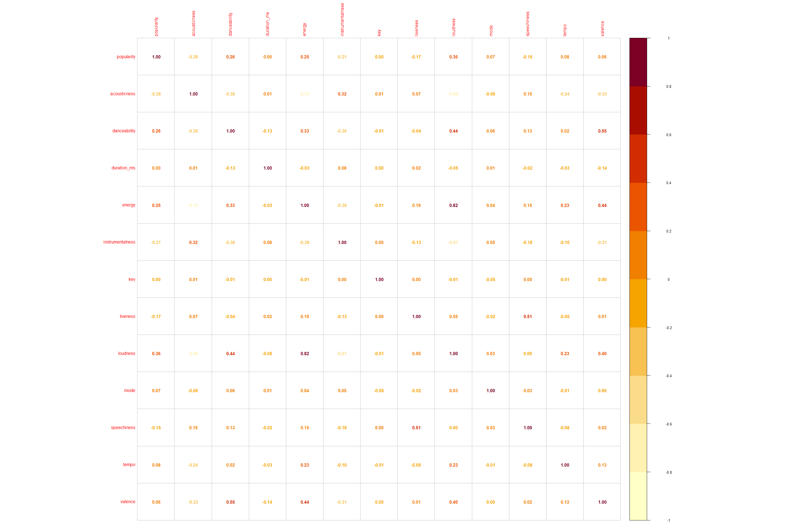

Spotify\_Data\_Track\_Analysis
================
AvaniPatil, Sushma Akoju, Armana Anand
9/23/2021

# Objective

Spotify is the worlds largest audio streaming application with services
available in more than 175 countries. With a market share of
approximately 32%, it has 365 million monthly active users, including
165 million paying subscribers, as of June 2021. A user can search for
music based on a song, artist and genre album. They can create, share,
edit playlists with other listeners all over the world. With such a
massive user base, as one would imagine Spotify data is a gold mine for
training machine learning algorithms and recommendation based systems.
As a freemium service, Spotify implements multitudes of data learning
tools and algorithms to leverage its data and create a streamlined
experience for its users, unmatched by its competitors. Our objective
with this project is to gain a deeper understanding of the Data Science
discipline by accessing this data, and doing some preliminary analysis
to come up with some conclusive observations.

We will primarily focus and attempt to understand each of the features,
their technical definitions cited here
https://developer.spotify.com/documentation/web-api/reference/\#endpoint-get-audio-features
. And we would like to see how existing human notions about music fare
against what data actually tells us about. For example, it has been
widely popular that the C\# chord is most popular in western music. We
want to find out how the features contribute to popularity.

## Organization of the Report

-   Objective
-   Methodology
    -   Web Data Collection
    -   Pre-processing
-   Analysis and Visualizations
    -   Popularity of each genre
    -   Correlation Map
    -   Correlation coefficient for each feature
    -   Popularity for each key
    -   Correlation based on feature groups
    -   Spotify tracks by Genre in the US
    -   Data summary and density distribution for all Spotify features
    -   Permutation Importances
-   Modeling the Data
    -   Linear Regression Modelling to predict popularity
    -   Linear Regression Modelling to check the linear fit
    -   Random Forest Regression Fit
-   Potential Bias and Conclusion

# Methodology

In this section, the process of data gathering and cleaning are
discussed.

## Web Data Collection

``` r
#Importing the data set

tracks <- read_csv("https://raw.githubusercontent.com/sushmaakoju/spotify-tracks-data-analysis/main/SpotifyFeatures.csv")
```

    ## Rows: 232725 Columns: 18

    ## -- Column specification --------------------------------------------------------
    ## Delimiter: ","
    ## chr  (7): genre, artist_name, track_name, track_id, key, mode, time_signature
    ## dbl (11): popularity, acousticness, danceability, duration_ms, energy, instr...

    ## 
    ## i Use `spec()` to retrieve the full column specification for this data.
    ## i Specify the column types or set `show_col_types = FALSE` to quiet this message.

``` r
head(tracks,n=10)
```

    ## # A tibble: 10 x 18
    ##    genre artist_name  track_name   track_id popularity acousticness danceability
    ##    <chr> <chr>        <chr>        <chr>         <dbl>        <dbl>        <dbl>
    ##  1 Movie Henri Salva~ C'est beau ~ 0BRjO6g~          0      0.611          0.389
    ##  2 Movie Martin & le~ Perdu d'ava~ 0BjC1Nf~          1      0.246          0.59 
    ##  3 Movie Joseph Will~ Don't Let M~ 0CoSDzo~          3      0.952          0.663
    ##  4 Movie Henri Salva~ Dis-moi Mon~ 0Gc6TVm~          0      0.703          0.24 
    ##  5 Movie Fabien Nataf Ouverture    0IuslXp~          4      0.95           0.331
    ##  6 Movie Henri Salva~ Le petit so~ 0Mf1jKa~          0      0.749          0.578
    ##  7 Movie Martin & le~ Premières r~ 0NUiKYR~          2      0.344          0.703
    ##  8 Movie Laura Mayne  Let Me Let ~ 0PbIF9Y~         15      0.939          0.416
    ##  9 Movie Chorus       Helka        0ST6uPf~          0      0.00104        0.734
    ## 10 Movie Le Club des~ Les bisous ~ 0VSqZ3K~         10      0.319          0.598
    ## # ... with 11 more variables: duration_ms <dbl>, energy <dbl>,
    ## #   instrumentalness <dbl>, key <chr>, liveness <dbl>, loudness <dbl>,
    ## #   mode <chr>, speechiness <dbl>, tempo <dbl>, time_signature <chr>,
    ## #   valence <dbl>

``` r
colnames(tracks)
```

    ##  [1] "genre"            "artist_name"      "track_name"       "track_id"        
    ##  [5] "popularity"       "acousticness"     "danceability"     "duration_ms"     
    ##  [9] "energy"           "instrumentalness" "key"              "liveness"        
    ## [13] "loudness"         "mode"             "speechiness"      "tempo"           
    ## [17] "time_signature"   "valence"

## Armana Anand Code

Downloaded from Kaggle, this data was originally sourced from Spotify
using their API.

[Here is the link to the Kaggle
dataset.](https://www.kaggle.com/tomigelo/spotify-audio-features)

The data set consists of the features of around 200k top
songs—Worldwide. Ranked by a proprietary algorithm for popularity in
2019.

Here are the features which will be measured to evaluate the data.

-   **Genre**
-   **Artist\_name**
-   **Track\_name**
-   **Track\_id**
-   **Popularity**: Scaled scaled from 0-100(Least –Most Popular)
-   **Acousticness**: Measure of how acoustic the track is. Ranges from
    0.0 to 1.0
-   **Danceability**: Measured using a mixture of song features such as
    beat strength, tempo stability, and overall tempo.
-   **Duration\_ms**
-   **Energy**: Measure from 0.0 to 1.0 and represents a perceptual
    measure of intensity and activity. Typically, energetic tracks feel
    fast, loud, and noisy.
-   **Instrumentalness**: Does it contain vocals? Range 0-1.
-   **Key**
-   **Liveness**: Detects the presence of an audience in the recording.
-   **Loudness**: Overall loudness of a track in decibels (dB). Values
    range between -55 and 5 dB.
-   **Mode**
-   **Speechiness**: Detects the presence of spoken words in a track.
-   **Tempo**: Overall estimated tempo of a track in beats per minute
    (BPM).
-   **Time\_signature**
-   **Valence**: Measure from 0.0 to 1.0 describing the musical
    positiveness conveyed by a track

More in depth information on how Spotify tags and analyses these
features can be found
[here](%22https://community.spotify.com/t5/Spotify-for-Developers/%22)

## Pre-processing

Let’s check for missing values in our data set.

``` r
#checking for missing values in the data set

colSums(is.na(tracks))
```

    ##            genre      artist_name       track_name         track_id 
    ##                0                0                0                0 
    ##       popularity     acousticness     danceability      duration_ms 
    ##                0                0                0                0 
    ##           energy instrumentalness              key         liveness 
    ##                0                0                0                0 
    ##         loudness             mode      speechiness            tempo 
    ##                0                0                0                0 
    ##   time_signature          valence 
    ##                0                0

As per above summary, there are no missing values in this data set.

``` r
# As there are no missing values, we will check for other errors.

# Let's check for distinct genre names to see if any genre is repeated.

distinct(data.frame(tracks$genre)) 
```

    ##        tracks.genre
    ## 1             Movie
    ## 2               R&B
    ## 3         A Capella
    ## 4       Alternative
    ## 5           Country
    ## 6             Dance
    ## 7        Electronic
    ## 8             Anime
    ## 9              Folk
    ## 10            Blues
    ## 11            Opera
    ## 12          Hip-Hop
    ## 13 Children's Music
    ## 14 Children’s Music
    ## 15              Rap
    ## 16            Indie
    ## 17        Classical
    ## 18              Pop
    ## 19           Reggae
    ## 20        Reggaeton
    ## 21             Jazz
    ## 22             Rock
    ## 23              Ska
    ## 24           Comedy
    ## 25             Soul
    ## 26       Soundtrack
    ## 27            World

As we can see there are two Children’s Music genre. We should rectify
this typo so that a single genre is visible.

``` r
# Rectifying typo in genre name Children's Music.

colnames(tracks)[colnames(tracks$genre) == "Children's Music"] <- "Children’s Music"

# Rechecking the distinct values.

distinct(data.frame(tracks$genre))
```

    ##        tracks.genre
    ## 1             Movie
    ## 2               R&B
    ## 3         A Capella
    ## 4       Alternative
    ## 5           Country
    ## 6             Dance
    ## 7        Electronic
    ## 8             Anime
    ## 9              Folk
    ## 10            Blues
    ## 11            Opera
    ## 12          Hip-Hop
    ## 13 Children's Music
    ## 14 Children’s Music
    ## 15              Rap
    ## 16            Indie
    ## 17        Classical
    ## 18              Pop
    ## 19           Reggae
    ## 20        Reggaeton
    ## 21             Jazz
    ## 22             Rock
    ## 23              Ska
    ## 24           Comedy
    ## 25             Soul
    ## 26       Soundtrack
    ## 27            World

``` r
#Mutate variables from numeric to factor

tracks <- tracks  %>% 
  mutate(genre = as.factor(genre),
         key = as.factor(key),
         genre = as.factor(str_replace_all(genre, "[[:punct:]]", "")),
         mode = as.factor(mode))

summary(tracks)
```

    ##              genre        artist_name         track_name       
    ##  Childrens Music: 14756   Length:232725      Length:232725     
    ##  Comedy         :  9681   Class :character   Class :character  
    ##  Soundtrack     :  9646   Mode  :character   Mode  :character  
    ##  Indie          :  9543                                        
    ##  Jazz           :  9441                                        
    ##  Pop            :  9386                                        
    ##  (Other)        :170272                                        
    ##    track_id           popularity      acousticness     danceability   
    ##  Length:232725      Min.   :  0.00   Min.   :0.0000   Min.   :0.0569  
    ##  Class :character   1st Qu.: 29.00   1st Qu.:0.0376   1st Qu.:0.4350  
    ##  Mode  :character   Median : 43.00   Median :0.2320   Median :0.5710  
    ##                     Mean   : 41.13   Mean   :0.3686   Mean   :0.5544  
    ##                     3rd Qu.: 55.00   3rd Qu.:0.7220   3rd Qu.:0.6920  
    ##                     Max.   :100.00   Max.   :0.9960   Max.   :0.9890  
    ##                                                                       
    ##   duration_ms          energy          instrumentalness         key       
    ##  Min.   :  15387   Min.   :0.0000203   Min.   :0.0000000   C      :27583  
    ##  1st Qu.: 182857   1st Qu.:0.3850000   1st Qu.:0.0000000   G      :26390  
    ##  Median : 220427   Median :0.6050000   Median :0.0000443   D      :24077  
    ##  Mean   : 235122   Mean   :0.5709577   Mean   :0.1483012   C#     :23201  
    ##  3rd Qu.: 265768   3rd Qu.:0.7870000   3rd Qu.:0.0358000   A      :22671  
    ##  Max.   :5552917   Max.   :0.9990000   Max.   :0.9990000   F      :20279  
    ##                                                            (Other):88524  
    ##     liveness          loudness          mode         speechiness    
    ##  Min.   :0.00967   Min.   :-52.457   Major:151744   Min.   :0.0222  
    ##  1st Qu.:0.09740   1st Qu.:-11.771   Minor: 80981   1st Qu.:0.0367  
    ##  Median :0.12800   Median : -7.762                  Median :0.0501  
    ##  Mean   :0.21501   Mean   : -9.570                  Mean   :0.1208  
    ##  3rd Qu.:0.26400   3rd Qu.: -5.501                  3rd Qu.:0.1050  
    ##  Max.   :1.00000   Max.   :  3.744                  Max.   :0.9670  
    ##                                                                     
    ##      tempo        time_signature        valence      
    ##  Min.   : 30.38   Length:232725      Min.   :0.0000  
    ##  1st Qu.: 92.96   Class :character   1st Qu.:0.2370  
    ##  Median :115.78   Mode  :character   Median :0.4440  
    ##  Mean   :117.67                      Mean   :0.4549  
    ##  3rd Qu.:139.05                      3rd Qu.:0.6600  
    ##  Max.   :242.90                      Max.   :1.0000  
    ## 

``` r
# Filter columns that are not presently needed for our analysis

tracks1 <- tracks %>% select(-c(track_id,time_signature))

# Glimpse data

glimpse(tracks1)
```

    ## Rows: 232,725
    ## Columns: 16
    ## $ genre            <fct> Movie, Movie, Movie, Movie, Movie, Movie, Movie, Movi~
    ## $ artist_name      <chr> "Henri Salvador", "Martin & les fées", "Joseph Willia~
    ## $ track_name       <chr> "C'est beau de faire un Show", "Perdu d'avance (par G~
    ## $ popularity       <dbl> 0, 1, 3, 0, 4, 0, 2, 15, 0, 10, 0, 2, 4, 3, 0, 0, 0, ~
    ## $ acousticness     <dbl> 0.61100, 0.24600, 0.95200, 0.70300, 0.95000, 0.74900,~
    ## $ danceability     <dbl> 0.389, 0.590, 0.663, 0.240, 0.331, 0.578, 0.703, 0.41~
    ## $ duration_ms      <dbl> 99373, 137373, 170267, 152427, 82625, 160627, 212293,~
    ## $ energy           <dbl> 0.9100, 0.7370, 0.1310, 0.3260, 0.2250, 0.0948, 0.270~
    ## $ instrumentalness <dbl> 0.00000000, 0.00000000, 0.00000000, 0.00000000, 0.123~
    ## $ key              <fct> C#, F#, C, C#, F, C#, C#, F#, C, G, E, C, F#, D#, G, ~
    ## $ liveness         <dbl> 0.3460, 0.1510, 0.1030, 0.0985, 0.2020, 0.1070, 0.105~
    ## $ loudness         <dbl> -1.828, -5.559, -13.879, -12.178, -21.150, -14.970, -~
    ## $ mode             <fct> Major, Minor, Minor, Major, Major, Major, Major, Majo~
    ## $ speechiness      <dbl> 0.0525, 0.0868, 0.0362, 0.0395, 0.0456, 0.1430, 0.953~
    ## $ tempo            <dbl> 166.969, 174.003, 99.488, 171.758, 140.576, 87.479, 8~
    ## $ valence          <dbl> 0.8140, 0.8160, 0.3680, 0.2270, 0.3900, 0.3580, 0.533~

Before we can move to visualizations and deeper analysis, lets take a
look at what the overall trend of our data is.

``` r
spotify_hist <- tracks[,-c(1,2,3,4,5,11,17)]
plot_num(spotify_hist)
```

    ## Warning: `guides(<scale> = FALSE)` is deprecated. Please use `guides(<scale> =
    ## "none")` instead.

<!-- -->

From the above it is interesting to note that danceability has a pretty
normal distribution of songs in our dataset. To no surprise, there are
not many people listening to Bach or YoYo Ma renditions of Vivaldi off
late. We can clearly see the evidence of that by looking at the tall
peak that signifies the clustering of most of our songs on the low to
zero instrumental scale. Similarly, majority of the popular songs
generally are 2- 5 mins long.

# Analysis and Visualizations

Now that we have pre-processed our data set, we can visualize basic data
to find correlations among our variables.

From our data set, we can group our data set by genre and focus on the
popularity parameter for visualization of data.

``` r
genre_popularity <- tracks %>% select(popularity, genre) %>% group_by(genre) %>% summarise("average_popularity" = round(mean(popularity)))

p <- ggplot(data=genre_popularity, mapping = aes(x = reorder(genre,average_popularity), y = average_popularity, fill = genre)) +
  geom_col() +
  coord_flip() +
  theme_minimal() +
  theme(
    legend.position = "none",
    
  ) +
  labs(
    y = "Average popularity",
    x = "Genre"
  )

p
```

<!-- -->  
We have plotted the music genre from highest popularity to lowest
popularity.

We can see that the Top 5 popular genres on spotify are -  
1. Pop  
2. Rap  
3. Rock  
4. HipHop  
5. Dance

Genres with lowest popularity on spotify.

1.  Anime
2.  Comedy
3.  Opera
4.  Movie
5.  A Capella

Let’s analyse the relationship between all numeric Spotify features now
using a correlation map.

``` r
# Plotting a correlation heat map to check correlation between all audio features.

ggcorr(tracks, low = "blue", high = "red")
```

<!-- -->

From above graph we can list out below significant observations -

1.  Energy and loudness have the highest correlation.

2.  Energy and acousticness have a highly-correlated inverse
    relationship

3.  Loudness and acousticness have a highly-correlated inverse
    relationship

4.  Some of the variables most correlated to Popularity seem to be:
    acousticness, danceability, energy, instrumentalness, and loudness.

## Avani Patil Code

Now that we are familiar with the data set attributes and the objective
of our analysis, let’s check for missing values in our data set.

``` r
# Checking for missing values in the data set

colSums(is.na(tracks))
```

    ##            genre      artist_name       track_name         track_id 
    ##                0                0                0                0 
    ##       popularity     acousticness     danceability      duration_ms 
    ##                0                0                0                0 
    ##           energy instrumentalness              key         liveness 
    ##                0                0                0                0 
    ##         loudness             mode      speechiness            tempo 
    ##                0                0                0                0 
    ##   time_signature          valence 
    ##                0                0

As per above summary, there are no missing values in this data set.

Now that we have the pre-processed data set, we can visualize basic data
to find correlations among our variables.

In our data set, we will be focusing on Popularity as our dependent
variable.  
So how is popularity actually calculated and what makes a song popular?

According to Spotify - popularity is calculated by an algorithm and is
based, in the most part, on the total number of plays the track has had
and how recently those tracks are played. Generally speaking, songs that
are being played a lot now will have a higher popularity than songs that
were played a lot in the past.

So for starters, let’s check the relationship between all the audio
features of Spotify data set to try and find some correlation between
them using th correlation heatmap mentioned above.

From above mentioned heatmap we can summarize that -

1.  ‘Energy’ and ‘loudness’ have the highest correlation, and a positive
    one, which is not very surprising as the louder a song is, the more
    energy it has.

2.  ‘Energy’ and ‘acousticness’ have a highly-correlated inverse
    relationship, which also makes total sense. The more a song skews
    towards being acoustic, the less energy value it tends to have.  
    We noticed similar inverse relationship between ‘Loudness’ and
    ‘acousticness’ as well.

Let’s sort the the data by popularity to check the top 10 popular songs.

``` r
tracks1 %>% top_n(10,popularity) %>% select(artist_name, track_name, popularity) %>% arrange(desc(popularity))
```

    ## # A tibble: 19 x 3
    ##    artist_name   track_name                                    popularity
    ##    <chr>         <chr>                                              <dbl>
    ##  1 Ariana Grande 7 rings                                              100
    ##  2 Ariana Grande 7 rings                                              100
    ##  3 Ariana Grande break up with your girlfriend, i'm bored              99
    ##  4 Post Malone   Wow.                                                  99
    ##  5 Ariana Grande break up with your girlfriend, i'm bored              99
    ##  6 Post Malone   Wow.                                                  99
    ##  7 Daddy Yankee  Con Calma                                             98
    ##  8 Daddy Yankee  Con Calma                                             98
    ##  9 Daddy Yankee  Con Calma                                             98
    ## 10 Halsey        Without Me                                            97
    ## 11 Ava Max       Sweet but Psycho                                      97
    ## 12 Post Malone   Sunflower - Spider-Man: Into the Spider-Verse         97
    ## 13 Halsey        Without Me                                            97
    ## 14 Post Malone   Sunflower - Spider-Man: Into the Spider-Verse         97
    ## 15 Halsey        Without Me                                            97
    ## 16 Sam Smith     Dancing With A Stranger (with Normani)                97
    ## 17 Marshmello    Happier                                               97
    ## 18 Ava Max       Sweet but Psycho                                      97
    ## 19 Pedro Capó    Calma - Remix                                         97

## Correlation coefficient for each feature

Now that we have plotted the correlation heat map, let’s check the
correlation coefficient values against each relationship.

``` r
# Eliminate the parameters which are not relevant to our correlation analysis and copy the same in a new df. 

tracks2 <- tracks %>% select(-c(track_id,time_signature,key,mode))

cor(tracks2[,4:14])
```

    ##                   popularity acousticness danceability duration_ms      energy
    ## popularity        1.00000000  -0.38129531   0.25656447  0.00234802  0.24892177
    ## acousticness     -0.38129531   1.00000000  -0.36454559  0.01120296 -0.72557636
    ## danceability      0.25656447  -0.36454559   1.00000000 -0.12578071  0.32580699
    ## duration_ms       0.00234802   0.01120296  -0.12578071  1.00000000 -0.03054981
    ## energy            0.24892177  -0.72557636   0.32580699 -0.03054981  1.00000000
    ## instrumentalness -0.21098311   0.31615411  -0.36494121  0.07602064 -0.37895695
    ## liveness         -0.16799519   0.06900353  -0.04168384  0.02378262  0.19280086
    ## loudness          0.36301074  -0.69020168   0.43866848 -0.04761783  0.81608797
    ## speechiness      -0.15107582   0.15093494   0.13455996 -0.01617141  0.14511980
    ## tempo             0.08103891  -0.23824736   0.02193911 -0.02845610  0.22877413
    ## valence           0.06007629  -0.32579820   0.54715402 -0.14181119  0.43677118
    ##                  instrumentalness    liveness     loudness  speechiness
    ## popularity            -0.21098311 -0.16799519  0.363010736 -0.151075818
    ## acousticness           0.31615411  0.06900353 -0.690201678  0.150934938
    ## danceability          -0.36494121 -0.04168384  0.438668484  0.134559958
    ## duration_ms            0.07602064  0.02378262 -0.047617826 -0.016171409
    ## energy                -0.37895695  0.19280086  0.816087967  0.145119802
    ## instrumentalness       1.00000000 -0.13419771 -0.506320170 -0.177147448
    ## liveness              -0.13419771  1.00000000  0.045685710  0.510146517
    ## loudness              -0.50632017  0.04568571  1.000000000 -0.002272769
    ## speechiness           -0.17714745  0.51014652 -0.002272769  1.000000000
    ## tempo                 -0.10413303 -0.05135460  0.228363652 -0.081540541
    ## valence               -0.30752185  0.01180437  0.399901355  0.023841622
    ##                        tempo     valence
    ## popularity        0.08103891  0.06007629
    ## acousticness     -0.23824736 -0.32579820
    ## danceability      0.02193911  0.54715402
    ## duration_ms      -0.02845610 -0.14181119
    ## energy            0.22877413  0.43677118
    ## instrumentalness -0.10413303 -0.30752185
    ## liveness         -0.05135460  0.01180437
    ## loudness          0.22836365  0.39990136
    ## speechiness      -0.08154054  0.02384162
    ## tempo             1.00000000  0.13485723
    ## valence           0.13485723  1.00000000

With our dependent variable being ‘popularity’, from above graph we can
note that there are poor correlation values across most of our
independent variables.  
From this correlation matrix, we can pluck five of the best features
(ones with the highest correlation) to use later on as predictors while
training our model -  
acousticness,  
danceability,  
energy,  
instrumentalness, and  
loudness.

## Popularity for each key

Now let’s compare Popularity with Key and check if we can find any
significant relationship between these two attributes.

So when it comes to western music, there are 12 keys. Let’s check the
popularity for each and every key.

``` r
# Plot keys and their popularity values.

tracks %>% group_by(key) %>% select(key, popularity) %>%
  ggplot(aes(x=as.factor(key),y=popularity,fill=as.factor(key))) +
  geom_boxplot() + theme(legend.position = "none") +
  labs(title="Popularity of Song Keys",
       x="Key", y="Popularity")
```

<!-- -->

There seems to be little differentiation between the keys and
popularity. However, one key does seem to have a larger number of
popular songs in it - C-Sharp key.

We can check this by filtering out songs where popularity is above 70 on
a scale on 100 and check how many popular songs fall under this key.

``` r
#tracks %>% filter(popularity > 70) %>% group_by(key) %>% summarize(count = n()) %>% arrange(desc(count))
```

Key 1 (which applies to c-Sharp) has more popular songs (1068 songs)
than other keys. This could be a potential predictor variable, so we
will encode a new binary variable we can use in our model.

``` r
#  Creating a new binary variable for key attribute

tracks$isKey1 <- as.integer(tracks$key == 1)
```

## Linear Regression Modelling

To warm-up, we will be starting with a simple linear regression model
and try and manipulate the predictor attributes to find the a model with
lowest Residual standard error and highest Adjusted R-squared.

Linear Model 1 (m1):

Dependent Variable - Popularity  
Predictor Variables - acousticness danceability, energy,
instrumentalness, liveness, loudness, speechiness, tempo, valence,
isKey1, energy and loudness.

``` r
m1 <- lm(popularity ~ acousticness + danceability + energy + instrumentalness + liveness + loudness + speechiness + tempo + valence + isKey1 + (energy * loudness), data=tracks)

summary(m1)
```

    ## 
    ## Call:
    ## lm(formula = popularity ~ acousticness + danceability + energy + 
    ##     instrumentalness + liveness + loudness + speechiness + tempo + 
    ##     valence + isKey1 + (energy * loudness), data = tracks)
    ## 
    ## Residuals:
    ##     Min      1Q  Median      3Q     Max 
    ## -58.073 -10.190   1.449  11.049  56.127 
    ## 
    ## Coefficients: (1 not defined because of singularities)
    ##                    Estimate Std. Error t value             Pr(>|t|)    
    ## (Intercept)       55.786296   0.336716 165.678 < 0.0000000000000002 ***
    ## acousticness     -12.008112   0.154651 -77.647 < 0.0000000000000002 ***
    ## danceability      17.896007   0.244464  73.205 < 0.0000000000000002 ***
    ## energy            -4.695025   0.304857 -15.401 < 0.0000000000000002 ***
    ## instrumentalness  -4.247604   0.133015 -31.933 < 0.0000000000000002 ***
    ## liveness          -9.481621   0.201964 -46.947 < 0.0000000000000002 ***
    ## loudness           0.683820   0.012004  56.967 < 0.0000000000000002 ***
    ## speechiness       -7.807189   0.233538 -33.430 < 0.0000000000000002 ***
    ## tempo             -0.004373   0.001118  -3.912   0.0000915725170060 ***
    ## valence          -13.297562   0.165468 -80.363 < 0.0000000000000002 ***
    ## isKey1                   NA         NA      NA                   NA    
    ## energy:loudness    0.180617   0.023932   7.547   0.0000000000000447 ***
    ## ---
    ## Signif. codes:  0 '***' 0.001 '**' 0.01 '*' 0.05 '.' 0.1 ' ' 1
    ## 
    ## Residual standard error: 15.92 on 232714 degrees of freedom
    ## Multiple R-squared:  0.2339, Adjusted R-squared:  0.2338 
    ## F-statistic:  7104 on 10 and 232714 DF,  p-value: < 0.00000000000000022

From above model, we can observe that the Adjusted R-squared is very low
and the Residual standard error is on the higher end for this model.  
Also, the key attribute is not adding up to anything in our model.

In our next modelling attempt, let’s get rid of the key attribute and
add couple of more parameters which have shown correlation among them.

Linear Model 2 (m2):

Dependent Variable - Popularity  
Predictor Variables - acousticness danceability, energy,
instrumentalness, liveness, loudness, speechiness, tempo, valence,
energy and loudness, acousticness and instrumentalness.

In this model, we have added an additional predictor acousticness and
instrumentalness.

``` r
m2 <- lm(popularity ~ acousticness + danceability + energy + instrumentalness + liveness + loudness + speechiness + tempo + valence + (energy * loudness) + (acousticness * instrumentalness), data=tracks)

summary(m2)
```

    ## 
    ## Call:
    ## lm(formula = popularity ~ acousticness + danceability + energy + 
    ##     instrumentalness + liveness + loudness + speechiness + tempo + 
    ##     valence + (energy * loudness) + (acousticness * instrumentalness), 
    ##     data = tracks)
    ## 
    ## Residuals:
    ##     Min      1Q  Median      3Q     Max 
    ## -58.721  -9.951   1.316  10.908  56.072 
    ## 
    ## Coefficients:
    ##                                 Estimate Std. Error t value
    ## (Intercept)                    58.290825   0.336710 173.119
    ## acousticness                  -15.002658   0.161330 -92.994
    ## danceability                   18.052361   0.242599  74.412
    ## energy                         -7.971595   0.307375 -25.934
    ## instrumentalness              -14.202184   0.211638 -67.106
    ## liveness                       -8.856882   0.200681 -44.134
    ## loudness                        0.867896   0.012298  70.572
    ## speechiness                    -7.403721   0.231840 -31.935
    ## tempo                          -0.003738   0.001109  -3.369
    ## valence                       -13.573857   0.164261 -82.636
    ## energy:loudness                -0.252460   0.024815 -10.174
    ## acousticness:instrumentalness  18.970531   0.315269  60.173
    ##                                           Pr(>|t|)    
    ## (Intercept)                   < 0.0000000000000002 ***
    ## acousticness                  < 0.0000000000000002 ***
    ## danceability                  < 0.0000000000000002 ***
    ## energy                        < 0.0000000000000002 ***
    ## instrumentalness              < 0.0000000000000002 ***
    ## liveness                      < 0.0000000000000002 ***
    ## loudness                      < 0.0000000000000002 ***
    ## speechiness                   < 0.0000000000000002 ***
    ## tempo                                     0.000755 ***
    ## valence                       < 0.0000000000000002 ***
    ## energy:loudness               < 0.0000000000000002 ***
    ## acousticness:instrumentalness < 0.0000000000000002 ***
    ## ---
    ## Signif. codes:  0 '***' 0.001 '**' 0.01 '*' 0.05 '.' 0.1 ' ' 1
    ## 
    ## Residual standard error: 15.8 on 232713 degrees of freedom
    ## Multiple R-squared:  0.2456, Adjusted R-squared:  0.2456 
    ## F-statistic:  6888 on 11 and 232713 DF,  p-value: < 0.00000000000000022

In above model, we can see that the Adjusted R-squared is has increased
from 0.2338 to 0.2456 and the Residual standard error has decreased from
15.92 to 15.8.  
However, the updated Adjusted R-squared is still quite low.

Let’s try and improve the model further by adding for correlation
predictors.

Linear Model 3 (m3):

Dependent Variable - Popularity  
Predictor Variables - acousticness danceability, energy,
instrumentalness, liveness, loudness, speechiness, tempo, valence,
energy and loudness, acousticness and instrumentalness, energy and
danceability.

In this model, we have added an additional predictor energy and
danceability.

``` r
m3 <- lm(popularity ~ acousticness + danceability + energy + instrumentalness + liveness + loudness + speechiness + tempo + valence + (energy * loudness) + (acousticness * instrumentalness) + (energy * danceability), data=tracks)

summary(m3)
```

    ## 
    ## Call:
    ## lm(formula = popularity ~ acousticness + danceability + energy + 
    ##     instrumentalness + liveness + loudness + speechiness + tempo + 
    ##     valence + (energy * loudness) + (acousticness * instrumentalness) + 
    ##     (energy * danceability), data = tracks)
    ## 
    ## Residuals:
    ##     Min      1Q  Median      3Q     Max 
    ## -59.368  -9.970   1.293  10.917  56.801 
    ## 
    ## Coefficients:
    ##                                  Estimate  Std. Error t value
    ## (Intercept)                    62.3343933   0.4171325 149.435
    ## acousticness                  -15.1516901   0.1614924 -93.823
    ## danceability                   11.0487426   0.4909714  22.504
    ## energy                        -16.0219339   0.5789554 -27.674
    ## instrumentalness              -14.1442256   0.2115453 -66.861
    ## liveness                       -8.7826321   0.2006162 -43.778
    ## loudness                        0.9388640   0.0130301  72.053
    ## speechiness                    -7.1087332   0.2324033 -30.588
    ## tempo                          -0.0009986   0.0011213  -0.891
    ## valence                       -13.5071933   0.1642163 -82.252
    ## energy:loudness                -0.3752865   0.0259063 -14.486
    ## acousticness:instrumentalness  18.5180796   0.3162925  58.547
    ## danceability:energy            12.8862781   0.7855224  16.405
    ##                                          Pr(>|t|)    
    ## (Intercept)                   <0.0000000000000002 ***
    ## acousticness                  <0.0000000000000002 ***
    ## danceability                  <0.0000000000000002 ***
    ## energy                        <0.0000000000000002 ***
    ## instrumentalness              <0.0000000000000002 ***
    ## liveness                      <0.0000000000000002 ***
    ## loudness                      <0.0000000000000002 ***
    ## speechiness                   <0.0000000000000002 ***
    ## tempo                                       0.373    
    ## valence                       <0.0000000000000002 ***
    ## energy:loudness               <0.0000000000000002 ***
    ## acousticness:instrumentalness <0.0000000000000002 ***
    ## danceability:energy           <0.0000000000000002 ***
    ## ---
    ## Signif. codes:  0 '***' 0.001 '**' 0.01 '*' 0.05 '.' 0.1 ' ' 1
    ## 
    ## Residual standard error: 15.79 on 232712 degrees of freedom
    ## Multiple R-squared:  0.2465, Adjusted R-squared:  0.2464 
    ## F-statistic:  6344 on 12 and 232712 DF,  p-value: < 0.00000000000000022

In above model, we can see that the Adjusted R-squared is has increased
from 0.2456 to 0.2464 and the Residual standard error has decreased from
15.8 to 15.79.

We’ll chose the model m3 as it has the best fit (R-Squared) to the data
compared to other models.

Let’s plot model m3 using residual plot and QQ plot.

``` r
# Plotting residual plot for Model 3

am3 <- augment(m3)

am3 %>% ggplot(aes(x=.fitted,y=.resid)) +
  geom_point(alpha=0.1) + geom_hline(yintercept=0) +
  labs(title="Residual Plot")
```

<!-- -->

``` r
# Plotting QQ plot for Model 3

am3 %>% ggplot(aes(sample=.std.resid)) +
  geom_qq() + geom_qq_line() +
  labs(title="QQ Plot")
```

<!-- -->

The residual plot has a definite pattern however, the QQ plot shows that
our residuals aren’t exactly normal throughout the range of samples.

Given the low Adjusted R-squared, and unusual patterns in the residuals,
the models we’ve created seem like they are unsuitable for predicting a
song’s popularity on Spotify.

## Sushma Akoju Code

Goal :  
We primarily focus and attempt to understand each of the features, their
technical definitions cited here
https://developer.spotify.com/documentation/web-api/reference/\#endpoint-get-audio-features
. we would like to see how existing human notions about music fare
against what data actually tells us about. For example, it has been
widely popular that the C\# chord is most popular in western music. We
want to find out how the features contribute to popularity.

Example: “My favorite things” song from “The Sound of music” movie which
was very popular back in 1960s and still considered a classic is
unfortunately has a popularity score of zero while a modern,
contemporary version inspired from the same song and rewritten with
different lyrics and named as “7 rings” by Ariana Grande, has a
popularity score of 100.

##### check few quick summaries for dataframe

``` r
head(tracks)
```

    ## # A tibble: 6 x 19
    ##   genre artist_name  track_name   track_id  popularity acousticness danceability
    ##   <fct> <chr>        <chr>        <chr>          <dbl>        <dbl>        <dbl>
    ## 1 Movie Henri Salva~ C'est beau ~ 0BRjO6ga~          0        0.611        0.389
    ## 2 Movie Martin & le~ Perdu d'ava~ 0BjC1Nfo~          1        0.246        0.59 
    ## 3 Movie Joseph Will~ Don't Let M~ 0CoSDzoN~          3        0.952        0.663
    ## 4 Movie Henri Salva~ Dis-moi Mon~ 0Gc6TVm5~          0        0.703        0.24 
    ## 5 Movie Fabien Nataf Ouverture    0IuslXpM~          4        0.95         0.331
    ## 6 Movie Henri Salva~ Le petit so~ 0Mf1jKa8~          0        0.749        0.578
    ## # ... with 12 more variables: duration_ms <dbl>, energy <dbl>,
    ## #   instrumentalness <dbl>, key <fct>, liveness <dbl>, loudness <dbl>,
    ## #   mode <fct>, speechiness <dbl>, tempo <dbl>, time_signature <chr>,
    ## #   valence <dbl>, isKey1 <int>

``` r
colSums(is.na(tracks))
```

    ##            genre      artist_name       track_name         track_id 
    ##                0                0                0                0 
    ##       popularity     acousticness     danceability      duration_ms 
    ##                0                0                0                0 
    ##           energy instrumentalness              key         liveness 
    ##                0                0                0                0 
    ##         loudness             mode      speechiness            tempo 
    ##                0                0                0                0 
    ##   time_signature          valence           isKey1 
    ##                0                0                0

``` r
head( tracks)
```

    ## # A tibble: 6 x 19
    ##   genre artist_name  track_name   track_id  popularity acousticness danceability
    ##   <fct> <chr>        <chr>        <chr>          <dbl>        <dbl>        <dbl>
    ## 1 Movie Henri Salva~ C'est beau ~ 0BRjO6ga~          0        0.611        0.389
    ## 2 Movie Martin & le~ Perdu d'ava~ 0BjC1Nfo~          1        0.246        0.59 
    ## 3 Movie Joseph Will~ Don't Let M~ 0CoSDzoN~          3        0.952        0.663
    ## 4 Movie Henri Salva~ Dis-moi Mon~ 0Gc6TVm5~          0        0.703        0.24 
    ## 5 Movie Fabien Nataf Ouverture    0IuslXpM~          4        0.95         0.331
    ## 6 Movie Henri Salva~ Le petit so~ 0Mf1jKa8~          0        0.749        0.578
    ## # ... with 12 more variables: duration_ms <dbl>, energy <dbl>,
    ## #   instrumentalness <dbl>, key <fct>, liveness <dbl>, loudness <dbl>,
    ## #   mode <fct>, speechiness <dbl>, tempo <dbl>, time_signature <chr>,
    ## #   valence <dbl>, isKey1 <int>

``` r
glimpse(tracks)
```

    ## Rows: 232,725
    ## Columns: 19
    ## $ genre            <fct> Movie, Movie, Movie, Movie, Movie, Movie, Movie, Movi~
    ## $ artist_name      <chr> "Henri Salvador", "Martin & les fées", "Joseph Willia~
    ## $ track_name       <chr> "C'est beau de faire un Show", "Perdu d'avance (par G~
    ## $ track_id         <chr> "0BRjO6ga9RKCKjfDqeFgWV", "0BjC1NfoEOOusryehmNudP", "~
    ## $ popularity       <dbl> 0, 1, 3, 0, 4, 0, 2, 15, 0, 10, 0, 2, 4, 3, 0, 0, 0, ~
    ## $ acousticness     <dbl> 0.61100, 0.24600, 0.95200, 0.70300, 0.95000, 0.74900,~
    ## $ danceability     <dbl> 0.389, 0.590, 0.663, 0.240, 0.331, 0.578, 0.703, 0.41~
    ## $ duration_ms      <dbl> 99373, 137373, 170267, 152427, 82625, 160627, 212293,~
    ## $ energy           <dbl> 0.9100, 0.7370, 0.1310, 0.3260, 0.2250, 0.0948, 0.270~
    ## $ instrumentalness <dbl> 0.00000000, 0.00000000, 0.00000000, 0.00000000, 0.123~
    ## $ key              <fct> C#, F#, C, C#, F, C#, C#, F#, C, G, E, C, F#, D#, G, ~
    ## $ liveness         <dbl> 0.3460, 0.1510, 0.1030, 0.0985, 0.2020, 0.1070, 0.105~
    ## $ loudness         <dbl> -1.828, -5.559, -13.879, -12.178, -21.150, -14.970, -~
    ## $ mode             <fct> Major, Minor, Minor, Major, Major, Major, Major, Majo~
    ## $ speechiness      <dbl> 0.0525, 0.0868, 0.0362, 0.0395, 0.0456, 0.1430, 0.953~
    ## $ tempo            <dbl> 166.969, 174.003, 99.488, 171.758, 140.576, 87.479, 8~
    ## $ time_signature   <chr> "4/4", "4/4", "5/4", "4/4", "4/4", "4/4", "4/4", "4/4~
    ## $ valence          <dbl> 0.8140, 0.8160, 0.3680, 0.2270, 0.3900, 0.3580, 0.533~
    ## $ isKey1           <int> 0, 0, 0, 0, 0, 0, 0, 0, 0, 0, 0, 0, 0, 0, 0, 0, 0, 0,~

## Including Plots

Some genres are duplicated. (encoding mismatches).

``` r
na.omit(tracks)
```

    ## # A tibble: 232,725 x 19
    ##    genre artist_name  track_name   track_id popularity acousticness danceability
    ##    <fct> <chr>        <chr>        <chr>         <dbl>        <dbl>        <dbl>
    ##  1 Movie Henri Salva~ C'est beau ~ 0BRjO6g~          0      0.611          0.389
    ##  2 Movie Martin & le~ Perdu d'ava~ 0BjC1Nf~          1      0.246          0.59 
    ##  3 Movie Joseph Will~ Don't Let M~ 0CoSDzo~          3      0.952          0.663
    ##  4 Movie Henri Salva~ Dis-moi Mon~ 0Gc6TVm~          0      0.703          0.24 
    ##  5 Movie Fabien Nataf Ouverture    0IuslXp~          4      0.95           0.331
    ##  6 Movie Henri Salva~ Le petit so~ 0Mf1jKa~          0      0.749          0.578
    ##  7 Movie Martin & le~ Premières r~ 0NUiKYR~          2      0.344          0.703
    ##  8 Movie Laura Mayne  Let Me Let ~ 0PbIF9Y~         15      0.939          0.416
    ##  9 Movie Chorus       Helka        0ST6uPf~          0      0.00104        0.734
    ## 10 Movie Le Club des~ Les bisous ~ 0VSqZ3K~         10      0.319          0.598
    ## # ... with 232,715 more rows, and 12 more variables: duration_ms <dbl>,
    ## #   energy <dbl>, instrumentalness <dbl>, key <fct>, liveness <dbl>,
    ## #   loudness <dbl>, mode <fct>, speechiness <dbl>, tempo <dbl>,
    ## #   time_signature <chr>, valence <dbl>, isKey1 <int>

``` r
genres <- distinct(tracks, genre)$genre
genres
```

    ##  [1] Movie           RB              A Capella       Alternative    
    ##  [5] Country         Dance           Electronic      Anime          
    ##  [9] Folk            Blues           Opera           HipHop         
    ## [13] Childrens Music Rap             Indie           Classical      
    ## [17] Pop             Reggae          Reggaeton       Jazz           
    ## [21] Rock            Ska             Comedy          Soul           
    ## [25] Soundtrack      World          
    ## 26 Levels: A Capella Alternative Anime Blues Childrens Music ... World

``` r
tracks[!duplicated(tracks$track_id),]
```

    ## # A tibble: 176,774 x 19
    ##    genre artist_name  track_name   track_id popularity acousticness danceability
    ##    <fct> <chr>        <chr>        <chr>         <dbl>        <dbl>        <dbl>
    ##  1 Movie Henri Salva~ C'est beau ~ 0BRjO6g~          0      0.611          0.389
    ##  2 Movie Martin & le~ Perdu d'ava~ 0BjC1Nf~          1      0.246          0.59 
    ##  3 Movie Joseph Will~ Don't Let M~ 0CoSDzo~          3      0.952          0.663
    ##  4 Movie Henri Salva~ Dis-moi Mon~ 0Gc6TVm~          0      0.703          0.24 
    ##  5 Movie Fabien Nataf Ouverture    0IuslXp~          4      0.95           0.331
    ##  6 Movie Henri Salva~ Le petit so~ 0Mf1jKa~          0      0.749          0.578
    ##  7 Movie Martin & le~ Premières r~ 0NUiKYR~          2      0.344          0.703
    ##  8 Movie Laura Mayne  Let Me Let ~ 0PbIF9Y~         15      0.939          0.416
    ##  9 Movie Chorus       Helka        0ST6uPf~          0      0.00104        0.734
    ## 10 Movie Le Club des~ Les bisous ~ 0VSqZ3K~         10      0.319          0.598
    ## # ... with 176,764 more rows, and 12 more variables: duration_ms <dbl>,
    ## #   energy <dbl>, instrumentalness <dbl>, key <fct>, liveness <dbl>,
    ## #   loudness <dbl>, mode <fct>, speechiness <dbl>, tempo <dbl>,
    ## #   time_signature <chr>, valence <dbl>, isKey1 <int>

``` r
genres <- distinct(tracks, genre)$genre
```

Convert character format columns: key and mode to numeric values.

``` r
unique(tracks$key)
```

    ##  [1] C# F# C  F  G  E  D# G# D  A# A  B 
    ## Levels: A A# B C C# D D# E F F# G G#

``` r
unique(as.numeric(as.factor(tracks$key)))
```

    ##  [1]  5 10  4  9 11  8  7 12  6  2  1  3

``` r
tracks$key <- as.numeric(as.factor(tracks$key))

unique(tracks$mode)
```

    ## [1] Major Minor
    ## Levels: Major Minor

``` r
unique(as.numeric(as.factor(tracks$mode)))
```

    ## [1] 1 2

``` r
tracks$mode <- as.numeric(as.factor(tracks$mode))
```

Get all numeric columns from the dataframe.

``` r
str(tracks)
```

    ## spec_tbl_df [232,725 x 19] (S3: spec_tbl_df/tbl_df/tbl/data.frame)
    ##  $ genre           : Factor w/ 26 levels "A Capella","Alternative",..: 15 15 15 15 15 15 15 15 15 15 ...
    ##  $ artist_name     : chr [1:232725] "Henri Salvador" "Martin & les fées" "Joseph Williams" "Henri Salvador" ...
    ##  $ track_name      : chr [1:232725] "C'est beau de faire un Show" "Perdu d'avance (par Gad Elmaleh)" "Don't Let Me Be Lonely Tonight" "Dis-moi Monsieur Gordon Cooper" ...
    ##  $ track_id        : chr [1:232725] "0BRjO6ga9RKCKjfDqeFgWV" "0BjC1NfoEOOusryehmNudP" "0CoSDzoNIKCRs124s9uTVy" "0Gc6TVm52BwZD07Ki6tIvf" ...
    ##  $ popularity      : num [1:232725] 0 1 3 0 4 0 2 15 0 10 ...
    ##  $ acousticness    : num [1:232725] 0.611 0.246 0.952 0.703 0.95 0.749 0.344 0.939 0.00104 0.319 ...
    ##  $ danceability    : num [1:232725] 0.389 0.59 0.663 0.24 0.331 0.578 0.703 0.416 0.734 0.598 ...
    ##  $ duration_ms     : num [1:232725] 99373 137373 170267 152427 82625 ...
    ##  $ energy          : num [1:232725] 0.91 0.737 0.131 0.326 0.225 0.0948 0.27 0.269 0.481 0.705 ...
    ##  $ instrumentalness: num [1:232725] 0 0 0 0 0.123 0 0 0 0.00086 0.00125 ...
    ##  $ key             : num [1:232725] 5 10 4 5 9 5 5 10 4 11 ...
    ##  $ liveness        : num [1:232725] 0.346 0.151 0.103 0.0985 0.202 0.107 0.105 0.113 0.0765 0.349 ...
    ##  $ loudness        : num [1:232725] -1.83 -5.56 -13.88 -12.18 -21.15 ...
    ##  $ mode            : num [1:232725] 1 2 2 1 1 1 1 1 1 1 ...
    ##  $ speechiness     : num [1:232725] 0.0525 0.0868 0.0362 0.0395 0.0456 0.143 0.953 0.0286 0.046 0.0281 ...
    ##  $ tempo           : num [1:232725] 167 174 99.5 171.8 140.6 ...
    ##  $ time_signature  : chr [1:232725] "4/4" "4/4" "5/4" "4/4" ...
    ##  $ valence         : num [1:232725] 0.814 0.816 0.368 0.227 0.39 0.358 0.533 0.274 0.765 0.718 ...
    ##  $ isKey1          : int [1:232725] 0 0 0 0 0 0 0 0 0 0 ...
    ##  - attr(*, "spec")=
    ##   .. cols(
    ##   ..   genre = col_character(),
    ##   ..   artist_name = col_character(),
    ##   ..   track_name = col_character(),
    ##   ..   track_id = col_character(),
    ##   ..   popularity = col_double(),
    ##   ..   acousticness = col_double(),
    ##   ..   danceability = col_double(),
    ##   ..   duration_ms = col_double(),
    ##   ..   energy = col_double(),
    ##   ..   instrumentalness = col_double(),
    ##   ..   key = col_character(),
    ##   ..   liveness = col_double(),
    ##   ..   loudness = col_double(),
    ##   ..   mode = col_character(),
    ##   ..   speechiness = col_double(),
    ##   ..   tempo = col_double(),
    ##   ..   time_signature = col_character(),
    ##   ..   valence = col_double()
    ##   .. )
    ##  - attr(*, "problems")=<externalptr>

``` r
columns <- colnames(tracks)
columns
```

    ##  [1] "genre"            "artist_name"      "track_name"       "track_id"        
    ##  [5] "popularity"       "acousticness"     "danceability"     "duration_ms"     
    ##  [9] "energy"           "instrumentalness" "key"              "liveness"        
    ## [13] "loudness"         "mode"             "speechiness"      "tempo"           
    ## [17] "time_signature"   "valence"          "isKey1"

``` r
numeric_columns <- unlist(lapply(tracks, is.numeric))
numeric_columns
```

    ##            genre      artist_name       track_name         track_id 
    ##            FALSE            FALSE            FALSE            FALSE 
    ##       popularity     acousticness     danceability      duration_ms 
    ##             TRUE             TRUE             TRUE             TRUE 
    ##           energy instrumentalness              key         liveness 
    ##             TRUE             TRUE             TRUE             TRUE 
    ##         loudness             mode      speechiness            tempo 
    ##             TRUE             TRUE             TRUE             TRUE 
    ##   time_signature          valence           isKey1 
    ##            FALSE             TRUE             TRUE

``` r
numeric_spotifydf <- tracks[,numeric_columns] %>% select (-c(isKey1))
colnames(numeric_spotifydf)
```

    ##  [1] "popularity"       "acousticness"     "danceability"     "duration_ms"     
    ##  [5] "energy"           "instrumentalness" "key"              "liveness"        
    ##  [9] "loudness"         "mode"             "speechiness"      "tempo"           
    ## [13] "valence"

## Correlation based on feature groups

Use Corrplot and stats library to plot correlation based on feature
groups, numeric plots.

Found this library more helpful to group into clusters for higher or
similar correlation between features.

``` r
corr_df2 <- stats::cor(numeric_spotifydf)
col3 = hcl.colors(10, "YlOrRd", rev = TRUE)
corr1 <- corrplot(corr_df2, col=col3, method = 'number')
```

<!-- -->

There is a high correlation between energy and loudness features and
similarly there is a second highest correlation between valence and
danceability where valence is positiveness or negativeness of a track
defined by (cheerful vs sad, depressive tune, lyrics)

## Spotify tracks by Genre in the US

For each feature, plot grouping w.r.t Popularity.

``` r
genres_df <- tracks %>%
   select(popularity, genre)%>%
    count(popularity, genre)
by_genres <- tracks %>% group_by(genre, popularity)
by_genres %>% summarise(
  popularity = mean(popularity),
)
```

    ## `summarise()` has grouped output by 'genre'. You can override using the `.groups` argument.

    ## # A tibble: 1,802 x 2
    ## # Groups:   genre [26]
    ##    genre     popularity
    ##    <fct>          <dbl>
    ##  1 A Capella          0
    ##  2 A Capella          1
    ##  3 A Capella          2
    ##  4 A Capella          3
    ##  5 A Capella          4
    ##  6 A Capella          5
    ##  7 A Capella          6
    ##  8 A Capella          7
    ##  9 A Capella          8
    ## 10 A Capella          9
    ## # ... with 1,792 more rows

``` r
by_genre <- by_genres %>% summarise(n = n())
```

    ## `summarise()` has grouped output by 'genre'. You can override using the `.groups` argument.

``` r
by_genre %>% summarise(n = sum(n)) %>% filter(n>0)
```

    ## # A tibble: 26 x 2
    ##    genre               n
    ##    <fct>           <int>
    ##  1 A Capella         119
    ##  2 Alternative      9263
    ##  3 Anime            8936
    ##  4 Blues            9023
    ##  5 Childrens Music 14756
    ##  6 Classical        9256
    ##  7 Comedy           9681
    ##  8 Country          8664
    ##  9 Dance            8701
    ## 10 Electronic       9377
    ## # ... with 16 more rows

``` r
#vtree(genres_df, "genre")
colnames(by_genre)
```

    ## [1] "genre"      "popularity" "n"

``` r
ggplot(genres_df)+
  geom_point(aes(x = genre, y= n))
```

<!-- -->

``` r
genres_df %>% ggplot(aes(x = genre, y= n))+
  geom_line(aes(color = "genre")) 
```

<!-- -->

``` r
ggplot(data=by_genre,aes(x = genre, y = n, fill=genre)) +
  geom_bar(stat="identity", width=0.5,  position=position_dodge())+
coord_flip()+
    labs(title = "Spotify tracks by Genre in US", y= NULL)
```

<!-- -->

Group by Genres and select all features except text based features.

``` r
genres_df <- tracks %>%
  select(-c(artist_name, track_name, track_id, time_signature, key))
```

## Data summary and density distribution for all spotify features

Each of features do seem to have different types of density, suggesting
distributions are different from each other. It would have been nice if
some normalization technique or re-sampling of features was done. But in
the interest of time, we could not do this. From the above density
plots, it would be reasonable to find some kind of normalization between
feature data.

``` r
spotify_summary <- datasummary_skim(numeric_spotifydf)
spotify_summary
```

<table class="table" style="width: auto !important; margin-left: auto; margin-right: auto;">
<thead>
<tr>
<th style="text-align:left;">
</th>
<th style="text-align:right;">
Unique (\#)
</th>
<th style="text-align:right;">
Missing (%)
</th>
<th style="text-align:right;">
Mean
</th>
<th style="text-align:right;">
SD
</th>
<th style="text-align:right;">
Min
</th>
<th style="text-align:right;">
Median
</th>
<th style="text-align:right;">
Max
</th>
<th style="text-align:right;">
</th>
</tr>
</thead>
<tbody>
<tr>
<td style="text-align:left;">
popularity
</td>
<td style="text-align:right;">
101
</td>
<td style="text-align:right;">
0
</td>
<td style="text-align:right;">
41.1
</td>
<td style="text-align:right;">
18.2
</td>
<td style="text-align:right;">
0.0
</td>
<td style="text-align:right;">
43.0
</td>
<td style="text-align:right;">
100.0
</td>
<td style="text-align:right;">
<svg xmlns="http://www.w3.org/2000/svg" xmlns:xlink="http://www.w3.org/1999/xlink" class="svglite" width="48.00pt" height="12.00pt" viewBox="0 0 48.00 12.00">
<defs>
<style type="text/css">
    .svglite line, .svglite polyline, .svglite polygon, .svglite path, .svglite rect, .svglite circle {
      fill: none;
      stroke: #000000;
      stroke-linecap: round;
      stroke-linejoin: round;
      stroke-miterlimit: 10.00;
    }
  </style>
</defs><rect width="100%" height="100%" style="stroke: none; fill: none;"></rect><defs><clipPath id="cpMC4wMHw0OC4wMHwwLjAwfDEyLjAw"><rect x="0.00" y="0.00" width="48.00" height="12.00"></rect></clipPath></defs><g clip-path="url(#cpMC4wMHw0OC4wMHwwLjAwfDEyLjAw)">  
</g><defs><clipPath id="cpMC4wMHw0OC4wMHwyLjg4fDEyLjAw"><rect x="0.00" y="2.88" width="48.00" height="9.12"></rect></clipPath></defs><g clip-path="url(#cpMC4wMHw0OC4wMHwyLjg4fDEyLjAw)"><rect x="1.78" y="8.06" width="2.22" height="3.61" style="stroke-width: 0.38; fill: #000000;"></rect><rect x="4.00" y="10.12" width="2.22" height="1.54" style="stroke-width: 0.38; fill: #000000;"></rect><rect x="6.22" y="9.07" width="2.22" height="2.59" style="stroke-width: 0.38; fill: #000000;"></rect><rect x="8.44" y="8.81" width="2.22" height="2.85" style="stroke-width: 0.38; fill: #000000;"></rect><rect x="10.67" y="7.28" width="2.22" height="4.39" style="stroke-width: 0.38; fill: #000000;"></rect><rect x="12.89" y="5.68" width="2.22" height="5.98" style="stroke-width: 0.38; fill: #000000;"></rect><rect x="15.11" y="5.11" width="2.22" height="6.55" style="stroke-width: 0.38; fill: #000000;"></rect><rect x="17.33" y="4.83" width="2.22" height="6.83" style="stroke-width: 0.38; fill: #000000;"></rect><rect x="19.56" y="4.29" width="2.22" height="7.37" style="stroke-width: 0.38; fill: #000000;"></rect><rect x="21.78" y="3.39" width="2.22" height="8.28" style="stroke-width: 0.38; fill: #000000;"></rect><rect x="24.00" y="3.22" width="2.22" height="8.44" style="stroke-width: 0.38; fill: #000000;"></rect><rect x="26.22" y="4.74" width="2.22" height="6.92" style="stroke-width: 0.38; fill: #000000;"></rect><rect x="28.44" y="6.57" width="2.22" height="5.09" style="stroke-width: 0.38; fill: #000000;"></rect><rect x="30.67" y="8.60" width="2.22" height="3.06" style="stroke-width: 0.38; fill: #000000;"></rect><rect x="32.89" y="10.16" width="2.22" height="1.50" style="stroke-width: 0.38; fill: #000000;"></rect><rect x="35.11" y="11.02" width="2.22" height="0.64" style="stroke-width: 0.38; fill: #000000;"></rect><rect x="37.33" y="11.45" width="2.22" height="0.22" style="stroke-width: 0.38; fill: #000000;"></rect><rect x="39.56" y="11.59" width="2.22" height="0.072" style="stroke-width: 0.38; fill: #000000;"></rect><rect x="41.78" y="11.64" width="2.22" height="0.026" style="stroke-width: 0.38; fill: #000000;"></rect><rect x="44.00" y="11.65" width="2.22" height="0.0088" style="stroke-width: 0.38; fill: #000000;"></rect></g>
</svg>
</td>
</tr>
<tr>
<td style="text-align:left;">
acousticness
</td>
<td style="text-align:right;">
4734
</td>
<td style="text-align:right;">
0
</td>
<td style="text-align:right;">
0.4
</td>
<td style="text-align:right;">
0.4
</td>
<td style="text-align:right;">
0.0
</td>
<td style="text-align:right;">
0.2
</td>
<td style="text-align:right;">
1.0
</td>
<td style="text-align:right;">
<svg xmlns="http://www.w3.org/2000/svg" xmlns:xlink="http://www.w3.org/1999/xlink" class="svglite" width="48.00pt" height="12.00pt" viewBox="0 0 48.00 12.00">
<defs>
<style type="text/css">
    .svglite line, .svglite polyline, .svglite polygon, .svglite path, .svglite rect, .svglite circle {
      fill: none;
      stroke: #000000;
      stroke-linecap: round;
      stroke-linejoin: round;
      stroke-miterlimit: 10.00;
    }
  </style>
</defs><rect width="100%" height="100%" style="stroke: none; fill: none;"></rect><defs><clipPath id="cpMC4wMHw0OC4wMHwwLjAwfDEyLjAw"><rect x="0.00" y="0.00" width="48.00" height="12.00"></rect></clipPath></defs><g clip-path="url(#cpMC4wMHw0OC4wMHwwLjAwfDEyLjAw)">  
</g><defs><clipPath id="cpMC4wMHw0OC4wMHwyLjg4fDEyLjAw"><rect x="0.00" y="2.88" width="48.00" height="9.12"></rect></clipPath></defs><g clip-path="url(#cpMC4wMHw0OC4wMHwyLjg4fDEyLjAw)"><rect x="1.78" y="3.22" width="2.23" height="8.44" style="stroke-width: 0.38; fill: #000000;"></rect><rect x="4.01" y="9.06" width="2.23" height="2.61" style="stroke-width: 0.38; fill: #000000;"></rect><rect x="6.24" y="9.83" width="2.23" height="1.83" style="stroke-width: 0.38; fill: #000000;"></rect><rect x="8.47" y="10.21" width="2.23" height="1.45" style="stroke-width: 0.38; fill: #000000;"></rect><rect x="10.70" y="10.45" width="2.23" height="1.21" style="stroke-width: 0.38; fill: #000000;"></rect><rect x="12.93" y="10.64" width="2.23" height="1.03" style="stroke-width: 0.38; fill: #000000;"></rect><rect x="15.16" y="10.75" width="2.23" height="0.91" style="stroke-width: 0.38; fill: #000000;"></rect><rect x="17.40" y="10.86" width="2.23" height="0.81" style="stroke-width: 0.38; fill: #000000;"></rect><rect x="19.63" y="10.92" width="2.23" height="0.74" style="stroke-width: 0.38; fill: #000000;"></rect><rect x="21.86" y="10.97" width="2.23" height="0.69" style="stroke-width: 0.38; fill: #000000;"></rect><rect x="24.09" y="11.00" width="2.23" height="0.66" style="stroke-width: 0.38; fill: #000000;"></rect><rect x="26.32" y="11.03" width="2.23" height="0.64" style="stroke-width: 0.38; fill: #000000;"></rect><rect x="28.55" y="11.00" width="2.23" height="0.66" style="stroke-width: 0.38; fill: #000000;"></rect><rect x="30.78" y="10.98" width="2.23" height="0.68" style="stroke-width: 0.38; fill: #000000;"></rect><rect x="33.01" y="10.88" width="2.23" height="0.78" style="stroke-width: 0.38; fill: #000000;"></rect><rect x="35.24" y="10.73" width="2.23" height="0.93" style="stroke-width: 0.38; fill: #000000;"></rect><rect x="37.48" y="10.59" width="2.23" height="1.08" style="stroke-width: 0.38; fill: #000000;"></rect><rect x="39.71" y="10.47" width="2.23" height="1.19" style="stroke-width: 0.38; fill: #000000;"></rect><rect x="41.94" y="10.28" width="2.23" height="1.38" style="stroke-width: 0.38; fill: #000000;"></rect><rect x="44.17" y="9.14" width="2.23" height="2.53" style="stroke-width: 0.38; fill: #000000;"></rect></g>
</svg>
</td>
</tr>
<tr>
<td style="text-align:left;">
danceability
</td>
<td style="text-align:right;">
1295
</td>
<td style="text-align:right;">
0
</td>
<td style="text-align:right;">
0.6
</td>
<td style="text-align:right;">
0.2
</td>
<td style="text-align:right;">
0.1
</td>
<td style="text-align:right;">
0.6
</td>
<td style="text-align:right;">
1.0
</td>
<td style="text-align:right;">
<svg xmlns="http://www.w3.org/2000/svg" xmlns:xlink="http://www.w3.org/1999/xlink" class="svglite" width="48.00pt" height="12.00pt" viewBox="0 0 48.00 12.00">
<defs>
<style type="text/css">
    .svglite line, .svglite polyline, .svglite polygon, .svglite path, .svglite rect, .svglite circle {
      fill: none;
      stroke: #000000;
      stroke-linecap: round;
      stroke-linejoin: round;
      stroke-miterlimit: 10.00;
    }
  </style>
</defs><rect width="100%" height="100%" style="stroke: none; fill: none;"></rect><defs><clipPath id="cpMC4wMHw0OC4wMHwwLjAwfDEyLjAw"><rect x="0.00" y="0.00" width="48.00" height="12.00"></rect></clipPath></defs><g clip-path="url(#cpMC4wMHw0OC4wMHwwLjAwfDEyLjAw)">  
</g><defs><clipPath id="cpMC4wMHw0OC4wMHwyLjg4fDEyLjAw"><rect x="0.00" y="2.88" width="48.00" height="9.12"></rect></clipPath></defs><g clip-path="url(#cpMC4wMHw0OC4wMHwyLjg4fDEyLjAw)"><rect x="1.45" y="10.94" width="2.38" height="0.73" style="stroke-width: 0.38; fill: #000000;"></rect><rect x="3.83" y="10.55" width="2.38" height="1.11" style="stroke-width: 0.38; fill: #000000;"></rect><rect x="6.22" y="9.70" width="2.38" height="1.96" style="stroke-width: 0.38; fill: #000000;"></rect><rect x="8.60" y="9.45" width="2.38" height="2.21" style="stroke-width: 0.38; fill: #000000;"></rect><rect x="10.99" y="9.01" width="2.38" height="2.65" style="stroke-width: 0.38; fill: #000000;"></rect><rect x="13.37" y="8.34" width="2.38" height="3.32" style="stroke-width: 0.38; fill: #000000;"></rect><rect x="15.75" y="7.35" width="2.38" height="4.32" style="stroke-width: 0.38; fill: #000000;"></rect><rect x="18.14" y="6.15" width="2.38" height="5.52" style="stroke-width: 0.38; fill: #000000;"></rect><rect x="20.52" y="4.84" width="2.38" height="6.83" style="stroke-width: 0.38; fill: #000000;"></rect><rect x="22.91" y="3.65" width="2.38" height="8.01" style="stroke-width: 0.38; fill: #000000;"></rect><rect x="25.29" y="3.22" width="2.38" height="8.44" style="stroke-width: 0.38; fill: #000000;"></rect><rect x="27.67" y="3.32" width="2.38" height="8.34" style="stroke-width: 0.38; fill: #000000;"></rect><rect x="30.06" y="3.71" width="2.38" height="7.95" style="stroke-width: 0.38; fill: #000000;"></rect><rect x="32.44" y="4.86" width="2.38" height="6.80" style="stroke-width: 0.38; fill: #000000;"></rect><rect x="34.83" y="6.26" width="2.38" height="5.40" style="stroke-width: 0.38; fill: #000000;"></rect><rect x="37.21" y="8.11" width="2.38" height="3.56" style="stroke-width: 0.38; fill: #000000;"></rect><rect x="39.59" y="9.67" width="2.38" height="1.99" style="stroke-width: 0.38; fill: #000000;"></rect><rect x="41.98" y="10.86" width="2.38" height="0.80" style="stroke-width: 0.38; fill: #000000;"></rect><rect x="44.36" y="11.54" width="2.38" height="0.13" style="stroke-width: 0.38; fill: #000000;"></rect></g>
</svg>
</td>
</tr>
<tr>
<td style="text-align:left;">
duration\_ms
</td>
<td style="text-align:right;">
70749
</td>
<td style="text-align:right;">
0
</td>
<td style="text-align:right;">
235122.3
</td>
<td style="text-align:right;">
118935.9
</td>
<td style="text-align:right;">
15387.0
</td>
<td style="text-align:right;">
220427.0
</td>
<td style="text-align:right;">
5552917.0
</td>
<td style="text-align:right;">
<svg xmlns="http://www.w3.org/2000/svg" xmlns:xlink="http://www.w3.org/1999/xlink" class="svglite" width="48.00pt" height="12.00pt" viewBox="0 0 48.00 12.00">
<defs>
<style type="text/css">
    .svglite line, .svglite polyline, .svglite polygon, .svglite path, .svglite rect, .svglite circle {
      fill: none;
      stroke: #000000;
      stroke-linecap: round;
      stroke-linejoin: round;
      stroke-miterlimit: 10.00;
    }
  </style>
</defs><rect width="100%" height="100%" style="stroke: none; fill: none;"></rect><defs><clipPath id="cpMC4wMHw0OC4wMHwwLjAwfDEyLjAw"><rect x="0.00" y="0.00" width="48.00" height="12.00"></rect></clipPath></defs><g clip-path="url(#cpMC4wMHw0OC4wMHwwLjAwfDEyLjAw)">  
</g><defs><clipPath id="cpMC4wMHw0OC4wMHwyLjg4fDEyLjAw"><rect x="0.00" y="2.88" width="48.00" height="9.12"></rect></clipPath></defs><g clip-path="url(#cpMC4wMHw0OC4wMHwyLjg4fDEyLjAw)"><rect x="1.65" y="3.22" width="4.01" height="8.44" style="stroke-width: 0.38; fill: #000000;"></rect><rect x="5.67" y="11.50" width="4.01" height="0.16" style="stroke-width: 0.38; fill: #000000;"></rect><rect x="9.68" y="11.65" width="4.01" height="0.010" style="stroke-width: 0.38; fill: #000000;"></rect><rect x="13.69" y="11.66" width="4.01" height="0.0020" style="stroke-width: 0.38; fill: #000000;"></rect><rect x="17.71" y="11.66" width="4.01" height="0.0011" style="stroke-width: 0.38; fill: #000000;"></rect><rect x="21.72" y="11.66" width="4.01" height="0.00070" style="stroke-width: 0.38; fill: #000000;"></rect><rect x="25.73" y="11.66" width="4.01" height="0.0010" style="stroke-width: 0.38; fill: #000000;"></rect><rect x="29.75" y="11.66" width="4.01" height="0.00056" style="stroke-width: 0.38; fill: #000000;"></rect><rect x="33.76" y="11.66" width="4.01" height="0.00019" style="stroke-width: 0.38; fill: #000000;"></rect><rect x="37.77" y="11.66" width="4.01" height="0.00019" style="stroke-width: 0.38; fill: #000000;"></rect><rect x="41.78" y="11.66" width="4.01" height="0.000037" style="stroke-width: 0.38; fill: #000000;"></rect><rect x="45.80" y="11.66" width="4.01" height="0.000037" style="stroke-width: 0.38; fill: #000000;"></rect></g>
</svg>
</td>
</tr>
<tr>
<td style="text-align:left;">
energy
</td>
<td style="text-align:right;">
2517
</td>
<td style="text-align:right;">
0
</td>
<td style="text-align:right;">
0.6
</td>
<td style="text-align:right;">
0.3
</td>
<td style="text-align:right;">
0.0
</td>
<td style="text-align:right;">
0.6
</td>
<td style="text-align:right;">
1.0
</td>
<td style="text-align:right;">
<svg xmlns="http://www.w3.org/2000/svg" xmlns:xlink="http://www.w3.org/1999/xlink" class="svglite" width="48.00pt" height="12.00pt" viewBox="0 0 48.00 12.00">
<defs>
<style type="text/css">
    .svglite line, .svglite polyline, .svglite polygon, .svglite path, .svglite rect, .svglite circle {
      fill: none;
      stroke: #000000;
      stroke-linecap: round;
      stroke-linejoin: round;
      stroke-miterlimit: 10.00;
    }
  </style>
</defs><rect width="100%" height="100%" style="stroke: none; fill: none;"></rect><defs><clipPath id="cpMC4wMHw0OC4wMHwwLjAwfDEyLjAw"><rect x="0.00" y="0.00" width="48.00" height="12.00"></rect></clipPath></defs><g clip-path="url(#cpMC4wMHw0OC4wMHwwLjAwfDEyLjAw)">  
</g><defs><clipPath id="cpMC4wMHw0OC4wMHwyLjg4fDEyLjAw"><rect x="0.00" y="2.88" width="48.00" height="9.12"></rect></clipPath></defs><g clip-path="url(#cpMC4wMHw0OC4wMHwyLjg4fDEyLjAw)"><rect x="1.78" y="7.92" width="2.22" height="3.74" style="stroke-width: 0.38; fill: #000000;"></rect><rect x="4.00" y="8.14" width="2.22" height="3.53" style="stroke-width: 0.38; fill: #000000;"></rect><rect x="6.23" y="8.11" width="2.22" height="3.56" style="stroke-width: 0.38; fill: #000000;"></rect><rect x="8.45" y="8.13" width="2.22" height="3.53" style="stroke-width: 0.38; fill: #000000;"></rect><rect x="10.67" y="8.18" width="2.22" height="3.48" style="stroke-width: 0.38; fill: #000000;"></rect><rect x="12.90" y="7.75" width="2.22" height="3.91" style="stroke-width: 0.38; fill: #000000;"></rect><rect x="15.12" y="7.30" width="2.22" height="4.36" style="stroke-width: 0.38; fill: #000000;"></rect><rect x="17.35" y="6.79" width="2.22" height="4.87" style="stroke-width: 0.38; fill: #000000;"></rect><rect x="19.57" y="5.93" width="2.22" height="5.73" style="stroke-width: 0.38; fill: #000000;"></rect><rect x="21.80" y="4.90" width="2.22" height="6.76" style="stroke-width: 0.38; fill: #000000;"></rect><rect x="24.02" y="4.54" width="2.22" height="7.12" style="stroke-width: 0.38; fill: #000000;"></rect><rect x="26.25" y="4.12" width="2.22" height="7.55" style="stroke-width: 0.38; fill: #000000;"></rect><rect x="28.47" y="3.86" width="2.22" height="7.80" style="stroke-width: 0.38; fill: #000000;"></rect><rect x="30.70" y="3.22" width="2.22" height="8.44" style="stroke-width: 0.38; fill: #000000;"></rect><rect x="32.92" y="3.30" width="2.22" height="8.36" style="stroke-width: 0.38; fill: #000000;"></rect><rect x="35.14" y="4.05" width="2.22" height="7.62" style="stroke-width: 0.38; fill: #000000;"></rect><rect x="37.37" y="3.80" width="2.22" height="7.86" style="stroke-width: 0.38; fill: #000000;"></rect><rect x="39.59" y="4.12" width="2.22" height="7.54" style="stroke-width: 0.38; fill: #000000;"></rect><rect x="41.82" y="4.74" width="2.22" height="6.92" style="stroke-width: 0.38; fill: #000000;"></rect><rect x="44.04" y="6.72" width="2.22" height="4.94" style="stroke-width: 0.38; fill: #000000;"></rect></g>
</svg>
</td>
</tr>
<tr>
<td style="text-align:left;">
instrumentalness
</td>
<td style="text-align:right;">
5400
</td>
<td style="text-align:right;">
0
</td>
<td style="text-align:right;">
0.1
</td>
<td style="text-align:right;">
0.3
</td>
<td style="text-align:right;">
0.0
</td>
<td style="text-align:right;">
0.0
</td>
<td style="text-align:right;">
1.0
</td>
<td style="text-align:right;">
<svg xmlns="http://www.w3.org/2000/svg" xmlns:xlink="http://www.w3.org/1999/xlink" class="svglite" width="48.00pt" height="12.00pt" viewBox="0 0 48.00 12.00">
<defs>
<style type="text/css">
    .svglite line, .svglite polyline, .svglite polygon, .svglite path, .svglite rect, .svglite circle {
      fill: none;
      stroke: #000000;
      stroke-linecap: round;
      stroke-linejoin: round;
      stroke-miterlimit: 10.00;
    }
  </style>
</defs><rect width="100%" height="100%" style="stroke: none; fill: none;"></rect><defs><clipPath id="cpMC4wMHw0OC4wMHwwLjAwfDEyLjAw"><rect x="0.00" y="0.00" width="48.00" height="12.00"></rect></clipPath></defs><g clip-path="url(#cpMC4wMHw0OC4wMHwwLjAwfDEyLjAw)">  
</g><defs><clipPath id="cpMC4wMHw0OC4wMHwyLjg4fDEyLjAw"><rect x="0.00" y="2.88" width="48.00" height="9.12"></rect></clipPath></defs><g clip-path="url(#cpMC4wMHw0OC4wMHwyLjg4fDEyLjAw)"><rect x="1.78" y="3.22" width="2.22" height="8.44" style="stroke-width: 0.38; fill: #000000;"></rect><rect x="4.00" y="11.41" width="2.22" height="0.25" style="stroke-width: 0.38; fill: #000000;"></rect><rect x="6.23" y="11.51" width="2.22" height="0.15" style="stroke-width: 0.38; fill: #000000;"></rect><rect x="8.45" y="11.55" width="2.22" height="0.11" style="stroke-width: 0.38; fill: #000000;"></rect><rect x="10.68" y="11.58" width="2.22" height="0.083" style="stroke-width: 0.38; fill: #000000;"></rect><rect x="12.90" y="11.58" width="2.22" height="0.077" style="stroke-width: 0.38; fill: #000000;"></rect><rect x="15.12" y="11.59" width="2.22" height="0.073" style="stroke-width: 0.38; fill: #000000;"></rect><rect x="17.35" y="11.60" width="2.22" height="0.065" style="stroke-width: 0.38; fill: #000000;"></rect><rect x="19.57" y="11.60" width="2.22" height="0.064" style="stroke-width: 0.38; fill: #000000;"></rect><rect x="21.80" y="11.60" width="2.22" height="0.063" style="stroke-width: 0.38; fill: #000000;"></rect><rect x="24.02" y="11.59" width="2.22" height="0.067" style="stroke-width: 0.38; fill: #000000;"></rect><rect x="26.25" y="11.59" width="2.22" height="0.068" style="stroke-width: 0.38; fill: #000000;"></rect><rect x="28.47" y="11.58" width="2.22" height="0.078" style="stroke-width: 0.38; fill: #000000;"></rect><rect x="30.70" y="11.57" width="2.22" height="0.091" style="stroke-width: 0.38; fill: #000000;"></rect><rect x="32.92" y="11.56" width="2.22" height="0.10" style="stroke-width: 0.38; fill: #000000;"></rect><rect x="35.14" y="11.52" width="2.22" height="0.15" style="stroke-width: 0.38; fill: #000000;"></rect><rect x="37.37" y="11.44" width="2.22" height="0.22" style="stroke-width: 0.38; fill: #000000;"></rect><rect x="39.59" y="11.27" width="2.22" height="0.39" style="stroke-width: 0.38; fill: #000000;"></rect><rect x="41.82" y="11.22" width="2.22" height="0.44" style="stroke-width: 0.38; fill: #000000;"></rect><rect x="44.04" y="11.54" width="2.22" height="0.13" style="stroke-width: 0.38; fill: #000000;"></rect></g>
</svg>
</td>
</tr>
<tr>
<td style="text-align:left;">
key
</td>
<td style="text-align:right;">
12
</td>
<td style="text-align:right;">
0
</td>
<td style="text-align:right;">
6.3
</td>
<td style="text-align:right;">
3.5
</td>
<td style="text-align:right;">
1.0
</td>
<td style="text-align:right;">
6.0
</td>
<td style="text-align:right;">
12.0
</td>
<td style="text-align:right;">
<svg xmlns="http://www.w3.org/2000/svg" xmlns:xlink="http://www.w3.org/1999/xlink" class="svglite" width="48.00pt" height="12.00pt" viewBox="0 0 48.00 12.00">
<defs>
<style type="text/css">
    .svglite line, .svglite polyline, .svglite polygon, .svglite path, .svglite rect, .svglite circle {
      fill: none;
      stroke: #000000;
      stroke-linecap: round;
      stroke-linejoin: round;
      stroke-miterlimit: 10.00;
    }
  </style>
</defs><rect width="100%" height="100%" style="stroke: none; fill: none;"></rect><defs><clipPath id="cpMC4wMHw0OC4wMHwwLjAwfDEyLjAw"><rect x="0.00" y="0.00" width="48.00" height="12.00"></rect></clipPath></defs><g clip-path="url(#cpMC4wMHw0OC4wMHwwLjAwfDEyLjAw)">  
</g><defs><clipPath id="cpMC4wMHw0OC4wMHwyLjg4fDEyLjAw"><rect x="0.00" y="2.88" width="48.00" height="9.12"></rect></clipPath></defs><g clip-path="url(#cpMC4wMHw0OC4wMHwyLjg4fDEyLjAw)"><rect x="1.78" y="4.72" width="2.02" height="6.94" style="stroke-width: 0.38; fill: #000000;"></rect><rect x="3.80" y="6.91" width="2.02" height="4.75" style="stroke-width: 0.38; fill: #000000;"></rect><rect x="5.82" y="11.66" width="2.02" height="0.00" style="stroke-width: 0.38; fill: #000000;"></rect><rect x="7.84" y="6.26" width="2.02" height="5.41" style="stroke-width: 0.38; fill: #000000;"></rect><rect x="9.86" y="11.66" width="2.02" height="0.00" style="stroke-width: 0.38; fill: #000000;"></rect><rect x="11.88" y="3.22" width="2.02" height="8.44" style="stroke-width: 0.38; fill: #000000;"></rect><rect x="13.90" y="11.66" width="2.02" height="0.00" style="stroke-width: 0.38; fill: #000000;"></rect><rect x="15.92" y="4.56" width="2.02" height="7.10" style="stroke-width: 0.38; fill: #000000;"></rect><rect x="17.94" y="11.66" width="2.02" height="0.00" style="stroke-width: 0.38; fill: #000000;"></rect><rect x="19.96" y="4.29" width="2.02" height="7.37" style="stroke-width: 0.38; fill: #000000;"></rect><rect x="21.98" y="11.66" width="2.02" height="0.00" style="stroke-width: 0.38; fill: #000000;"></rect><rect x="24.00" y="9.35" width="2.02" height="2.32" style="stroke-width: 0.38; fill: #000000;"></rect><rect x="26.02" y="11.66" width="2.02" height="0.00" style="stroke-width: 0.38; fill: #000000;"></rect><rect x="28.04" y="6.34" width="2.02" height="5.32" style="stroke-width: 0.38; fill: #000000;"></rect><rect x="30.06" y="11.66" width="2.02" height="0.00" style="stroke-width: 0.38; fill: #000000;"></rect><rect x="32.08" y="5.45" width="2.02" height="6.21" style="stroke-width: 0.38; fill: #000000;"></rect><rect x="34.10" y="11.66" width="2.02" height="0.00" style="stroke-width: 0.38; fill: #000000;"></rect><rect x="36.12" y="7.00" width="2.02" height="4.66" style="stroke-width: 0.38; fill: #000000;"></rect><rect x="38.14" y="11.66" width="2.02" height="0.00" style="stroke-width: 0.38; fill: #000000;"></rect><rect x="40.16" y="3.58" width="2.02" height="8.08" style="stroke-width: 0.38; fill: #000000;"></rect><rect x="42.18" y="11.66" width="2.02" height="0.00" style="stroke-width: 0.38; fill: #000000;"></rect><rect x="44.20" y="7.02" width="2.02" height="4.64" style="stroke-width: 0.38; fill: #000000;"></rect></g>
</svg>
</td>
</tr>
<tr>
<td style="text-align:left;">
liveness
</td>
<td style="text-align:right;">
1732
</td>
<td style="text-align:right;">
0
</td>
<td style="text-align:right;">
0.2
</td>
<td style="text-align:right;">
0.2
</td>
<td style="text-align:right;">
0.0
</td>
<td style="text-align:right;">
0.1
</td>
<td style="text-align:right;">
1.0
</td>
<td style="text-align:right;">
<svg xmlns="http://www.w3.org/2000/svg" xmlns:xlink="http://www.w3.org/1999/xlink" class="svglite" width="48.00pt" height="12.00pt" viewBox="0 0 48.00 12.00">
<defs>
<style type="text/css">
    .svglite line, .svglite polyline, .svglite polygon, .svglite path, .svglite rect, .svglite circle {
      fill: none;
      stroke: #000000;
      stroke-linecap: round;
      stroke-linejoin: round;
      stroke-miterlimit: 10.00;
    }
  </style>
</defs><rect width="100%" height="100%" style="stroke: none; fill: none;"></rect><defs><clipPath id="cpMC4wMHw0OC4wMHwwLjAwfDEyLjAw"><rect x="0.00" y="0.00" width="48.00" height="12.00"></rect></clipPath></defs><g clip-path="url(#cpMC4wMHw0OC4wMHwwLjAwfDEyLjAw)">  
</g><defs><clipPath id="cpMC4wMHw0OC4wMHwyLjg4fDEyLjAw"><rect x="0.00" y="2.88" width="48.00" height="9.12"></rect></clipPath></defs><g clip-path="url(#cpMC4wMHw0OC4wMHwyLjg4fDEyLjAw)"><rect x="1.34" y="11.11" width="2.24" height="0.55" style="stroke-width: 0.38; fill: #000000;"></rect><rect x="3.59" y="4.52" width="2.24" height="7.14" style="stroke-width: 0.38; fill: #000000;"></rect><rect x="5.83" y="3.22" width="2.24" height="8.44" style="stroke-width: 0.38; fill: #000000;"></rect><rect x="8.08" y="8.97" width="2.24" height="2.70" style="stroke-width: 0.38; fill: #000000;"></rect><rect x="10.32" y="10.00" width="2.24" height="1.66" style="stroke-width: 0.38; fill: #000000;"></rect><rect x="12.56" y="10.24" width="2.24" height="1.42" style="stroke-width: 0.38; fill: #000000;"></rect><rect x="14.81" y="10.10" width="2.24" height="1.57" style="stroke-width: 0.38; fill: #000000;"></rect><rect x="17.05" y="10.62" width="2.24" height="1.04" style="stroke-width: 0.38; fill: #000000;"></rect><rect x="19.30" y="11.25" width="2.24" height="0.42" style="stroke-width: 0.38; fill: #000000;"></rect><rect x="21.54" y="11.38" width="2.24" height="0.29" style="stroke-width: 0.38; fill: #000000;"></rect><rect x="23.78" y="11.42" width="2.24" height="0.24" style="stroke-width: 0.38; fill: #000000;"></rect><rect x="26.03" y="11.43" width="2.24" height="0.23" style="stroke-width: 0.38; fill: #000000;"></rect><rect x="28.27" y="11.39" width="2.24" height="0.27" style="stroke-width: 0.38; fill: #000000;"></rect><rect x="30.51" y="11.26" width="2.24" height="0.40" style="stroke-width: 0.38; fill: #000000;"></rect><rect x="32.76" y="11.33" width="2.24" height="0.33" style="stroke-width: 0.38; fill: #000000;"></rect><rect x="35.00" y="11.45" width="2.24" height="0.21" style="stroke-width: 0.38; fill: #000000;"></rect><rect x="37.25" y="11.48" width="2.24" height="0.19" style="stroke-width: 0.38; fill: #000000;"></rect><rect x="39.49" y="11.44" width="2.24" height="0.23" style="stroke-width: 0.38; fill: #000000;"></rect><rect x="41.73" y="11.38" width="2.24" height="0.28" style="stroke-width: 0.38; fill: #000000;"></rect><rect x="43.98" y="11.44" width="2.24" height="0.23" style="stroke-width: 0.38; fill: #000000;"></rect></g>
</svg>
</td>
</tr>
<tr>
<td style="text-align:left;">
loudness
</td>
<td style="text-align:right;">
27923
</td>
<td style="text-align:right;">
0
</td>
<td style="text-align:right;">
-9.6
</td>
<td style="text-align:right;">
6.0
</td>
<td style="text-align:right;">
-52.5
</td>
<td style="text-align:right;">
-7.8
</td>
<td style="text-align:right;">
3.7
</td>
<td style="text-align:right;">
<svg xmlns="http://www.w3.org/2000/svg" xmlns:xlink="http://www.w3.org/1999/xlink" class="svglite" width="48.00pt" height="12.00pt" viewBox="0 0 48.00 12.00">
<defs>
<style type="text/css">
    .svglite line, .svglite polyline, .svglite polygon, .svglite path, .svglite rect, .svglite circle {
      fill: none;
      stroke: #000000;
      stroke-linecap: round;
      stroke-linejoin: round;
      stroke-miterlimit: 10.00;
    }
  </style>
</defs><rect width="100%" height="100%" style="stroke: none; fill: none;"></rect><defs><clipPath id="cpMC4wMHw0OC4wMHwwLjAwfDEyLjAw"><rect x="0.00" y="0.00" width="48.00" height="12.00"></rect></clipPath></defs><g clip-path="url(#cpMC4wMHw0OC4wMHwwLjAwfDEyLjAw)">  
</g><defs><clipPath id="cpMC4wMHw0OC4wMHwyLjg4fDEyLjAw"><rect x="0.00" y="2.88" width="48.00" height="9.12"></rect></clipPath></defs><g clip-path="url(#cpMC4wMHw0OC4wMHwyLjg4fDEyLjAw)"><rect x="-0.23" y="11.66" width="3.95" height="0.000076" style="stroke-width: 0.38; fill: #000000;"></rect><rect x="3.72" y="11.66" width="3.95" height="0.0011" style="stroke-width: 0.38; fill: #000000;"></rect><rect x="7.67" y="11.65" width="3.95" height="0.010" style="stroke-width: 0.38; fill: #000000;"></rect><rect x="11.63" y="11.62" width="3.95" height="0.045" style="stroke-width: 0.38; fill: #000000;"></rect><rect x="15.58" y="11.53" width="3.95" height="0.14" style="stroke-width: 0.38; fill: #000000;"></rect><rect x="19.54" y="11.30" width="3.95" height="0.36" style="stroke-width: 0.38; fill: #000000;"></rect><rect x="23.49" y="10.91" width="3.95" height="0.75" style="stroke-width: 0.38; fill: #000000;"></rect><rect x="27.45" y="10.26" width="3.95" height="1.40" style="stroke-width: 0.38; fill: #000000;"></rect><rect x="31.40" y="8.41" width="3.95" height="3.26" style="stroke-width: 0.38; fill: #000000;"></rect><rect x="35.35" y="3.22" width="3.95" height="8.44" style="stroke-width: 0.38; fill: #000000;"></rect><rect x="39.31" y="8.29" width="3.95" height="3.37" style="stroke-width: 0.38; fill: #000000;"></rect><rect x="43.26" y="11.66" width="3.95" height="0.0070" style="stroke-width: 0.38; fill: #000000;"></rect></g>
</svg>
</td>
</tr>
<tr>
<td style="text-align:left;">
mode
</td>
<td style="text-align:right;">
2
</td>
<td style="text-align:right;">
0
</td>
<td style="text-align:right;">
1.3
</td>
<td style="text-align:right;">
0.5
</td>
<td style="text-align:right;">
1.0
</td>
<td style="text-align:right;">
1.0
</td>
<td style="text-align:right;">
2.0
</td>
<td style="text-align:right;">
<svg xmlns="http://www.w3.org/2000/svg" xmlns:xlink="http://www.w3.org/1999/xlink" class="svglite" width="48.00pt" height="12.00pt" viewBox="0 0 48.00 12.00">
<defs>
<style type="text/css">
    .svglite line, .svglite polyline, .svglite polygon, .svglite path, .svglite rect, .svglite circle {
      fill: none;
      stroke: #000000;
      stroke-linecap: round;
      stroke-linejoin: round;
      stroke-miterlimit: 10.00;
    }
  </style>
</defs><rect width="100%" height="100%" style="stroke: none; fill: none;"></rect><defs><clipPath id="cpMC4wMHw0OC4wMHwwLjAwfDEyLjAw"><rect x="0.00" y="0.00" width="48.00" height="12.00"></rect></clipPath></defs><g clip-path="url(#cpMC4wMHw0OC4wMHwwLjAwfDEyLjAw)">  
</g><defs><clipPath id="cpMC4wMHw0OC4wMHwyLjg4fDEyLjAw"><rect x="0.00" y="2.88" width="48.00" height="9.12"></rect></clipPath></defs><g clip-path="url(#cpMC4wMHw0OC4wMHwyLjg4fDEyLjAw)"><rect x="1.78" y="3.22" width="2.22" height="8.44" style="stroke-width: 0.38; fill: #000000;"></rect><rect x="4.00" y="11.66" width="2.22" height="0.00" style="stroke-width: 0.38; fill: #000000;"></rect><rect x="6.22" y="11.66" width="2.22" height="0.00" style="stroke-width: 0.38; fill: #000000;"></rect><rect x="8.44" y="11.66" width="2.22" height="0.00" style="stroke-width: 0.38; fill: #000000;"></rect><rect x="10.67" y="11.66" width="2.22" height="0.00" style="stroke-width: 0.38; fill: #000000;"></rect><rect x="12.89" y="11.66" width="2.22" height="0.00" style="stroke-width: 0.38; fill: #000000;"></rect><rect x="15.11" y="11.66" width="2.22" height="0.00" style="stroke-width: 0.38; fill: #000000;"></rect><rect x="17.33" y="11.66" width="2.22" height="0.00" style="stroke-width: 0.38; fill: #000000;"></rect><rect x="19.56" y="11.66" width="2.22" height="0.00" style="stroke-width: 0.38; fill: #000000;"></rect><rect x="21.78" y="11.66" width="2.22" height="0.00" style="stroke-width: 0.38; fill: #000000;"></rect><rect x="24.00" y="11.66" width="2.22" height="0.00" style="stroke-width: 0.38; fill: #000000;"></rect><rect x="26.22" y="11.66" width="2.22" height="0.00" style="stroke-width: 0.38; fill: #000000;"></rect><rect x="28.44" y="11.66" width="2.22" height="0.00" style="stroke-width: 0.38; fill: #000000;"></rect><rect x="30.67" y="11.66" width="2.22" height="0.00" style="stroke-width: 0.38; fill: #000000;"></rect><rect x="32.89" y="11.66" width="2.22" height="0.00" style="stroke-width: 0.38; fill: #000000;"></rect><rect x="35.11" y="11.66" width="2.22" height="0.00" style="stroke-width: 0.38; fill: #000000;"></rect><rect x="37.33" y="11.66" width="2.22" height="0.00" style="stroke-width: 0.38; fill: #000000;"></rect><rect x="39.56" y="11.66" width="2.22" height="0.00" style="stroke-width: 0.38; fill: #000000;"></rect><rect x="41.78" y="11.66" width="2.22" height="0.00" style="stroke-width: 0.38; fill: #000000;"></rect><rect x="44.00" y="7.16" width="2.22" height="4.51" style="stroke-width: 0.38; fill: #000000;"></rect></g>
</svg>
</td>
</tr>
<tr>
<td style="text-align:left;">
speechiness
</td>
<td style="text-align:right;">
1641
</td>
<td style="text-align:right;">
0
</td>
<td style="text-align:right;">
0.1
</td>
<td style="text-align:right;">
0.2
</td>
<td style="text-align:right;">
0.0
</td>
<td style="text-align:right;">
0.1
</td>
<td style="text-align:right;">
1.0
</td>
<td style="text-align:right;">
<svg xmlns="http://www.w3.org/2000/svg" xmlns:xlink="http://www.w3.org/1999/xlink" class="svglite" width="48.00pt" height="12.00pt" viewBox="0 0 48.00 12.00">
<defs>
<style type="text/css">
    .svglite line, .svglite polyline, .svglite polygon, .svglite path, .svglite rect, .svglite circle {
      fill: none;
      stroke: #000000;
      stroke-linecap: round;
      stroke-linejoin: round;
      stroke-miterlimit: 10.00;
    }
  </style>
</defs><rect width="100%" height="100%" style="stroke: none; fill: none;"></rect><defs><clipPath id="cpMC4wMHw0OC4wMHwwLjAwfDEyLjAw"><rect x="0.00" y="0.00" width="48.00" height="12.00"></rect></clipPath></defs><g clip-path="url(#cpMC4wMHw0OC4wMHwwLjAwfDEyLjAw)">  
</g><defs><clipPath id="cpMC4wMHw0OC4wMHwyLjg4fDEyLjAw"><rect x="0.00" y="2.88" width="48.00" height="9.12"></rect></clipPath></defs><g clip-path="url(#cpMC4wMHw0OC4wMHwyLjg4fDEyLjAw)"><rect x="0.73" y="3.22" width="2.35" height="8.44" style="stroke-width: 0.38; fill: #000000;"></rect><rect x="3.09" y="7.59" width="2.35" height="4.07" style="stroke-width: 0.38; fill: #000000;"></rect><rect x="5.44" y="10.45" width="2.35" height="1.21" style="stroke-width: 0.38; fill: #000000;"></rect><rect x="7.79" y="10.96" width="2.35" height="0.70" style="stroke-width: 0.38; fill: #000000;"></rect><rect x="10.14" y="11.13" width="2.35" height="0.53" style="stroke-width: 0.38; fill: #000000;"></rect><rect x="12.49" y="11.22" width="2.35" height="0.44" style="stroke-width: 0.38; fill: #000000;"></rect><rect x="14.85" y="11.34" width="2.35" height="0.33" style="stroke-width: 0.38; fill: #000000;"></rect><rect x="17.20" y="11.45" width="2.35" height="0.21" style="stroke-width: 0.38; fill: #000000;"></rect><rect x="19.55" y="11.54" width="2.35" height="0.13" style="stroke-width: 0.38; fill: #000000;"></rect><rect x="21.90" y="11.59" width="2.35" height="0.075" style="stroke-width: 0.38; fill: #000000;"></rect><rect x="24.25" y="11.62" width="2.35" height="0.042" style="stroke-width: 0.38; fill: #000000;"></rect><rect x="26.61" y="11.64" width="2.35" height="0.022" style="stroke-width: 0.38; fill: #000000;"></rect><rect x="28.96" y="11.65" width="2.35" height="0.016" style="stroke-width: 0.38; fill: #000000;"></rect><rect x="31.31" y="11.65" width="2.35" height="0.013" style="stroke-width: 0.38; fill: #000000;"></rect><rect x="33.66" y="11.64" width="2.35" height="0.017" style="stroke-width: 0.38; fill: #000000;"></rect><rect x="36.01" y="11.64" width="2.35" height="0.020" style="stroke-width: 0.38; fill: #000000;"></rect><rect x="38.37" y="11.63" width="2.35" height="0.031" style="stroke-width: 0.38; fill: #000000;"></rect><rect x="40.72" y="11.57" width="2.35" height="0.093" style="stroke-width: 0.38; fill: #000000;"></rect><rect x="43.07" y="11.24" width="2.35" height="0.42" style="stroke-width: 0.38; fill: #000000;"></rect><rect x="45.42" y="11.57" width="2.35" height="0.089" style="stroke-width: 0.38; fill: #000000;"></rect></g>
</svg>
</td>
</tr>
<tr>
<td style="text-align:left;">
tempo
</td>
<td style="text-align:right;">
78512
</td>
<td style="text-align:right;">
0
</td>
<td style="text-align:right;">
117.7
</td>
<td style="text-align:right;">
30.9
</td>
<td style="text-align:right;">
30.4
</td>
<td style="text-align:right;">
115.8
</td>
<td style="text-align:right;">
242.9
</td>
<td style="text-align:right;">
<svg xmlns="http://www.w3.org/2000/svg" xmlns:xlink="http://www.w3.org/1999/xlink" class="svglite" width="48.00pt" height="12.00pt" viewBox="0 0 48.00 12.00">
<defs>
<style type="text/css">
    .svglite line, .svglite polyline, .svglite polygon, .svglite path, .svglite rect, .svglite circle {
      fill: none;
      stroke: #000000;
      stroke-linecap: round;
      stroke-linejoin: round;
      stroke-miterlimit: 10.00;
    }
  </style>
</defs><rect width="100%" height="100%" style="stroke: none; fill: none;"></rect><defs><clipPath id="cpMC4wMHw0OC4wMHwwLjAwfDEyLjAw"><rect x="0.00" y="0.00" width="48.00" height="12.00"></rect></clipPath></defs><g clip-path="url(#cpMC4wMHw0OC4wMHwwLjAwfDEyLjAw)">  
</g><defs><clipPath id="cpMC4wMHw0OC4wMHwyLjg4fDEyLjAw"><rect x="0.00" y="2.88" width="48.00" height="9.12"></rect></clipPath></defs><g clip-path="url(#cpMC4wMHw0OC4wMHwyLjg4fDEyLjAw)"><rect x="1.70" y="11.64" width="2.09" height="0.025" style="stroke-width: 0.38; fill: #000000;"></rect><rect x="3.79" y="11.59" width="2.09" height="0.070" style="stroke-width: 0.38; fill: #000000;"></rect><rect x="5.88" y="11.37" width="2.09" height="0.29" style="stroke-width: 0.38; fill: #000000;"></rect><rect x="7.97" y="10.32" width="2.09" height="1.34" style="stroke-width: 0.38; fill: #000000;"></rect><rect x="10.06" y="6.76" width="2.09" height="4.91" style="stroke-width: 0.38; fill: #000000;"></rect><rect x="12.15" y="4.63" width="2.09" height="7.03" style="stroke-width: 0.38; fill: #000000;"></rect><rect x="14.25" y="3.22" width="2.09" height="8.44" style="stroke-width: 0.38; fill: #000000;"></rect><rect x="16.34" y="5.19" width="2.09" height="6.47" style="stroke-width: 0.38; fill: #000000;"></rect><rect x="18.43" y="4.96" width="2.09" height="6.70" style="stroke-width: 0.38; fill: #000000;"></rect><rect x="20.52" y="4.00" width="2.09" height="7.66" style="stroke-width: 0.38; fill: #000000;"></rect><rect x="22.61" y="5.40" width="2.09" height="6.26" style="stroke-width: 0.38; fill: #000000;"></rect><rect x="24.70" y="6.48" width="2.09" height="5.19" style="stroke-width: 0.38; fill: #000000;"></rect><rect x="26.79" y="8.71" width="2.09" height="2.95" style="stroke-width: 0.38; fill: #000000;"></rect><rect x="28.88" y="9.09" width="2.09" height="2.57" style="stroke-width: 0.38; fill: #000000;"></rect><rect x="30.98" y="8.88" width="2.09" height="2.78" style="stroke-width: 0.38; fill: #000000;"></rect><rect x="33.07" y="10.63" width="2.09" height="1.03" style="stroke-width: 0.38; fill: #000000;"></rect><rect x="35.16" y="11.25" width="2.09" height="0.41" style="stroke-width: 0.38; fill: #000000;"></rect><rect x="37.25" y="11.39" width="2.09" height="0.27" style="stroke-width: 0.38; fill: #000000;"></rect><rect x="39.34" y="11.64" width="2.09" height="0.027" style="stroke-width: 0.38; fill: #000000;"></rect><rect x="41.43" y="11.66" width="2.09" height="0.0022" style="stroke-width: 0.38; fill: #000000;"></rect><rect x="43.52" y="11.66" width="2.09" height="0.0022" style="stroke-width: 0.38; fill: #000000;"></rect><rect x="45.62" y="11.66" width="2.09" height="0.00028" style="stroke-width: 0.38; fill: #000000;"></rect></g>
</svg>
</td>
</tr>
<tr>
<td style="text-align:left;">
valence
</td>
<td style="text-align:right;">
1692
</td>
<td style="text-align:right;">
0
</td>
<td style="text-align:right;">
0.5
</td>
<td style="text-align:right;">
0.3
</td>
<td style="text-align:right;">
0.0
</td>
<td style="text-align:right;">
0.4
</td>
<td style="text-align:right;">
1.0
</td>
<td style="text-align:right;">
<svg xmlns="http://www.w3.org/2000/svg" xmlns:xlink="http://www.w3.org/1999/xlink" class="svglite" width="48.00pt" height="12.00pt" viewBox="0 0 48.00 12.00">
<defs>
<style type="text/css">
    .svglite line, .svglite polyline, .svglite polygon, .svglite path, .svglite rect, .svglite circle {
      fill: none;
      stroke: #000000;
      stroke-linecap: round;
      stroke-linejoin: round;
      stroke-miterlimit: 10.00;
    }
  </style>
</defs><rect width="100%" height="100%" style="stroke: none; fill: none;"></rect><defs><clipPath id="cpMC4wMHw0OC4wMHwwLjAwfDEyLjAw"><rect x="0.00" y="0.00" width="48.00" height="12.00"></rect></clipPath></defs><g clip-path="url(#cpMC4wMHw0OC4wMHwwLjAwfDEyLjAw)">  
</g><defs><clipPath id="cpMC4wMHw0OC4wMHwyLjg4fDEyLjAw"><rect x="0.00" y="2.88" width="48.00" height="9.12"></rect></clipPath></defs><g clip-path="url(#cpMC4wMHw0OC4wMHwyLjg4fDEyLjAw)"><rect x="1.78" y="5.39" width="2.22" height="6.27" style="stroke-width: 0.38; fill: #000000;"></rect><rect x="4.00" y="5.11" width="2.22" height="6.55" style="stroke-width: 0.38; fill: #000000;"></rect><rect x="6.22" y="5.09" width="2.22" height="6.57" style="stroke-width: 0.38; fill: #000000;"></rect><rect x="8.44" y="4.26" width="2.22" height="7.40" style="stroke-width: 0.38; fill: #000000;"></rect><rect x="10.67" y="4.54" width="2.22" height="7.12" style="stroke-width: 0.38; fill: #000000;"></rect><rect x="12.89" y="4.39" width="2.22" height="7.28" style="stroke-width: 0.38; fill: #000000;"></rect><rect x="15.11" y="3.58" width="2.22" height="8.08" style="stroke-width: 0.38; fill: #000000;"></rect><rect x="17.33" y="3.22" width="2.22" height="8.44" style="stroke-width: 0.38; fill: #000000;"></rect><rect x="19.56" y="4.14" width="2.22" height="7.52" style="stroke-width: 0.38; fill: #000000;"></rect><rect x="21.78" y="4.07" width="2.22" height="7.59" style="stroke-width: 0.38; fill: #000000;"></rect><rect x="24.00" y="3.73" width="2.22" height="7.93" style="stroke-width: 0.38; fill: #000000;"></rect><rect x="26.22" y="4.19" width="2.22" height="7.47" style="stroke-width: 0.38; fill: #000000;"></rect><rect x="28.44" y="4.83" width="2.22" height="6.83" style="stroke-width: 0.38; fill: #000000;"></rect><rect x="30.67" y="5.03" width="2.22" height="6.63" style="stroke-width: 0.38; fill: #000000;"></rect><rect x="32.89" y="5.61" width="2.22" height="6.05" style="stroke-width: 0.38; fill: #000000;"></rect><rect x="35.11" y="6.08" width="2.22" height="5.58" style="stroke-width: 0.38; fill: #000000;"></rect><rect x="37.33" y="6.79" width="2.22" height="4.87" style="stroke-width: 0.38; fill: #000000;"></rect><rect x="39.56" y="7.36" width="2.22" height="4.31" style="stroke-width: 0.38; fill: #000000;"></rect><rect x="41.78" y="8.21" width="2.22" height="3.46" style="stroke-width: 0.38; fill: #000000;"></rect><rect x="44.00" y="9.10" width="2.22" height="2.56" style="stroke-width: 0.38; fill: #000000;"></rect></g>
</svg>
</td>
</tr>
</tbody>
</table>

Plot the density distributions of each of features.

``` r
spotify_histograms <- numeric_spotifydf[,-c(4)]
plot_num(spotify_histograms)
```

    ## Warning: `guides(<scale> = FALSE)` is deprecated. Please use `guides(<scale> =
    ## "none")` instead.

<!-- -->

``` r
ggplot(tracks, aes(popularity)) +
  geom_density()
```

<!-- -->

``` r
ggplot(tracks, aes(energy)) +
  geom_density()
```

<!-- -->

``` r
ggplot(tracks, aes(danceability)) +
  geom_density()
```

<!-- -->

``` r
ggplot(tracks, aes(key)) +
  geom_density()
```

<!-- -->

## Linear Regression Modelling to check the linear fit

Check linear fit between all features vs popularity  
This is multiple regression since we have multiple predictors vs one
response variable.

We find a linear fit for y = \[popularity\] and X = \[ acousticness,
danceability, duration\_ms, energy, instrumentalness, liveness,
loudness, speechiness, tempo, valence\] to check model fit.

``` r
lmfit = lm(popularity ~ acousticness + danceability + duration_ms +energy + instrumentalness + liveness + loudness + speechiness + tempo + valence, numeric_spotifydf )
summary(lmfit)
```

    ## 
    ## Call:
    ## lm(formula = popularity ~ acousticness + danceability + duration_ms + 
    ##     energy + instrumentalness + liveness + loudness + speechiness + 
    ##     tempo + valence, data = numeric_spotifydf)
    ## 
    ## Residuals:
    ##     Min      1Q  Median      3Q     Max 
    ## -58.034 -10.215   1.413  11.058  57.368 
    ## 
    ## Coefficients:
    ##                        Estimate     Std. Error t value             Pr(>|t|)    
    ## (Intercept)       55.3882318323   0.3440857483 160.972 < 0.0000000000000002 ***
    ## acousticness     -11.9348863471   0.1547306909 -77.133 < 0.0000000000000002 ***
    ## danceability      17.7399712075   0.2421276181  73.267 < 0.0000000000000002 ***
    ## duration_ms        0.0000024569   0.0000002816   8.726 < 0.0000000000000002 ***
    ## energy            -5.6278359232   0.2794090244 -20.142 < 0.0000000000000002 ***
    ## instrumentalness  -4.3105903938   0.1330431074 -32.400 < 0.0000000000000002 ***
    ## liveness          -9.6705519516   0.2011430478 -48.078 < 0.0000000000000002 ***
    ## loudness           0.7150992187   0.0112616140  63.499 < 0.0000000000000002 ***
    ## speechiness       -8.1081609287   0.2298549766 -35.275 < 0.0000000000000002 ***
    ## tempo             -0.0042749795   0.0011180789  -3.824             0.000132 ***
    ## valence          -13.2258861142   0.1659321212 -79.707 < 0.0000000000000002 ***
    ## ---
    ## Signif. codes:  0 '***' 0.001 '**' 0.01 '*' 0.05 '.' 0.1 ' ' 1
    ## 
    ## Residual standard error: 15.92 on 232714 degrees of freedom
    ## Multiple R-squared:  0.2339, Adjusted R-squared:  0.2339 
    ## F-statistic:  7106 on 10 and 232714 DF,  p-value: < 0.00000000000000022

``` r
plot(lmfit)
```

<!-- --><!-- --><!-- --><!-- -->

The summary of linear fit suggests that R-squared value is 0.2339 which
is not significant enough to explain how much percentage of data fits
linearly. Standard error is 15.92 suggests this is 15.92 standard
deviations of the residuals away from true regression fit. The p-value
of less than 0.01 suggests that null hypothesis that predictors and
response variables are not related can be rejected. Hence observed
values of response variable are no better than predicted values, by a
chance. However since this is a multiple linear regression, F-statistic
may also be relevant here since it checks if atleast one of the
predictors’ coefficients is non-zero. F-statistic = (SSR/SSE) = (Sum of
squares regression) / (sum of squares error) -&gt; is the ratio of
variance explained / variance that cannot be explained. The standard
errors suggest that about \~75% of variance in data cannot be explained.
P(&gt; \|t\|) for each of features also suggests null hypothesis that
there is no relation between predictors and response variable - must be
rejected.

checking coefficients

``` r
coefficients(lmfit)
```

    ##      (Intercept)     acousticness     danceability      duration_ms 
    ##  55.388231832270 -11.934886347087  17.739971207543   0.000002456887 
    ##           energy instrumentalness         liveness         loudness 
    ##  -5.627835923246  -4.310590393787  -9.670551951580   0.715099218724 
    ##      speechiness            tempo          valence 
    ##  -8.108160928731  -0.004274979477 -13.225886114236

``` r
lmfit2 = lm(popularity ~ acousticness + danceability +energy + instrumentalness + liveness + loudness + speechiness + tempo + valence + key+mode+(energy * loudness) + (valence * danceability) , numeric_spotifydf )
summary(lmfit2)
```

    ## 
    ## Call:
    ## lm(formula = popularity ~ acousticness + danceability + energy + 
    ##     instrumentalness + liveness + loudness + speechiness + tempo + 
    ##     valence + key + mode + (energy * loudness) + (valence * danceability), 
    ##     data = numeric_spotifydf)
    ## 
    ## Residuals:
    ##    Min     1Q Median     3Q    Max 
    ## -60.60 -10.16   1.42  10.98  57.75 
    ## 
    ## Coefficients:
    ##                        Estimate Std. Error t value             Pr(>|t|)    
    ## (Intercept)           48.642916   0.383028 126.996 < 0.0000000000000002 ***
    ## acousticness         -11.869822   0.154208 -76.973 < 0.0000000000000002 ***
    ## danceability          26.491613   0.379808  69.750 < 0.0000000000000002 ***
    ## energy                -4.806738   0.303869 -15.818 < 0.0000000000000002 ***
    ## instrumentalness      -4.074058   0.133798 -30.449 < 0.0000000000000002 ***
    ## liveness              -9.667267   0.201558 -47.963 < 0.0000000000000002 ***
    ## loudness               0.627526   0.012114  51.802 < 0.0000000000000002 ***
    ## speechiness           -8.102821   0.232924 -34.787 < 0.0000000000000002 ***
    ## tempo                 -0.008507   0.001124  -7.569   0.0000000000000376 ***
    ## valence                0.836879   0.480117   1.743               0.0813 .  
    ## key                    0.038810   0.009514   4.079   0.0000452207135986 ***
    ## mode                   1.895830   0.069785  27.167 < 0.0000000000000002 ***
    ## energy:loudness        0.269525   0.024068  11.198 < 0.0000000000000002 ***
    ## danceability:valence -23.230354   0.749642 -30.989 < 0.0000000000000002 ***
    ## ---
    ## Signif. codes:  0 '***' 0.001 '**' 0.01 '*' 0.05 '.' 0.1 ' ' 1
    ## 
    ## Residual standard error: 15.87 on 232711 degrees of freedom
    ## Multiple R-squared:  0.2393, Adjusted R-squared:  0.2392 
    ## F-statistic:  5630 on 13 and 232711 DF,  p-value: < 0.00000000000000022

The summary of linear fit suggests that R-squared value is 0.2392 which
should be significant enough to explain how much percentage of data fits
linearly. Standard error is 15.92 suggests this is 15.92 standard
deviations of the residuals away from true regression fit. The p-value
of less than 0.01 suggests that null hypothesis that predictors and
response variables are not related can be rejected. Hence observed
values of response variable are no better than predicted values, by a
chance. However since this is a multiple linear regression, F-statistic
may also be relevant here since it checks if atleast one of the
predictors’ coefficients is non-zero. F-statistic = (SSR/SSE) = (Sum of
squares regression) / (sum of squares error) -&gt; is the ratio of
variance explained / varinace that cannot be explained. The standard
errors suggest that about \~75% of variance in data cannot be explained.
P(&gt; \|t\|) for each of features also suggests null hypothesis that
there is no relation between predictors and response variable - must be
rejected. From p(&gt;\|t\|) = 0.08 for valence, seems to indicate null
hypothesis true for valence and popularity score suggesting that valence
has no influence on popularity score.

``` r
anova(lmfit2)
```

    ## Analysis of Variance Table
    ## 
    ## Response: popularity
    ##                          Df   Sum Sq  Mean Sq    F value                Pr(>F)
    ## acousticness              1 11195075 11195075 44473.7751 < 0.00000000000000022
    ## danceability              1  1227403  1227403  4876.0073 < 0.00000000000000022
    ## energy                    1   213263   213263   847.2141 < 0.00000000000000022
    ## instrumentalness          1   433266   433266  1721.1992 < 0.00000000000000022
    ## liveness                  1  1482439  1482439  5889.1653 < 0.00000000000000022
    ## loudness                  1  1638613  1638613  6509.5846 < 0.00000000000000022
    ## speechiness               1   121368   121368   482.1469 < 0.00000000000000022
    ## tempo                     1    29421    29421   116.8794 < 0.00000000000000022
    ## valence                   1  1653514  1653514  6568.7823 < 0.00000000000000022
    ## key                       1     1943     1943     7.7177              0.005469
    ## mode                      1   172847   172847   686.6535 < 0.00000000000000022
    ## energy:loudness           1    12763    12763    50.7023     0.000000000001078
    ## danceability:valence      1   241728   241728   960.2924 < 0.00000000000000022
    ## Residuals            232711 58578725      252                                 
    ##                         
    ## acousticness         ***
    ## danceability         ***
    ## energy               ***
    ## instrumentalness     ***
    ## liveness             ***
    ## loudness             ***
    ## speechiness          ***
    ## tempo                ***
    ## valence              ***
    ## key                  ** 
    ## mode                 ***
    ## energy:loudness      ***
    ## danceability:valence ***
    ## Residuals               
    ## ---
    ## Signif. codes:  0 '***' 0.001 '**' 0.01 '*' 0.05 '.' 0.1 ' ' 1

``` r
plot(lmfit2)
```

<!-- --><!-- --><!-- --><!-- -->

get model summary for Linear regression and Generalized Linear
regression with Gaussian.

``` r
models <- list(
  "OLS"     = lmfit2,
  "GLM" = glm(popularity ~ acousticness + danceability +energy + instrumentalness + liveness + loudness + speechiness + tempo + valence + key+mode+(energy * loudness) + (valence * danceability) , data = numeric_spotifydf , family = gaussian)
)
modelsummary(models,
             fmt = 1,
               estimate  = c(
                "{estimate} ({std.error})",
                "{estimate} [{conf.low}, {conf.high}]"),
               statistic = NULL,
              coef_omit = "Intercept",
             output = "table1.png")
```

    ## save_kable will have the best result with magick installed.

Get standard errors, statistics and p-values for each of models.

``` r
modelsummary(models,gof_omit = ".*",
               statistic = c("conf.int",
                           "s.e. = {std.error}", 
                           "t = {statistic}",
                           "p = {p.value}"),
             output = "table2.png")
```

    ## save_kable will have the best result with magick installed.

taking linear regression fit analysis further, using model summary
package we are able to compare how features fit in comparison between
linear regression as well as Gaussian Generalized Linear regression fit.
There is no change in P-values or null hypothesis analysis. However,
individual feature’s standard errors seems significant and are very low.
This suggests that linear regression (generalized or OLS) seem to be
overfitted.

## Random Forest Regression Fit

Random Forest Regression fit by train and test split.  
Create train and test sets

``` r
train = sample(1:nrow(numeric_spotifydf), 300)
rf.spotify = randomForest(popularity~., data = numeric_spotifydf, subset = train)
rf.spotify
```

    ## 
    ## Call:
    ##  randomForest(formula = popularity ~ ., data = numeric_spotifydf,      subset = train) 
    ##                Type of random forest: regression
    ##                      Number of trees: 500
    ## No. of variables tried at each split: 4
    ## 
    ##           Mean of squared residuals: 234.7449
    ##                     % Var explained: 22.66

In case of Random Forest regression, number of trees are 500 with 4
variables at each split. as well the MSR is 252.81 and explained
variance is still low 24.79 % of variance explained.  
The following plot suggests that 50 trees or so is enough to fit the
model with RFR.

``` r
plot(rf.spotify)
```

<!-- -->

For each variables 1 to 17 of features, find Out-of-bag and test errors
for each fit.

``` r
oob.err = double(17)
test.err = double(17)
for(mtry in 1:17){
    fit = randomForest(popularity~., data = numeric_spotifydf, subset=train, mtry=mtry, ntree = 350)
      oob.err[mtry] = fit$mse[350]
      pred = predict(fit, numeric_spotifydf[-train,])
      test.err[mtry] = with(numeric_spotifydf[-train,], mean( (popularity-pred)^2 ))
}
```

    ## Warning in randomForest.default(m, y, ...): invalid mtry: reset to within valid
    ## range

    ## Warning in randomForest.default(m, y, ...): invalid mtry: reset to within valid
    ## range

    ## Warning in randomForest.default(m, y, ...): invalid mtry: reset to within valid
    ## range

    ## Warning in randomForest.default(m, y, ...): invalid mtry: reset to within valid
    ## range

    ## Warning in randomForest.default(m, y, ...): invalid mtry: reset to within valid
    ## range

Random Forest Regression Trees 17\*350 trees with MSE for OOB and Test
errors

``` r
matplot(1:mtry, cbind(test.err, oob.err), pch = 23, col = c("red", "blue"), type = "b", ylab="Mean Squared Error", lwd=6)
legend("topright", legend = c("OOB", "Test"), pch = 23, col = c("red", "blue"))
```

<!-- -->

The above plot suggests that Out-Of-Bag error estimates (red colored
curve) is very far apart from test error estimates. There is no
correlation between OOB and test errors. Errors never really tends to
minimize as the number of features increase during training.

``` r
oob.err 
```

    ##  [1] 237.1873 238.0288 237.5652 230.3515 233.9030 235.3551 232.6335 236.9761
    ##  [9] 238.6123 233.2557 236.4816 238.7473 234.7574 235.0626 238.8272 243.3352
    ## [17] 232.2579

``` r
test.err
```

    ##  [1] 252.5317 247.2591 246.7608 245.7253 245.1862 246.6584 246.7087 246.6459
    ##  [9] 245.9499 247.1305 248.1627 247.5047 249.4933 248.1956 248.7933 248.8083
    ## [17] 249.3635

Basic Random Forest on all features

``` r
rf.spotify1 = randomForest(popularity~., data = numeric_spotifydf, subset = train, importance = TRUE)
rf.spotify1
```

    ## 
    ## Call:
    ##  randomForest(formula = popularity ~ ., data = numeric_spotifydf,      importance = TRUE, subset = train) 
    ##                Type of random forest: regression
    ##                      Number of trees: 500
    ## No. of variables tried at each split: 4
    ## 
    ##           Mean of squared residuals: 233.6768
    ##                     % Var explained: 23.01

``` r
summary(rf.spotify1)
```

    ##                 Length Class  Mode     
    ## call              5    -none- call     
    ## type              1    -none- character
    ## predicted       300    -none- numeric  
    ## mse             500    -none- numeric  
    ## rsq             500    -none- numeric  
    ## oob.times       300    -none- numeric  
    ## importance       24    -none- numeric  
    ## importanceSD     12    -none- numeric  
    ## localImportance   0    -none- NULL     
    ## proximity         0    -none- NULL     
    ## ntree             1    -none- numeric  
    ## mtry              1    -none- numeric  
    ## forest           11    -none- list     
    ## coefs             0    -none- NULL     
    ## y               300    -none- numeric  
    ## test              0    -none- NULL     
    ## inbag             0    -none- NULL     
    ## terms             3    terms  call

``` r
plot(rf.spotify1)
```

<!-- -->

In case of Random Forest regression, number of trees are 500 with 4
variables at each split. as well the MSR is 268 and explained variance
is still low 29.36 % of variance explained.

Use Random forest to find Variance based Feature Importances.

``` r
rf.spotify1$importance
```

    ##                     %IncMSE IncNodePurity
    ## acousticness     70.5148294    13089.4664
    ## danceability     16.6696709     8042.1709
    ## duration_ms      35.8717274    11159.6100
    ## energy           16.9436375     7539.4439
    ## instrumentalness  5.9951207     5288.9564
    ## key              -1.5752052     3164.3304
    ## liveness         -0.4890755     5357.5152
    ## loudness         32.3930221    10920.3852
    ## mode              2.1632780      946.8947
    ## speechiness       4.5072056     7061.4488
    ## tempo            12.7364517     6748.0149
    ## valence          11.4736317     7557.2425

``` r
rf.spotify1$importanceSD
```

    ##     acousticness     danceability      duration_ms           energy 
    ##        3.3888749        1.9023404        2.2452593        2.1580139 
    ## instrumentalness              key         liveness         loudness 
    ##        1.4532147        1.0707384        1.3186186        2.6787367 
    ##             mode      speechiness            tempo          valence 
    ##        0.5784512        1.5309566        1.5875302        1.6713878

Plot the Feature importances from Random Forest Regression for each
feature.

``` r
create_rfplot <- function(rf, type){
  
  imp <- importance(rf, type = type, scale = F)
  
  featureImportance <- data.frame(Feature = row.names(imp), Importance = imp[,1])
  
  p <- ggplot(featureImportance, aes(x = reorder(Feature, Importance), y = Importance)) +
       geom_bar(stat = "identity", fill = featureImportance$Importance, width = 0.65) +
       coord_flip() + 
       theme_light(base_size = 25) +
       theme(axis.title.x = element_text(size = 20, color = "black"),
             axis.title.y = element_blank(),
             axis.text.x  = element_text(size = 20, color = "black"),
             axis.text.y  = element_text(size = 20, color = "black")) 
  return(p)
}
create_rfplot(rf.spotify1, type = 2)
```

<!-- -->

The Random Forest Regression Feature importances suggest that duration
is the most important feature of the response variable i.e Popularity
score.

``` r
data.frame(Feature = row.names(rf.spotify1$importance), Importance = rf.spotify1$importance[,1])
```

    ##                           Feature Importance
    ## acousticness         acousticness 70.5148294
    ## danceability         danceability 16.6696709
    ## duration_ms           duration_ms 35.8717274
    ## energy                     energy 16.9436375
    ## instrumentalness instrumentalness  5.9951207
    ## key                           key -1.5752052
    ## liveness                 liveness -0.4890755
    ## loudness                 loudness 32.3930221
    ## mode                         mode  2.1632780
    ## speechiness           speechiness  4.5072056
    ## tempo                       tempo 12.7364517
    ## valence                   valence 11.4736317

To do permutation Importance to compare Feature importances with that of
Feature Importances from Random Forest regression’s variance based
importance, we need forest and inbag values to be available in RFR
forest object so Permutation-based analysis over repeated samples of
all-features-except-one is done based on available statistical
information. This makes Permutation Importance more relevant. The
Permutation Importance done here is also conditional since we observe
multi-collinearity between predictors/independent features themselves.
Conditional Permutation importance more relevant in this case since
finding accuracy when correlation threshold is (suggested &gt; 0.2)
which is true in this case. We have multiple features having correlation
&gt; 0.2 suggesting Conditional Permutation Importance as more
appropriate method to find importance of a feature’s relation to
response variable.

``` r
rf.spotify2 = randomForest(popularity~., data = numeric_spotifydf, subset = train, replace = FALSE, nodesize = 7, keep.forest = TRUE, keep.inbag = TRUE)
rf.spotify2
```

    ## 
    ## Call:
    ##  randomForest(formula = popularity ~ ., data = numeric_spotifydf,      replace = FALSE, nodesize = 7, keep.forest = TRUE, keep.inbag = TRUE,      subset = train) 
    ##                Type of random forest: regression
    ##                      Number of trees: 500
    ## No. of variables tried at each split: 4
    ## 
    ##           Mean of squared residuals: 232.2054
    ##                     % Var explained: 23.49

``` r
permimp <- permimp(rf.spotify2, conditional = TRUE, progressBar = FALSE, do_check=FALSE)
```

## Permutation Importances

Permutation Importances are calculated by repeated bagging,
bootstrapping and sampling from Random Forest Regression fit to derive
importance of a feature based on change in error (positive or negative
or none). If there was no change in error in absence of a feature, that
feature is considered not important for observed values of reponse
variable.

``` r
permimp$values
```

    ##     acousticness     danceability      duration_ms           energy 
    ##       8.66295784       2.43842259      22.71859043      -0.02457266 
    ## instrumentalness              key         liveness         loudness 
    ##       4.11961581      -0.82200824      -1.59649377       2.86069906 
    ##             mode      speechiness            tempo          valence 
    ##       1.07305694       2.51559466       7.69380917       3.74853675

``` r
ggplot(as.data.frame(permimp$values), aes(x = reorder(names(permimp$values)
, as.numeric(permimp$values)), y = as.numeric(permimp$values))) +
       geom_bar(stat = "identity", fill = as.factor(seq(0,11)), width = 0.65) +
       coord_flip() + 
       theme_light(base_size = 25) +
       theme(axis.title.x = element_text(size = 20, color = "black"),
             axis.title.y = element_blank(),
             axis.text.x  = element_text(size = 20, color = "black"),
             axis.text.y  = element_text(size = 20, color = "black"))+xlab("Features")+ylab("Importance")
```

<!-- -->

Lastly, we see that on the contrary, acousticness has no influence over
popularity score. However, duration, instrumentalness, loudness, valence
seem to have good influence over response variable.

Finally, we think given the number of tracks, we can use most
statsitically important features to train and test regression fit using
cross validation and epochs. Further we would like to conduct tests on a
randomly generated date from the model fit. We further would like to
explore, as a future work, to find regression or models that better fit
multi-collinear features while also finding some better techniques to
normalize each of feature-wise distributions.

# Potential Bias and Conclusion

## Bias

Following are some of the bias affecting our data and causing an
unreliable analysis.

1.  Currently, the Spotify user base predominantly comprises European,
    North American and Latin America
    listeners[ref](“%20https://www.statista.com/statistics/813902/spotify-share-monthly-active-users-by-region/”).
    This heavily influences popularity charts and which songs get plays.
    This lack of diversity certainly affects our data set and makes it
    less nuanced.

2.  There are over 70 million songs on Spotify, of which this data set
    includes only 230,000. Having feature values of these less popular
    songs would be immensely helpful to determine which songs have the
    potential to get famous.

3.  On the analytics end, our modest learning models have a limited
    capability of predicting popularity with the provided variables. We
    might need to get more sophisticated with our modeling as we have
    only scratched the surface at this point of time and might need to
    apply fancier predictive.

4.  A more robust dataset with added attributes, in addition to a more
    elegant model, would definitely prove more effective and help us
    achieve our end goals with more satisfactory results.

## Conclusion

Lastly, we see that on the contrary, acousticness has no influence over
popularity score. However, duration, instrumentalness, loudness, valence
seem to have good influence over response variable.  
Finally, we think given the number of tracks, we can use most
statistically important features to train and test regression fit using
cross validation and epochs. Further we would like to conduct tests on a
randomly generated date from the model fit. We further would like to
explore, as a future work, to find regression or models that better fit
multi-collinear features while also finding some better techniques to
normalize each of feature-wise distributions. The additional information
about musical and vocal acoustics and the pattern in which the acoustic
signals themselves relate to the popularity score will be helpful.

-   [Github
    repository](https://github.com/sushmaakoju/spotify-tracks-data-analysis)
-   [Github
    repository](https://sushmaakoju.github.io/spotify-tracks-data-analysis/)
